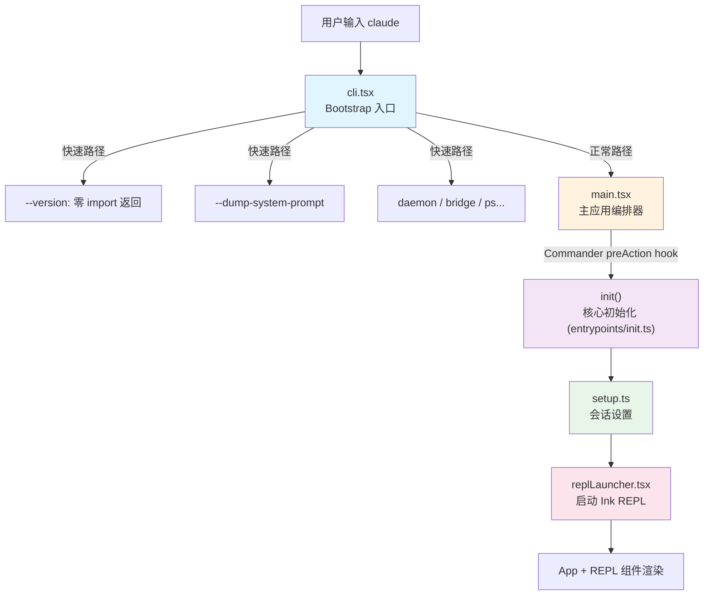
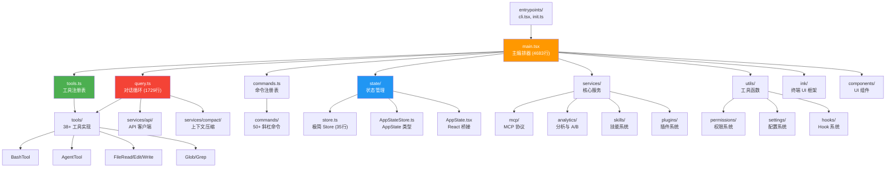

# 第 1 篇：项目全景 — 一个 AI CLI 产品的技术蓝图

> 本篇是《深入 Claude Code CLI 源码》系列的开篇。我们将从技术栈选型、启动链路、模块依赖三个维度，建立对整个项目的全局认知。

## 为什么要从全景开始？

当你面对一个近 1900 个 TypeScript 文件、核心文件超过 4000 行的大型项目时，最大的挑战不是读懂某个函数，而是**不知道从哪里开始读**。

Claude Code CLI 是 Anthropic 公司开发的 AI 驱动命令行编程助手。它不是一个简单的 API wrapper —— 它是一个完整的 AI Agent 运行时，包含了从终端 UI 渲染、多 Agent 编排、工具系统、权限安全到 Prompt 工程的全技术栈。理解它的全貌，等于理解了一个生产级 AI 产品的完整架构。

本篇将回答三个核心问题：
1. **为什么选择这些技术？** — Bun + TypeScript + Ink + Commander.js 的技术栈选型逻辑
2. **程序是怎么启动的？** — 从 `cli.tsx` 到 REPL 的启动链路
3. **代码是怎么组织的？** — 近 1900 个文件的模块依赖全景

---

## 一、技术栈选型：为什么是 Bun + TypeScript + Ink？

### 1.1 运行时：Bun

Claude Code CLI 运行在 **Bun** 上而非 Node.js。这个选择不是追新，而是有明确的工程理由：

- **启动速度**：Bun 的冷启动时间远低于 Node.js，对 CLI 工具至关重要。用户输入 `claude` 到看到界面的时间直接影响体验。
- **内置 bundler**：Bun 的 `bun:bundle` 模块提供了编译期 `feature()` 函数，可以实现 Dead Code Elimination（DCE）。这让同一份代码可以构建出内部版和外部版两个不同的产品。
- **TypeScript 原生支持**：无需 `ts-node` 或额外的转译步骤。

一个关键的 Bun 特性在整个代码库中被大量使用：

```typescript
// entrypoints/cli.tsx:1
import { feature } from 'bun:bundle';

// tools.ts:26-28
const SleepTool =
  feature('PROACTIVE') || feature('KAIROS')
    ? require('./tools/SleepTool/SleepTool.js').SleepTool
    : null
```

`feature()` 在编译时被替换为 `true` 或 `false`，配合 `require()`（而非 `import`），Bun 的 bundler 可以在编译期直接删除不需要的代码分支，实现真正的零成本抽象。

### 1.2 语言：TypeScript + Zod

TypeScript 提供静态类型安全。值得注意的是，项目大量使用 **Zod** 做运行时类型验证 —— 这是因为 AI 模型返回的工具调用参数是动态的，TypeScript 的编译期类型检查无法覆盖。

### 1.3 终端 UI：Ink（React for CLI）

Claude Code CLI 的终端界面不是用 `console.log` 拼的，而是用 **Ink** —— 一个在终端中运行 React 的框架。项目甚至 fork 了 Ink 框架并做了大量深度定制（`ink/` 目录约有 96 个文件）：

```
ink/
├── reconciler.ts          # 自定义 React reconciler
├── layout/                # 基于 Yoga 的布局引擎
├── render-node-to-output.ts  # 渲染到终端
├── optimizer.ts           # 渲染性能优化
├── line-width-cache.ts    # 行宽缓存
└── ...（共约 96 个文件）
```

为什么用 React 做终端 UI？因为 Claude Code 的界面是**高度动态**的：流式输出、多工具并行进度条、权限确认对话框、主题切换……这些用命令式代码管理会变成噩梦，但用 React 的声明式模型就很自然。

### 1.4 CLI 参数解析：Commander.js

参数解析使用 `@commander-js/extra-typings` —— Commander.js 的类型增强版。在 `main.tsx` 中可以看到它被用来定义所有 CLI 选项和子命令。

### 技术栈总结

| 层级 | 技术选择 | 选择理由 |
|------|---------|---------|
| 运行时 | Bun | 快速启动 + 编译期 DCE |
| 语言 | TypeScript | 类型安全 + 大型项目可维护性 |
| 运行时验证 | Zod | AI 返回值的动态验证 |
| 终端 UI | Ink (forked) | React 声明式 UI 模型 |
| CLI 解析 | Commander.js | 成熟的参数解析方案 |
| 布局引擎 | Yoga | 终端中的 Flexbox |

---

## 二、启动链路：从 `claude` 到 REPL 的调用流程

当用户在终端输入 `claude` 并回车时，程序经过 4 个层次的初始化，最终启动交互式 REPL。每一层都有明确的职责分工：



> **注意**：`init()` 并不是独立的启动层级。它定义在 `entrypoints/init.ts` 中，但实际是在 `main.tsx` 的 Commander `preAction` hook 内被调用的（`main.tsx:907-916`）。这意味着 `init()` 的执行时机由 Commander.js 的命令解析流程控制——只有当用户执行一个真正的命令时才会触发，显示帮助信息（`--help`）时不会执行。

### 2.1 第一层：cli.tsx — Bootstrap 入口

**文件**：`entrypoints/cli.tsx`（约 300 行）

这是程序的**真正入口**。它的核心设计原则是：**尽可能少加载模块，尽可能快返回**。

```typescript
// entrypoints/cli.tsx:33-42
async function main(): Promise<void> {
  const args = process.argv.slice(2);

  // Fast-path for --version/-v: zero module loading needed
  if (args.length === 1 && (args[0] === '--version' || args[0] === '-v' || args[0] === '-V')) {
    console.log(`${MACRO.VERSION} (Claude Code)`);
    return;
  }
  // ...
}
```

`--version` 路径实现了**零 import 返回** —— 除了 `cli.tsx` 本身，不加载任何其他模块。`MACRO.VERSION` 是编译时内联的常量，连字符串拼接的成本都省了。

cli.tsx 定义了大量「快速路径」（fast-path），每个路径只动态 import 必需的模块。以下是主要的快速路径（完整列表还包括 `--daemon-worker`、`--claude-in-chrome-mcp`、`environment-runner`、`self-hosted-runner`、template jobs、tmux worktree 等，详见源码）：

| 快速路径 | 触发条件 | 加载的模块 |
|----------|---------|-----------|
| --version | 单参数 `-v/-V/--version` | 无 |
| --dump-system-prompt | 首参数匹配 | config, model, prompts |
| daemon | 首参数 `daemon` | config, sinks, daemon/main |
| bridge/remote | 首参数 `remote-control` 等 | config, auth, bridge |
| ps/logs/attach/kill | 首参数匹配 | config, cli/bg |
| 正常启动 | 无匹配 | main.tsx（全量） |

只有当没有任何快速路径匹配时，才加载最重的 `main.tsx`：

```typescript
// entrypoints/cli.tsx:291-298
const { startCapturingEarlyInput } = await import('../utils/earlyInput.js');
startCapturingEarlyInput();
profileCheckpoint('cli_before_main_import');
const { main: cliMain } = await import('../main.js');
profileCheckpoint('cli_after_main_import');
await cliMain();
```

注意这里用了 `profileCheckpoint()` 打点 —— 团队在持续监控 `import main.js` 的耗时，因为这一步会触发大量模块的求值。

### 2.2 第二层：main.tsx — 主应用编排器

**文件**：`main.tsx`（约 4683 行）

这是整个项目**最大的单文件**。它是整个 CLI 应用的编排中心，负责：
- 用 Commander.js 定义所有 CLI 参数和子命令（`config`、`doctor`、`mcp` 等）
- 通过 `preAction` hook 编排初始化流程：`init()` → 配置迁移 → 远程设置加载
- 认证流程（API Key / OAuth / AWS / GCP）
- 模型选择与验证
- 权限模式初始化
- MCP 服务器配置与连接
- 插件加载与 Agent 定义发现
- 创建 AppState 并启动 REPL（交互模式）或执行 print 模式（非交互模式）

main.tsx 的前 20 行展示了一个精妙的启动优化技巧 —— **侧效果前置**：

```typescript
// main.tsx:1-20
import { profileCheckpoint, profileReport } from './utils/startupProfiler.js';
profileCheckpoint('main_tsx_entry');  // 立即打点

import { startMdmRawRead } from './utils/settings/mdm/rawRead.js';
startMdmRawRead();  // 立即启动 MDM 子进程

import { ensureKeychainPrefetchCompleted, startKeychainPrefetch }
  from './utils/secureStorage/keychainPrefetch.js';
startKeychainPrefetch();  // 立即启动 Keychain 预取
```

这些 `import` 语句之间穿插着函数调用 —— **在后续 135ms 的 import 求值期间**，MDM 子进程和 Keychain 读取已经在并行执行了。这是一个巧妙的性能优化：利用 JavaScript 模块求值的阻塞时间来并行执行 I/O。

### 2.3 init() — 核心初始化（在 main.tsx 的 preAction 中调用）

**文件**：`entrypoints/init.ts`

`init()` 定义在单独的文件中，但通过 `main.tsx` 的 Commander `preAction` hook 调用（`main.tsx:916`）。它用 lodash 的 `memoize` 包装，确保无论被调用多少次都只执行一次：

```typescript
// entrypoints/init.ts:57
export const init = memoize(async (): Promise<void> => {
  // 配置验证
  enableConfigs();
  // 环境变量应用（安全的部分）
  applySafeConfigEnvironmentVariables();
  // CA 证书配置
  applyExtraCACertsFromConfig();
  // 优雅退出注册
  setupGracefulShutdown();
  // 遥测初始化
  // 代理配置
  // MTLS 配置
  // Policy limits 加载
  // ...
});
```

关键设计：`init()` 区分了「安全环境变量」和「完整环境变量」。在用户接受信任对话框（trust dialog）之前，只应用安全的环境变量。这是安全性考虑 —— 未确认信任的项目不应该能通过 `.claude/settings.json` 修改关键环境变量。

### 2.4 setup.ts — 会话设置

**文件**：`setup.ts`（约 477 行）

`setup()` 处理每次会话的初始化：
- 设置工作目录（CWD）
- Git Worktree 创建（如果启用 `--worktree`）
- Hooks 配置快照
- 文件变更监听器初始化
- Session Memory 初始化
- Analytics 事件 `tengu_started` 发送

```typescript
// setup.ts:56-66
export async function setup(
  cwd: string,
  permissionMode: PermissionMode,
  allowDangerouslySkipPermissions: boolean,
  worktreeEnabled: boolean,
  // ...
): Promise<void> {
  setCwd(cwd);
  captureHooksConfigSnapshot();
  initializeFileChangedWatcher(cwd);
  // ...
}
```

### 2.5 replLauncher.tsx — 启动 REPL

**文件**：`replLauncher.tsx`（约 22 行）

最终的 REPL 启动异常简洁 —— 它只做一件事：将 `<App>` 和 `<REPL>` 组件渲染到 Ink 的 React 树中：

```typescript
// replLauncher.tsx:12-22
export async function launchRepl(
  root: Root, appProps: AppWrapperProps,
  replProps: REPLProps,
  renderAndRun: (root: Root, element: React.ReactNode) => Promise<void>
): Promise<void> {
  const { App } = await import('./components/App.js');
  const { REPL } = await import('./screens/REPL.js');
  await renderAndRun(root,
    <App {...appProps}>
      <REPL {...replProps} />
    </App>
  );
}
```

注意 `App` 和 `REPL` 都是动态 `import` 的 —— 延迟到最后一刻才加载这些重量级 UI 模块。

---

## 三、模块依赖全景：近 1900 个文件的组织方式

Claude Code CLI 的源码按职责划分为 10+ 个顶层模块：



### 3.1 核心文件规模

| 文件 | 行数 | 职责 |
|------|------|------|
| `main.tsx` | 4683 | 主编排器，CLI 参数定义，启动流程 |
| `query.ts` | 1729 | 对话循环，API 调用，工具执行 |
| `Tool.ts` | 792 | Tool 接口定义，buildTool() |
| `commands.ts` | 754 | 命令注册表，50+ 斜杠命令 |
| `tools.ts` | 389 | 工具注册表，getAllBaseTools() |
| `setup.ts` | 477 | 会话初始化 |
| `cli.tsx` | 303 | Bootstrap 入口 |

### 3.2 目录结构与职责

```
claude-code-cli/
├── entrypoints/          # 入口点 (cli.tsx, init.ts)
├── state/                # 状态管理 (store, AppState)
├── tools/                # 38+ 工具实现，每个一个目录
│   ├── AgentTool/        # Agent 子系统
│   ├── BashTool/         # Shell 命令执行
│   ├── FileEditTool/     # 文件编辑
│   ├── GlobTool/         # 文件搜索
│   └── ...
├── commands/             # 50+ 斜杠命令
├── services/             # 核心服务
│   ├── api/              # Anthropic API 客户端
│   ├── compact/          # 上下文压缩
│   ├── mcp/              # MCP 协议实现
│   └── analytics/        # 分析与 Feature Flags
├── components/           # 380+ UI 组件文件
│   └── design-system/    # 设计系统基础组件
├── ink/                  # Fork 的 Ink 框架 (约 96 个文件)
├── utils/                # 工具函数
│   ├── permissions/      # 权限系统
│   ├── settings/         # 多层配置系统
│   └── hooks/            # Hook 系统
├── constants/            # 常量定义 (System Prompt 在这里)
├── tasks/                # 任务系统 (并发 Agent)
├── coordinator/          # 多 Agent 协调
├── memdir/               # 自动记忆系统
├── skills/               # 技能框架
├── bridge/               # IDE 远程桥接
└── migrations/           # 配置迁移脚本
```

### 3.3 关键数据流

整个应用的核心数据流可以概括为一条主线：

```
用户输入 → query.ts 组装消息 → Anthropic API → 模型返回 tool_use
→ 查找并执行 Tool → 结果回传 API → 模型继续/结束
```

这条主线由 `query.ts` 驱动，它是整个应用的**心脏**。每一次用户提问，都会触发这个循环，直到模型决定停止使用工具并给出最终回复。

---

## 四、几个值得注意的架构决策

### 4.1 单文件 vs 模块化的取舍

`main.tsx` 有 4683 行，`query.ts` 有 1729 行 —— 这看起来违背了「小文件」原则。但这是有意为之的：

- **main.tsx** 是编排器，它需要 import 几乎所有模块来完成初始化。如果拆分，只是把 import 分散到多个文件，并不会减少复杂度。
- **query.ts** 是对话循环，它的逻辑是高度内聚的。拆分会增加理解成本。

### 4.2 动态 import 的战略性使用

项目中有两种 import 模式：

```typescript
// 静态 import：模块求值时立即加载
import { BashTool } from './tools/BashTool/BashTool.js'

// 动态 import：运行到此处时才加载
const { App } = await import('./components/App.js')
```

**规律**：核心逻辑用静态 import（确保类型检查），UI 和可选功能用动态 import（延迟加载）。

### 4.3 循环依赖的处理

项目中有多处循环依赖，统一使用懒 `require()` 模式处理：

```typescript
// tools.ts:63-66
const getTeamCreateTool = () =>
  require('./tools/TeamCreateTool/TeamCreateTool.js')
    .TeamCreateTool as typeof import('./tools/TeamCreateTool/TeamCreateTool.js').TeamCreateTool
```

这个模式的关键点：
1. **用函数包装** `require()` —— 只在调用时才执行
2. **用 `as typeof import(...)` 保留类型信息** —— 不丢失类型安全
3. **注释标注原因** —— `// Lazy require to break circular dependency`

---

## 五、可迁移的设计模式

### 模式 1：分层启动 + 快速路径

将 CLI 启动分为多层，每层只加载必需的模块。对于简单命令（如 `--version`），在最早的层级就返回，避免加载整个应用。

**适用场景**：任何 CLI 工具，特别是启动速度敏感的场景。

### 模式 2：侧效果前置并行化

利用 JavaScript 模块求值的阻塞时间，在 import 语句之间插入 I/O 操作的启动调用。这样在后续模块加载期间，I/O 已经在并行执行。

**适用场景**：任何需要在启动时执行 I/O（网络请求、文件读取、子进程）的应用。

### 模式 3：编译期 Feature Flag + 条件 require

用编译期常量（如 Bun 的 `feature()`）配合条件 `require()` 实现零成本的功能门控。编译器可以在构建时完全删除不需要的代码分支。

**适用场景**：需要从同一份代码构建多个版本（如内部版/外部版、免费版/付费版）的项目。

---

## 下一篇预告

[第 2 篇：启动优化 — 毫秒级 CLI 启动的工程艺术](./02-启动优化.md)

我们将深入 `cli.tsx` 和 `main.tsx` 的前 200 行，揭示 Claude Code 团队如何将 CLI 启动时间优化到毫秒级别。你会看到 `profileCheckpoint()`、`startMdmRawRead()`、`startKeychainPrefetch()` 背后的完整优化思路。

---

*本文基于 Claude Code CLI 源码目录 `/Users/yao/work/code/aswsome-project/claude-code-cli/` 分析撰写。*
