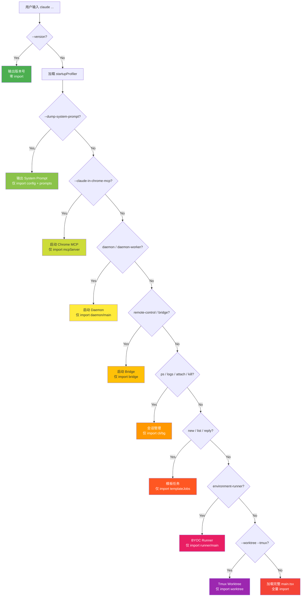

# 第 2 篇：启动优化 -- 毫秒级 CLI 启动的工程艺术

> 本篇是《深入 Claude Code CLI 源码》系列的第 2 篇。我们将深入 `cli.tsx` 和 `main.tsx` 的启动路径，揭示 Claude Code 团队如何将 CLI 启动时间优化到毫秒级别。

## 为什么启动速度如此重要？

CLI 工具的第一印象就是**启动速度**。用户在终端输入 `claude` 并回车的那一刻，心理预期是"即时响应"。如果启动需要 2 秒，用户会觉得卡顿；如果需要 5 秒，用户会开始怀疑是不是命令输错了。

对于 Claude Code 这样一个重量级应用——近 1900 个 TypeScript 文件、依赖 React/Ink/Yoga 渲染引擎、需要连接 MCP 服务器和 Anthropic API——要做到毫秒级启动，绝非易事。

本篇将揭示 Claude Code 采用的 **6 大启动优化策略**：

1. **快速路径（Fast Path）**：对简单命令实现零 import 返回
2. **侧效果前置（Side-Effect Hoisting）**：利用模块求值时间并行执行 I/O
3. **API 预连接（Preconnect）**：在用户还在打字时完成 TCP+TLS 握手
4. **早期输入捕获（Early Input Capture）**：启动期间不丢失用户输入
5. **编译期 Dead Code Elimination**：`feature()` 函数让未使用的代码从构建产物中彻底消失
6. **`memoize` 防重复初始化**：确保昂贵的初始化逻辑只执行一次

---

## 一、快速路径：让简单命令零代价返回

### 1.1 核心思想

Claude Code CLI 的入口文件 `cli.tsx` 遵循一个核心原则：**尽可能少加载模块，尽可能快返回**。

当用户执行 `claude --version` 时，他们不需要 React、不需要 Ink、不需要 API 客户端、不需要工具系统——他们只需要一个版本号字符串。所以 `cli.tsx` 在最早的位置截断执行：

```typescript
// entrypoints/cli.tsx:33-42
async function main(): Promise<void> {
  const args = process.argv.slice(2);

  // Fast-path for --version/-v: zero module loading needed
  if (args.length === 1 && (args[0] === '--version' || args[0] === '-v' || args[0] === '-V')) {
    // MACRO.VERSION is inlined at build time
    console.log(`${MACRO.VERSION} (Claude Code)`);
    return;
  }
  // ...
}
```

`MACRO.VERSION` 是编译时内联的常量，连函数调用的开销都没有。整个 `--version` 路径**不再动态加载任何额外业务模块**。

> **注意**：`cli.tsx` 并非完全没有顶层副作用。在 `main()` 函数之前，它还执行了几项环境修正：修复 corepack auto-pinning（`COREPACK_ENABLE_AUTO_PIN = '0'`）、为 CCR 容器环境设置 `NODE_OPTIONS` 堆大小、以及内部版的 Ablation Baseline 环境变量批量写入。这些副作用的共同特点是：**不 import 任何业务模块**，仅操作 `process.env`，耗时可忽略。

### 1.2 多层快速路径

`--version` 只是第一层。`cli.tsx` 定义了一个**瀑布式的快速路径链**，每条路径只动态 import 它真正需要的模块：



注意一个关键细节：**许多可裁剪的快速路径使用 `feature()` 做编译期门控**。例如：

```typescript
// entrypoints/cli.tsx:100-106
if (feature('DAEMON') && args[0] === '--daemon-worker') {
  const { runDaemonWorker } = await import('../daemon/workerRegistry.js');
  await runDaemonWorker(args[1]);
  return;
}
```

`feature('DAEMON')` 在编译时会被替换为 `true` 或 `false`。如果构建的是不支持 Daemon 的版本，整个 `if` 分支（包括 `import('../daemon/workerRegistry.js')`）会被 Bun 的 Dead Code Elimination 完全删除。这意味着**外部版构建产物中根本不存在这些快速路径的代码**。

不过，并非所有快速路径都有 `feature()` 门控。例如 `--claude-in-chrome-mcp` 和 `--chrome-native-host` 这两条路径没有 `feature()` 包裹（`cli.tsx:72-85`），说明它们在所有构建版本中都可用。`feature()` 门控主要用于那些**明确只属于特定构建版本的功能**。

### 1.3 动态 import 的战术运用

注意所有快速路径中 import 的写法：

```typescript
// 动态 import —— 运行到此处时才加载模块
const { enableConfigs } = await import('../utils/config.js');
const { bridgeMain } = await import('../bridge/bridgeMain.js');
```

而不是顶部的静态 import。这是有意为之的——**`cli.tsx` 顶部没有任何静态的业务模块 import**（唯一的静态 import 是 `bun:bundle`，它是编译期原语，不引入运行时模块）。整个文件的设计哲学是：在确定了要走哪条路径之后，才加载那条路径需要的模块。

这个设计的效果是：如果 `cli.tsx` 顶部有 20 个静态 import，每次启动都要加载它们。但使用动态 import 后，`claude daemon` 只加载 daemon 相关模块，`claude ps` 只加载会话管理模块，互不影响。

---

## 二、侧效果前置：利用模块求值的"空闲时间"

### 2.1 问题背景

当快速路径都没有匹配时，`cli.tsx` 需要加载完整的 `main.tsx`。而 `main.tsx` 的静态 import 链非常庞大——有上百个静态 import 语句。根据源码注释（`main.tsx:4`），这些模块的求值大约需要 **~135ms**。

在这段时间内，JavaScript 引擎忙着求值模块、执行顶层代码、构建依赖图。这段时间**事件循环是被阻塞的**——但操作系统的 I/O 子系统是空闲的！

Claude Code 团队的洞察是：**有些启动时必须做的 I/O 操作（子进程、Keychain 读取），可以在模块求值开始前就启动，让它们与模块加载并行执行。**

### 2.2 `main.tsx` 的前 20 行

这是整个代码库中最精妙的启动优化之一。让我们逐行分析 `main.tsx` 的开头：

```typescript
// main.tsx:1-20
// These side-effects must run before all other imports:
// 1. profileCheckpoint marks entry before heavy module evaluation begins
// 2. startMdmRawRead fires MDM subprocesses (plutil/reg query) so they run in
//    parallel with the remaining ~135ms of imports below
// 3. startKeychainPrefetch fires both macOS keychain reads (OAuth + legacy API
//    key) in parallel — isRemoteManagedSettingsEligible() otherwise reads them
//    sequentially via sync spawn inside applySafeConfigEnvironmentVariables()
//    (~65ms on every macOS startup)
import { profileCheckpoint, profileReport } from './utils/startupProfiler.js';
profileCheckpoint('main_tsx_entry');     // 立即打点！

import { startMdmRawRead } from './utils/settings/mdm/rawRead.js';
startMdmRawRead();                      // 立即启动 MDM 子进程！

import { ensureKeychainPrefetchCompleted, startKeychainPrefetch }
  from './utils/secureStorage/keychainPrefetch.js';
startKeychainPrefetch();                // 立即启动 Keychain 读取！

import { feature } from 'bun:bundle';
import { Command as CommanderCommand, ... } from '@commander-js/extra-typings';
// ... 剩余上百个 import，源码注释称耗时 ~135ms
```

注意这里的模式：**import 语句和函数调用交错排列**。在 JavaScript 中，模块求值是同步顺序执行的。所以执行流程是：

1. 加载 `startupProfiler.js`（很小，几乎不耗时）
2. 调用 `profileCheckpoint('main_tsx_entry')` —— 记录入口时间
3. 加载 `rawRead.js`（只依赖 `child_process` 和 `fs`，很快）
4. 调用 `startMdmRawRead()` —— **启动 MDM 子进程但不等待结果**
5. 加载 `keychainPrefetch.js`（同样轻量）
6. 调用 `startKeychainPrefetch()` —— **启动 Keychain 子进程但不等待结果**
7. 开始加载剩余的上百个模块... **此时 MDM 和 Keychain 子进程已经在并行运行了！**

### 2.3 MDM 子进程预取：`startMdmRawRead()`

MDM（Mobile Device Management）是 macOS/Windows 上的企业设备管理机制。Claude Code 需要读取 MDM 配置来应用企业策略。

```typescript
// utils/settings/mdm/rawRead.ts:120-123
export function startMdmRawRead(): void {
  if (rawReadPromise) return;    // 防重复
  rawReadPromise = fireRawRead();
}
```

`fireRawRead()` 内部是平台分支逻辑：

- **macOS**：并行读取多个 plist 文件路径（先 `existsSync()` 检查文件是否存在，不存在则跳过 5ms 的 plutil 子进程）
- **Windows**：并行查询 HKLM 和 HKCU 两个注册表路径
- **Linux**：直接返回空（无 MDM）

```typescript
// utils/settings/mdm/rawRead.ts:57-88
if (process.platform === 'darwin') {
  const plistPaths = getMacOSPlistPaths();
  const allResults = await Promise.all(
    plistPaths.map(async ({ path, label }) => {
      // Fast-path: skip plutil if file doesn't exist (~5ms savings per missing file)
      if (!existsSync(path)) {
        return { stdout: '', label, ok: false };
      }
      const { stdout, code } = await execFilePromise(PLUTIL_PATH, [
        ...PLUTIL_ARGS_PREFIX, path
      ]);
      return { stdout, label, ok: code === 0 && !!stdout };
    }),
  );
  // First source wins (array is in priority order)
  const winner = allResults.find(r => r.ok);
  // ...
}
```

这里有两个值得注意的优化：

1. **`existsSync()` 前置检查**：在非 MDM 管理的机器上（绝大多数开发者），plist 文件根本不存在。用同步的 `existsSync()` 跳过不存在的文件，避免了启动一个注定失败的 plutil 子进程（每个约 5ms）。
2. **`Promise.all` 并行**：如果有多个 plist 路径需要检查，它们是并行执行的，而不是串行等待。

### 2.4 Keychain 预取：`startKeychainPrefetch()`

这个优化更加精彩。在 macOS 上，Claude Code 需要从 Keychain 读取两个条目：

- **OAuth token**（`Claude Code-credentials`）：~32ms
- **Legacy API key**（`Claude Code`）：~33ms

如果串行读取，这就是 **~65ms 的阻塞时间**。而且原来的代码使用的是同步的 `execSync`，这意味着主线程完全阻塞。

预取方案是在 `main.tsx` 模块求值开始时就启动这两个读取，使用异步的 `execFile`：

```typescript
// utils/secureStorage/keychainPrefetch.ts:69-89
export function startKeychainPrefetch(): void {
  if (process.platform !== 'darwin' || prefetchPromise || isBareMode()) return;

  // Fire both subprocesses immediately (non-blocking)
  const oauthSpawn = spawnSecurity(
    getMacOsKeychainStorageServiceName(CREDENTIALS_SERVICE_SUFFIX),
  );
  const legacySpawn = spawnSecurity(getMacOsKeychainStorageServiceName());

  prefetchPromise = Promise.all([oauthSpawn, legacySpawn]).then(
    ([oauth, legacy]) => {
      if (!oauth.timedOut) primeKeychainCacheFromPrefetch(oauth.stdout);
      if (!legacy.timedOut) legacyApiKeyPrefetch = { stdout: legacy.stdout };
    },
  );
}
```

关键细节：

- **`primeKeychainCacheFromPrefetch()`**：将结果写入缓存，后续同步的 Keychain 读取会直接命中缓存，不再启动子进程。
- **超时处理**：如果预取超时（`timedOut`），不会写入缓存——让后续的同步读取重试，而不是用一个可能不完整的结果。
- **`isBareMode()` 跳过**：`--bare` 模式下跳过 Keychain 读取（该模式仅使用环境变量认证）。

### 2.5 等待预取完成

在 `main.tsx` 的 Commander `preAction` hook 中，所有预取的结果被统一等待：

```typescript
// main.tsx:907-916
program.hook('preAction', async thisCommand => {
  profileCheckpoint('preAction_start');
  // Await async subprocess loads started at module evaluation (lines 12-20).
  // Nearly free — subprocesses complete during the ~135ms of imports above.
  await Promise.all([
    ensureMdmSettingsLoaded(),
    ensureKeychainPrefetchCompleted()
  ]);
  profileCheckpoint('preAction_after_mdm');
  await init();
  // ...
});
```

注释中写道："Nearly free — subprocesses complete during the ~135ms of imports above"。这两个子进程各需要 ~30ms，而 import 求值需要 ~135ms。所以等到 `preAction` 执行时，子进程早已完成，`await` 几乎是零耗时的。

**效果**：将 macOS 上 **~65ms 的串行阻塞**优化为 **~0ms 的额外等待**。

---

## 三、API 预连接：在用户打字时完成握手

### 3.1 TCP+TLS 握手的隐性成本

每次 HTTPS 请求的第一步是 TCP 连接 + TLS 握手，这通常需要 **100-200ms**。对于 Claude Code 来说，用户发送第一条消息时，这 100-200ms 是纯等待——API 还没开始处理请求，时间全花在了网络握手上。

Claude Code 的解决方案是 **API 预连接**：在 `init()` 阶段就向 Anthropic API 发送一个 `HEAD` 请求，提前完成 TCP+TLS 握手。源码注释指出，这在两种模式下都有效：**交互模式**下与"用户正在打字"的时间重叠；**`-p` 模式**下与 action-handler 的约 100ms 工作（setup、commands、MCP 配置）重叠：

```typescript
// utils/apiPreconnect.ts:31-71
export function preconnectAnthropicApi(): void {
  if (fired) return;
  fired = true;

  // Skip if using a cloud provider — different endpoint + auth
  if (
    isEnvTruthy(process.env.CLAUDE_CODE_USE_BEDROCK) ||
    isEnvTruthy(process.env.CLAUDE_CODE_USE_VERTEX) ||
    isEnvTruthy(process.env.CLAUDE_CODE_USE_FOUNDRY)
  ) { return; }

  // Skip if proxy/mTLS/unix — SDK's custom dispatcher won't reuse this pool
  if (
    process.env.HTTPS_PROXY || process.env.http_proxy ||
    process.env.ANTHROPIC_UNIX_SOCKET ||
    process.env.CLAUDE_CODE_CLIENT_CERT
  ) { return; }

  const baseUrl =
    process.env.ANTHROPIC_BASE_URL || getOauthConfig().BASE_API_URL;

  // Fire and forget. HEAD = no response body, connection eligible for reuse.
  void fetch(baseUrl, {
    method: 'HEAD',
    signal: AbortSignal.timeout(10_000),
  }).catch(() => {});
}
```

### 3.2 为什么这行得通？

这个优化依赖于 Bun 的连接池机制：

1. **`fetch()` 使用全局 keep-alive 连接池**：Bun 的 fetch 实现共享一个进程级的连接池
2. **`HEAD` 请求没有 response body**：连接在 headers 返回后立即可被复用
3. **后续 API 请求复用暖连接**：当 Anthropic SDK 发起真正的 API 请求时，连接池中已经有一个完成了 TLS 握手的连接

### 3.3 调用时机的考量

预连接在 `init()` 内部调用，位于 `applyExtraCACertsFromConfig()` 和 `configureGlobalAgents()` **之后**。这个顺序很重要：

```typescript
// entrypoints/init.ts:78-79
applyExtraCACertsFromConfig();      // 先加载自定义 CA 证书
// ...
configureGlobalAgents();            // 再配置代理
// ...
preconnectAnthropicApi();           // 最后才预连接
```

如果顺序反了——在 CA 证书配置前就预连接——会导致两个问题：
1. 预连接使用错误的 TLS 证书，握手失败
2. 更严重的是，Bun 的 BoringSSL 会在首次 TLS 握手时**锁定证书存储**，导致后续配置的自定义 CA 证书不生效

### 3.4 智能跳过

预连接在以下情况被跳过：
- **使用 Bedrock/Vertex/Foundry**：不同的 API 端点，预连接 Anthropic API 无意义
- **使用代理/mTLS/Unix Socket**：SDK 会使用自定义的 dispatcher/agent，不会复用全局连接池
- 这些情况下预连接反而会**浪费一个连接**，得不偿失

---

## 四、早期输入捕获：启动时不丢失用户按键

### 4.1 问题场景

很多用户的习惯是：输入 `claude` 回车后，**立刻开始打要问的问题**，不等 REPL 渲染完成。但在 REPL 初始化完成前，终端处于"无人接管 stdin"的状态——用户的击键会丢失。

Claude Code 的解决方案是在 `cli.tsx` 中尽早接管 stdin：

```typescript
// entrypoints/cli.tsx:288-291
const { startCapturingEarlyInput } = await import('../utils/earlyInput.js');
startCapturingEarlyInput();
profileCheckpoint('cli_before_main_import');
const { main: cliMain } = await import('../main.js');
```

注意时序：`startCapturingEarlyInput()` 在 `import('../main.js')` **之前**调用。这意味着在 main.tsx 模块加载期间（源码注释称约 ~135ms），用户的输入已经被捕获了。

### 4.2 实现细节

```typescript
// utils/earlyInput.ts:29-67
export function startCapturingEarlyInput(): void {
  // 仅在交互模式下捕获，-p (print) 模式跳过
  if (!process.stdin.isTTY || isCapturing ||
      process.argv.includes('-p') || process.argv.includes('--print')) {
    return;
  }

  isCapturing = true;
  earlyInputBuffer = '';

  // 设置 raw mode，与 Ink 的 stdin 处理方式一致
  process.stdin.setEncoding('utf8');
  process.stdin.setRawMode(true);
  process.stdin.ref();

  readableHandler = () => {
    let chunk = process.stdin.read();
    while (chunk !== null) {
      if (typeof chunk === 'string') {
        processChunk(chunk);
      }
      chunk = process.stdin.read();
    }
  };

  process.stdin.on('readable', readableHandler);
}
```

`processChunk()` 函数处理了各种边界情况：

- **Ctrl+C (code 3)**：立即退出进程，exit code 130
- **Ctrl+D (code 4)**：EOF，停止捕获
- **Backspace (code 127/8)**：删除最后一个 grapheme cluster（注意不是简单的删除最后一个 char，而是正确处理 Unicode 组合字符）
- **ESC 序列**：跳过箭头键、功能键等转义序列
- **回车 (code 13)**：转换为换行符

当 REPL 准备就绪后，调用 `consumeEarlyInput()` 获取缓冲区中的文本，并自动停止捕获：

```typescript
// utils/earlyInput.ts:164-169
export function consumeEarlyInput(): string {
  stopCapturingEarlyInput();
  const input = earlyInputBuffer.trim();
  earlyInputBuffer = '';
  return input;
}
```

### 4.3 与 Ink 的完整交接闭环

早期输入捕获不是一个孤立的模块——它与 Ink 框架和 REPL 组件有精确的交接协议。整个生命周期涉及三个参与者：

**1. 停止捕获的时机**

`stopCapturingEarlyInput()` 有三个调用点，覆盖了所有场景：

- **非交互模式**（`main.tsx:807`）：`-p` / `--init-only` / `--sdk-url` 等非交互模式下，直接停止捕获
- **Ink 接管 stdin**（`ink/components/App.tsx:224-228`）：当 Ink 的 `App` 组件首次启用 raw mode 时，**必须先停止 early capture**，因为两者都使用 `stdin.on('readable')` + `stdin.read()` 模式，不能共存——否则 early capture 的 handler 会抢先 drain stdin，Ink 的 handler 就读不到数据了
- **消费缓冲区时**（`earlyInput.ts:165`）：`consumeEarlyInput()` 内部自动调用 `stopCapturingEarlyInput()`

```typescript
// ink/components/App.tsx:224-228
// Stop early input capture right before we add our own readable handler.
// Both use the same stdin 'readable' + read() pattern, so they can't
// coexist -- our handler would drain stdin before Ink's can see it.
// The buffered text is preserved for REPL.tsx via consumeEarlyInput().
stopCapturingEarlyInput();
```

**2. 消费缓冲区**

REPL 组件在初始化时通过 `useState` 的 lazy initializer 消费早期输入：

```typescript
// screens/REPL.tsx:1331
const [inputValue, setInputValueRaw] = useState(() => consumeEarlyInput());
```

这个设计很巧妙——`useState` 的 lazy initializer 只在组件首次挂载时执行一次，正好对应"REPL 准备就绪"的时刻。

**3. 不重置 stdin 状态**

`stopCapturingEarlyInput()` **不会**调用 `setRawMode(false)` 来重置 stdin：

> Don't reset stdin state - the REPL's Ink App will manage stdin state.
> If we call setRawMode(false) here, it can interfere with the REPL's own stdin setup which happens around the same time.

整个交接链是：`cli.tsx` 开始捕获 → Ink `App` 接管 stdin 时停止捕获 → `REPL` 组件消费缓冲区。三个阶段无缝衔接，既不丢输入，也不与 Ink 冲突。

---

## 五、编译期 Dead Code Elimination

### 5.1 `feature()` 函数机制

Bun 的 `bun:bundle` 提供了一个编译期函数 `feature()`，它在构建时被替换为字面量 `true` 或 `false`。配合 JavaScript 引擎的常量折叠优化，整个代码分支可以在编译期被删除：

```typescript
// 源码
if (feature('DAEMON') && args[0] === 'daemon') {
  const { daemonMain } = await import('../daemon/main.js');
  await daemonMain(args.slice(1));
  return;
}

// 外部版构建后 (feature('DAEMON') → false)
if (false && args[0] === 'daemon') {  // Dead code, 被 DCE 删除
  // ...
}
```

### 5.2 构建期优化补充：`feature()` + `require()` 的组合拳

上面展示的 `feature()` 在 `cli.tsx` 中是直接的**启动路径优化**——未匹配的快速路径代码物理消失，减少了 `cli.tsx` 自身的大小。

但 `feature()` + `require()` 的组合还有另一个重要用途：**构建产物裁剪**。这主要影响的不是启动热路径的延迟，而是整个包的依赖图大小。例如在 `tools.ts` 中：

```typescript
// tools.ts:25-53
const SleepTool =
  feature('PROACTIVE') || feature('KAIROS')
    ? require('./tools/SleepTool/SleepTool.js').SleepTool
    : null;

const cronTools = feature('AGENT_TRIGGERS')
  ? [
      require('./tools/ScheduleCronTool/CronCreateTool.js').CronCreateTool,
      require('./tools/ScheduleCronTool/CronDeleteTool.js').CronDeleteTool,
      require('./tools/ScheduleCronTool/CronListTool.js').CronListTool,
    ]
  : [];

const MonitorTool = feature('MONITOR_TOOL')
  ? require('./tools/MonitorTool/MonitorTool.js').MonitorTool
  : null;
```

**为什么这里用 `require()` 而不是 `import`？**

- 静态 `import` 无论条件如何都会被 bundler 纳入依赖图
- `require()` 是运行时调用，当 `feature()` 为 `false` 时，`require()` 所在的分支被 DCE 删除，连带其模块引用一并消失
- 效果：外部版的构建产物中，`SleepTool`、`CronTool`、`MonitorTool` 的代码**物理上不存在**

### 5.3 `cli.tsx` 中的 Ablation Baseline

`cli.tsx` 顶部有一个有趣的 `feature()` 使用：

```typescript
// entrypoints/cli.tsx:21-26
if (feature('ABLATION_BASELINE') && process.env.CLAUDE_CODE_ABLATION_BASELINE) {
  for (const k of [
    'CLAUDE_CODE_SIMPLE', 'CLAUDE_CODE_DISABLE_THINKING',
    'DISABLE_INTERLEAVED_THINKING', 'DISABLE_COMPACT',
    'DISABLE_AUTO_COMPACT', 'CLAUDE_CODE_DISABLE_AUTO_MEMORY',
    'CLAUDE_CODE_DISABLE_BACKGROUND_TASKS',
  ]) {
    process.env[k] ??= '1';
  }
}
```

注释解释了为什么这段代码必须在 `cli.tsx` 而不是 `init.ts`：

> BashTool/AgentTool/PowerShellTool capture DISABLE_BACKGROUND_TASKS into module-level consts at import time — init() runs too late.

某些工具模块在 import 时就读取环境变量并缓存为模块级常量。如果在 `init()` 中才设置环境变量，这些模块已经加载完毕，读到的是旧值。所以**必须在模块求值开始前**设置。这是一个典型的"执行时序"问题。

---

## 六、`memoize` 防重复初始化

### 6.1 `init()` 的 memoize 包装

`init()` 函数包含大量昂贵的初始化逻辑（配置验证、CA 证书、代理配置、mTLS、遥测等），它被 lodash 的 `memoize` 包装：

```typescript
// entrypoints/init.ts:57
export const init = memoize(async (): Promise<void> => {
  const initStartTime = Date.now();
  logForDiagnosticsNoPII('info', 'init_started');
  profileCheckpoint('init_function_start');

  enableConfigs();
  applySafeConfigEnvironmentVariables();
  applyExtraCACertsFromConfig();
  setupGracefulShutdown();
  // ... 大量初始化逻辑

  preconnectAnthropicApi();
  // ...
  profileCheckpoint('init_function_end');
});
```

`memoize` 确保无论 `init()` 被调用多少次，内部逻辑只执行一次，后续调用直接返回缓存的 Promise。这在复杂的启动流程中非常重要——不同的代码路径可能都需要确保初始化已完成，但不需要担心重复执行。

### 6.2 `init()` 内的延迟加载

`init()` 内部也运用了延迟加载策略。以 OpenTelemetry 初始化为例：

```typescript
// entrypoints/init.ts:306-310
async function setMeterState(): Promise<void> {
  // Lazy-load instrumentation to defer ~400KB of OpenTelemetry + protobuf
  const { initializeTelemetry } = await import(
    '../utils/telemetry/instrumentation.js'
  );
  const meter = await initializeTelemetry();
  // ...
}
```

注释说明了原因：OpenTelemetry + protobuf 模块约有 **~400KB**，gRPC 导出器更是有 **~700KB**。如果在启动时全部加载，会显著增加启动时间。通过动态 import，这些模块只在遥测真正初始化时才加载。

### 6.3 `init()` 中"安全"与"完整"环境变量的区分

`init()` 区分了两类环境变量的应用时机：

```typescript
// init.ts:73-74
// Apply only safe environment variables before trust dialog
applySafeConfigEnvironmentVariables();
```

完整的环境变量（`applyConfigEnvironmentVariables()`）要等到 trust dialog 之后才应用。这是一个**安全性考量**：未确认信任的项目不应该能通过 `.claude/settings.json` 修改关键环境变量（如 `ANTHROPIC_API_KEY`、`HTTP_PROXY`）。

---

## 七、启动性能度量：`profileCheckpoint()`

### 7.1 双模式设计

启动性能不能只靠"感觉"，需要数据。Claude Code 的启动分析器有两种模式：

```typescript
// utils/startupProfiler.ts:26-36
const DETAILED_PROFILING = isEnvTruthy(process.env.CLAUDE_CODE_PROFILE_STARTUP);
const STATSIG_SAMPLE_RATE = 0.005;
const STATSIG_LOGGING_SAMPLED =
  process.env.USER_TYPE === 'ant' || Math.random() < STATSIG_SAMPLE_RATE;
const SHOULD_PROFILE = DETAILED_PROFILING || STATSIG_LOGGING_SAMPLED;
```

1. **采样日志**：100% 内部用户 + 0.5% 外部用户，自动上报关键阶段耗时到 Statsig

> **源码考古发现**：文件顶部的文档注释（`startupProfiler.ts:6`）写的是"0.1% of external users"，但实际常量 `STATSIG_SAMPLE_RATE = 0.005` 对应的是 0.5%。注释与实现不一致——**以常量为准**。这种注释过时的情况在大型项目中很常见，也提醒我们在读源码时要以代码为准，注释仅作参考。

2. **详细分析**：`CLAUDE_CODE_PROFILE_STARTUP=1` 开启，输出完整的时间线报告和内存快照

### 7.2 零开销守卫

对于未被采样的 99.5% 外部用户：

```typescript
// utils/startupProfiler.ts:65-68
export function profileCheckpoint(name: string): void {
  if (!SHOULD_PROFILE) return;  // 立即返回，零开销
  // ...
}
```

`SHOULD_PROFILE` 是模块加载时就确定的常量，不会改变。所以 JIT 编译器可以将这个函数优化为空操作。

### 7.3 关键阶段定义

```typescript
// utils/startupProfiler.ts:49-54
const PHASE_DEFINITIONS = {
  import_time: ['cli_entry', 'main_tsx_imports_loaded'],
  init_time: ['init_function_start', 'init_function_end'],
  settings_time: ['eagerLoadSettings_start', 'eagerLoadSettings_end'],
  total_time: ['cli_entry', 'main_after_run'],
} as const;
```

这些阶段定义了 Claude Code 团队最关心的启动性能指标。通过采样日志，他们可以在 Statsig 上看到全球用户的启动耗时分布，及时发现性能退化。

值得一提的是，`main_after_run` 这个 checkpoint 在源码中被打了两次——一次在 `main()` 函数末尾（`main.tsx:855`），一次在内部的 `run()` 函数末尾（`main.tsx:4508`）。`PHASE_DEFINITIONS` 中的 `total_time` 引用了这个名字，但 `perf_hooks` 的 `getEntriesByType('mark')` 会返回所有同名打点。这说明打点体系在实践中并不是教科书式完美的——但作为采样日志（而非精确计时），这个误差在可接受范围内。

---

## 八、启动优化的完整时间线

将以上所有优化策略串联起来，一次完整的交互式启动时间线如下：

```
T+0ms     cli.tsx 入口（顶层副作用：env 修正，无模块加载）
          ├── 检查快速路径（--version, daemon, bridge...）
          └── 无匹配 → 进入正常启动

T+1ms     startCapturingEarlyInput()  ← 开始捕获用户输入
          import('../main.js')        ← 开始加载 main.tsx

T+2ms     main.tsx 模块求值开始
          ├── profileCheckpoint('main_tsx_entry')
          ├── startMdmRawRead()       ← MDM 子进程启动（不等待）
          ├── startKeychainPrefetch() ← Keychain 子进程启动（不等待）
          └── 开始求值上百个 import...
                                       ↕ MDM/Keychain 子进程并行运行中
T+~30ms   MDM 子进程完成              ← 但 JS 还在加载模块，结果暂存
T+~35ms   Keychain 子进程完成         ← 同上

T+~137ms  main.tsx 所有 import 求值完成
          Commander preAction hook 触发
          ├── await ensureMdmSettingsLoaded()     ← 立即返回（已完成）
          ├── await ensureKeychainPrefetchCompleted() ← 立即返回（已完成）
          ├── await init()
          │   ├── enableConfigs()
          │   ├── applySafeConfigEnvironmentVariables()
          │   ├── applyExtraCACertsFromConfig()
          │   ├── configureGlobalAgents()
          │   ├── preconnectAnthropicApi()  ← TCP+TLS 握手启动（不等待）
          │   └── ...
          └── 继续 action handler...

T+~250ms  REPL 渲染完成
          ├── Ink App 接管 stdin，停止 early capture
          ├── REPL 组件 consumeEarlyInput()  ← 取出启动期间的用户输入
          └── 用户看到交互界面                ← TCP+TLS 握手已在后台完成
```

> **注意**：上述时间线中的毫秒数来源于源码注释（如 `main.tsx:4` 提到 ~135ms），代表团队在开发时测量的典型值，实际耗时因机器性能和模块数量变化而不同。

---

## 九、可迁移的设计模式

### 模式 1：瀑布式快速路径

将 CLI 入口设计为一系列条件短路：每条路径只加载必需的模块，越简单的命令越早返回。使用动态 `import()` 而非静态 `import`，确保模块加载是按需的。

**适用场景**：任何有多个子命令的 CLI 工具。特别是当不同子命令的依赖差异很大时（如一个子命令需要 React，另一个只需要 fs），快速路径可以避免加载无关模块。

### 模式 2：I/O 前置并行化

利用 JavaScript 模块求值的阻塞时间，在 import 之间插入异步 I/O 的启动调用。子进程/网络请求在模块加载期间并行执行，加载完成后 `await` 几乎是零耗时的。

**适用场景**：任何启动时需要执行子进程、网络请求或文件读取的应用。关键是将"启动 I/O"和"等待 I/O 结果"分离，让两者之间填入模块加载的时间。

### 模式 3：API 预连接

在实际 API 请求之前，发送一个轻量的 `HEAD` 请求来预热 TCP+TLS 连接。利用 keep-alive 连接池，后续请求复用已建立的连接。

**适用场景**：任何需要与远端 API 通信的应用。特别是第一次请求延迟敏感的场景。注意要在 TLS 配置（CA 证书、代理）完成后再预连接，否则预连接使用的证书/通道可能与后续请求不一致。

---

## 下一篇预告

[第 3 篇：状态管理 -- React 与非 React 世界的状态桥接](./03-状态管理.md)

我们将深入 `state/store.ts`，看看一个仅 35 行代码的极简 Store 实现如何同时服务 React 组件和非 React 的工具系统。你会发现 Claude Code 如何在 React Context 和命令式代码之间建立优雅的桥梁。

---

*本文基于 Claude Code CLI 开源源码分析撰写。*
