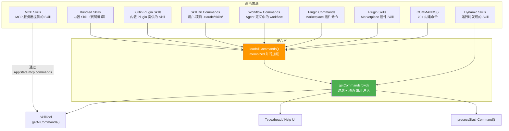

# 第 11 篇：命令系统 — 斜杠命令的聚合与扩展架构

> 本篇是《深入 Claude Code CLI 源码》系列第 11 篇。我们将深入 `commands.ts` 及其周边模块，揭示 Claude Code 如何将内建命令、用户自定义 Skill、Plugin 命令、Bundled Skill、MCP Skill 和 Workflow 命令统一到一套类型体系中，并实现懒加载、条件注册和动态发现。

## 为什么需要一个命令系统？

当你在 Claude Code REPL 里输入 `/commit`、`/compact`、`/review` 时，你用的是**斜杠命令**（Slash Command）。这些命令看起来只是快捷操作，但在 Claude Code 中，它们承载着远比表面复杂的职责：

1. **有的命令本地执行**（如 `/clear` 清空对话历史）
2. **有的命令生成 Prompt 发给模型**（如 `/commit` 生成代码审查提示词）
3. **有的命令需要渲染交互式 UI**（如 `/config` 弹出配置面板）
4. **有的命令来自用户自定义 Skill**（`.claude/skills/` 目录下的 Markdown 文件）
5. **有的命令来自第三方 Plugin**（Marketplace 安装的扩展）
6. **有的命令来自 MCP 服务器**（远程 AI 工具提供的技能）
7. **有的命令只对内部用户可见**（Anthropic 员工专用）

关键问题是：如何用**一套统一的类型体系**将这些来源完全不同、执行方式各异的命令聚合在一起？如何让 70+ 个内建命令的加载不拖慢启动速度？如何让新的命令来源（如 Workflow、Dynamic Skill）无缝接入？

本篇将回答这三个核心问题。

---

## 一、Command 类型体系：三种执行模型的统一

### 1.1 Command 联合类型

命令系统的类型基础定义在 `types/command.ts` 中。一个 `Command` 是 `CommandBase`（共享字段）与三种执行模型之一的交叉类型：

```typescript
// types/command.ts:205-206
export type Command = CommandBase &
  (PromptCommand | LocalCommand | LocalJSXCommand)
```

三种执行模型的核心差异：

| 类型 | `type` 值 | 执行方式 | 典型命令 |
|------|-----------|---------|---------|
| **Prompt 命令** | `'prompt'` | 生成 Prompt 内容发给模型 | `/commit`, `/review`, 自定义 Skill |
| **Local 命令** | `'local'` | 本地执行，返回文本结果 | `/clear`, `/compact`, `/cost` |
| **Local-JSX 命令** | `'local-jsx'` | 本地执行，渲染 React(Ink) UI | `/config`, `/model`, `/mcp` |

### 1.2 CommandBase：共享的元数据协议

`CommandBase` 定义了所有命令共享的 18 个字段（`types/command.ts:175-203`），这些字段构成了命令系统的**发现协议**——无论命令来自哪里，只要实现这个接口，就能被 typeahead 搜索、权限检查、可用性过滤等基础设施统一处理：

```typescript
// types/command.ts:175-203
export type CommandBase = {
  availability?: CommandAvailability[]  // 'claude-ai' | 'console'
  description: string
  hasUserSpecifiedDescription?: boolean
  isEnabled?: () => boolean            // 运行时条件启用
  isHidden?: boolean                   // 隐藏不在 typeahead 中显示
  name: string
  aliases?: string[]                   // 别名（如 /clear 的别名 /reset, /new）
  whenToUse?: string                   // 详细的使用场景（给模型看的）
  disableModelInvocation?: boolean     // 是否禁止模型通过 SkillTool 调用
  userInvocable?: boolean              // 是否允许用户手动 /xxx 触发
  loadedFrom?: 'commands_DEPRECATED' | 'skills' | 'plugin' | 'managed' | 'bundled' | 'mcp'
  kind?: 'workflow'                    // 区分 workflow 命令
  immediate?: boolean                  // 是否绕过排队立即执行
  userFacingName?: () => string        // 显示名（可不同于内部 name）
  // ...
}
```

设计亮点在于 `isEnabled` 和 `availability` 的分离：
- **`availability`**：静态的身份门控（你是哪种用户？claude.ai 订阅者还是 Console API 用户？）
- **`isEnabled()`**：动态的功能开关（Feature Flag 是否打开？平台是否支持？）

这种分离让 `meetsAvailabilityRequirement()` 和 `isCommandEnabled()` 各司其职，互不干扰。

### 1.3 PromptCommand：Skill 的底层抽象

Prompt 命令是三种类型中最丰富的，因为它同时要支持内建 prompt 命令和外部 Skill 扩展：

```typescript
// types/command.ts:25-57
export type PromptCommand = {
  type: 'prompt'
  progressMessage: string
  contentLength: number
  argNames?: string[]
  allowedTools?: string[]          // 该 Skill 额外允许的工具
  model?: string                   // 指定模型（覆盖默认）
  source: SettingSource | 'builtin' | 'mcp' | 'plugin' | 'bundled'
  hooks?: HooksSettings            // Skill 自带的 hooks
  skillRoot?: string               // Skill 的根目录
  context?: 'inline' | 'fork'     // 执行上下文
  agent?: string                   // fork 模式下使用的 Agent 类型
  effort?: EffortValue             // 推理 effort 级别
  paths?: string[]                 // 条件激活的文件路径 glob
  getPromptForCommand(             // 核心方法：生成 prompt
    args: string,
    context: ToolUseContext,
  ): Promise<ContentBlockParam[]>
}
```

`getPromptForCommand()` 是 Prompt 命令的核心。当用户输入 `/commit` 时，系统调用这个方法获取完整的 prompt 内容，然后作为用户消息发送给模型。这意味着**自定义 Skill 的本质就是一个 Prompt 生成器**。

### 1.4 Local 命令的懒加载

Local 和 Local-JSX 命令都使用 `load()` 方法实现懒加载：

```typescript
// types/command.ts:74-78
type LocalCommand = {
  type: 'local'
  supportsNonInteractive: boolean
  load: () => Promise<LocalCommandModule>   // 延迟加载实现模块
}

// types/command.ts:144-152
type LocalJSXCommand = {
  type: 'local-jsx'
  load: () => Promise<LocalJSXCommandModule>
}
```

看一个典型的 `local` 命令定义：

```typescript
// commands/clear/index.ts
const clear = {
  type: 'local',
  name: 'clear',
  description: 'Clear conversation history and free up context',
  aliases: ['reset', 'new'],
  supportsNonInteractive: false,
  load: () => import('./clear.js'),  // 只在实际执行时才加载
} satisfies Command
```

**关键设计**：index.ts 只包含元数据（name、description 等静态信息），真正的实现代码在 `clear.ts` 中，通过 `load()` 的动态 `import()` 延迟加载。这意味着 CLI 启动时加载 70+ 个命令的 index.ts 几乎是零成本——没有任何重量级依赖被加载。

### 1.5 命令调度：switch 三分路

当用户输入以 `/` 开头的文本时，`processSlashCommand.tsx` 中的调度逻辑根据 `command.type` 三分路执行：

```typescript
// utils/processUserInput/processSlashCommand.tsx:550-723
switch (command.type) {
  case 'local-jsx':
    // 调用 load()，获取 JSX 渲染函数
    // 通过 onDone 回调收集结果
    return new Promise<SlashCommandResult>(resolve => { ... });

  case 'local':
    // 调用 load()，获取 call() 函数
    // 直接执行并返回 text/compact/skip 结果
    const mod = await command.load();
    const result = await mod.call(args, context);
    // ...

  case 'prompt':
    // 调用 getPromptForCommand()，获取 prompt 内容
    // 作为用户消息注入对话，触发模型响应
    const promptContent = await command.getPromptForCommand(args, context);
    // ...
}
```

---

## 二、命令聚合：六大来源的统一注册

`commands.ts` 是整个命令系统的**聚合枢纽**。它将来自六个不同来源的命令合并为一个统一的列表。

### 2.1 内建命令：静态导入 + Feature Gate

文件顶部是 70+ 个内建命令的导入区。这里有两种导入方式，服务于不同目的：

**方式一：静态 import（大多数命令）**

```typescript
// commands.ts:2-58
import clear from './commands/clear/index.js'
import compact from './commands/compact/index.js'
import config from './commands/config/index.js'
// ...约 60 个类似的导入
```

需要注意的是，这些静态导入的成本**并不一致**。`local` / `local-jsx` 命令通常通过 `index.ts` + `load()` 模式实现了真正的轻量注册——index.ts 只含元数据，实现代码延迟加载。但**内建 `prompt` 命令往往没有这层 shim**：比如 `commit.ts`、`security-review.ts`、`advisor.ts` 等都是直接导入的完整实现文件，其中包含了 `executeShellCommandsInPrompt`、`parseFrontmatter` 等实际依赖。

项目对此有明确的意识——`/insights` 命令（113KB/3200 行）专门做了一个 lazy shim（`commands.ts:190-202`），通过在 `getPromptForCommand()` 内部动态 `import` 真实实现来避免启动时加载。这个特殊处理恰好说明并非所有静态导入都是零成本的。

**方式二：条件 require + feature() DCE**

```typescript
// commands.ts:62-122
const proactive =
  feature('PROACTIVE') || feature('KAIROS')
    ? require('./commands/proactive.js').default
    : null

const voiceCommand = feature('VOICE_MODE')
  ? require('./commands/voice/index.js').default
  : null

const workflowsCmd = feature('WORKFLOW_SCRIPTS')
  ? (require('./commands/workflows/index.js') as typeof import('./commands/workflows/index.js')).default
  : null
```

这些是通过编译期 `feature()` 门控的命令。在外部构建中，`feature('VOICE_MODE')` 被替换为 `false`，整个 `require()` 分支被 Dead Code Elimination 移除——连模块文件都不会打包进最终产物。

还有一种特殊的运行时条件：

```typescript
// commands.ts:48-52
const agentsPlatform =
  process.env.USER_TYPE === 'ant'
    ? require('./commands/agents-platform/index.js').default
    : null
```

`USER_TYPE === 'ant'` 是运行时检查（非编译期），区分内部版和外部版。

### 2.2 COMMANDS() 注册表

所有内建命令汇聚到一个用 `memoize` 包装的函数中：

```typescript
// commands.ts:258-346
const COMMANDS = memoize((): Command[] => [
  addDir,
  advisor,
  agents,
  branch,
  // ...约 70 个命令
  ...(proactive ? [proactive] : []),
  ...(voiceCommand ? [voiceCommand] : []),
  ...(process.env.USER_TYPE === 'ant' && !process.env.IS_DEMO
    ? INTERNAL_ONLY_COMMANDS
    : []),
])
```

**为什么用 `memoize(() => [...])`  而不是直接声明 `const COMMANDS = [...]`？** 注释说得很清楚：

> Declared as a function so that we don't run this until getCommands is called, since underlying functions read from config, which can't be read at module initialization time.

有些命令（如 `login()`）需要读取配置才能确定其状态，而配置在模块初始化阶段还没就绪。用函数延迟到首次调用时执行，避免了初始化顺序问题。

`INTERNAL_ONLY_COMMANDS` 单独收集了所有仅对内部用户可见的命令：

```typescript
// commands.ts:225-254
export const INTERNAL_ONLY_COMMANDS = [
  backfillSessions,
  breakCache,
  bughunter,
  commit,
  commitPushPr,
  // ...约 25 个内部命令
].filter(Boolean)
```

### 2.3 六源聚合：loadAllCommands

真正的魔法在 `loadAllCommands()` 中——它将六个来源的命令**并行加载**后合并：

```typescript
// commands.ts:449-469
const loadAllCommands = memoize(async (cwd: string): Promise<Command[]> => {
  const [
    { skillDirCommands, pluginSkills, bundledSkills, builtinPluginSkills },
    pluginCommands,
    workflowCommands,
  ] = await Promise.all([
    getSkills(cwd),                   // ① Skill 目录 + Plugin Skill + Bundled Skill
    getPluginCommands(),              // ② Plugin 命令
    getWorkflowCommands              // ③ Workflow 命令
      ? getWorkflowCommands(cwd)
      : Promise.resolve([]),
  ])

  return [
    ...bundledSkills,                 // 优先级最高：内建 Skill
    ...builtinPluginSkills,           // 内置 Plugin 的 Skill
    ...skillDirCommands,              // 用户/项目自定义 Skill
    ...workflowCommands,              // Workflow 命令
    ...pluginCommands,                // Plugin 命令
    ...pluginSkills,                  // Plugin 提供的 Skill
    ...COMMANDS(),                    // ④ 内建命令（优先级最低）
  ]
})
```

注意合并顺序：**扩展命令优先于内建命令**。这意味着如果用户定义了一个与内建命令同名的 Skill，用户的版本会优先被找到。



### 2.4 getCommands()：可用性过滤 + 动态注入

`loadAllCommands()` 的结果是被 memoize 的（因为加载涉及磁盘 I/O）。但最终暴露给消费者的 `getCommands()` 每次调用都会重新过滤——因为用户的身份状态可能在会话中改变（如执行 `/login` 后）：

```typescript
// commands.ts:476-517
export async function getCommands(cwd: string): Promise<Command[]> {
  const allCommands = await loadAllCommands(cwd)

  // 运行时发现的 Skill（动态目录发现 + 条件路径激活）
  const dynamicSkills = getDynamicSkills()

  const baseCommands = allCommands.filter(
    _ => meetsAvailabilityRequirement(_) && isCommandEnabled(_),
  )

  // 去重后注入动态 Skill
  const baseCommandNames = new Set(baseCommands.map(c => c.name))
  const uniqueDynamicSkills = dynamicSkills.filter(
    s => !baseCommandNames.has(s.name) &&
         meetsAvailabilityRequirement(s) &&
         isCommandEnabled(s),
  )

  // 插入位置：在第一个内建命令之前
  // 按当前 loadAllCommands 的合并顺序，这意味着动态 Skill 落在
  // bundledSkills → builtinPluginSkills → skillDirCommands → workflowCommands
  // → pluginCommands → pluginSkills 这一整段之后、COMMANDS() 之前
  const builtInNames = new Set(COMMANDS().map(c => c.name))
  const insertIndex = baseCommands.findIndex(c => builtInNames.has(c.name))
  return [
    ...baseCommands.slice(0, insertIndex),
    ...uniqueDynamicSkills,
    ...baseCommands.slice(insertIndex),
  ]
}
```

**可用性过滤**的逻辑值得注意（`commands.ts:417-443`）：

```typescript
export function meetsAvailabilityRequirement(cmd: Command): boolean {
  if (!cmd.availability) return true       // 没声明 = 所有人可用
  for (const a of cmd.availability) {
    switch (a) {
      case 'claude-ai':
        if (isClaudeAISubscriber()) return true
        break
      case 'console':
        if (!isClaudeAISubscriber() && !isUsing3PServices() &&
            isFirstPartyAnthropicBaseUrl())
          return true
        break
    }
  }
  return false
}
```

---

## 三、Skill 加载：从 Markdown 到 Command

Skill 是 Claude Code 的扩展机制——用户通过编写 Markdown 文件就能创建新的命令。`skills/loadSkillsDir.ts` 实现了这个从磁盘文件到 `Command` 对象的转换流水线。

### 3.1 Skill 的目录结构与加载层级

Skill 从五个目录层级加载，优先级从高到低：

| 层级 | 路径 | 来源标识 |
|------|------|---------|
| Managed（企业策略） | `<managed-path>/.claude/skills/` | `policySettings` |
| User（用户级） | `~/.claude/skills/` | `userSettings` |
| Project（项目级） | `<cwd>/.claude/skills/` | `projectSettings` |
| Additional（附加目录） | `<--add-dir>/.claude/skills/` | `projectSettings` |
| Legacy（兼容旧格式） | `<cwd>/.claude/commands/` | `commands_DEPRECATED` |

新格式的 Skill 严格要求**目录格式**：

```
.claude/skills/
├── my-skill/
│   └── SKILL.md       # 必须叫 SKILL.md
├── another-skill/
│   ├── SKILL.md
│   └── helper.py      # 可以附带其他文件
```

旧的 `/commands/` 目录同时支持目录格式和单文件格式（`some-command.md`），但标记为 `commands_DEPRECATED`。

### 3.2 Frontmatter 解析

每个 Skill 的 `SKILL.md` 使用 YAML Frontmatter 定义元数据：

```markdown
---
description: Generate a git commit message
allowed-tools: Bash(git add:*), Bash(git status:*), Bash(git commit:*)
model: sonnet
context: fork
agent: Bash
effort: high
when_to_use: When user wants to commit changes
argument-hint: <message>
user-invocable: true
paths: src/**/*.ts, lib/**/*.js
hooks:
  PreToolCall:
    - matcher: Bash
      hooks:
        - type: command
          command: echo "pre-hook"
---

你是一个 Git 提交助手...
```

Frontmatter 的解析分两步完成。首先 `parseSkillFrontmatterFields()`（`loadSkillsDir.ts:185-265`）解析大部分字段——description、allowed-tools、model、hooks、context、agent、effort、shell 等。但 `paths` 字段（条件激活的文件路径 glob）**不在此函数中**，而是由独立的 `parseSkillPaths()`（`loadSkillsDir.ts:159-178`）单独处理。两者的结果随后在加载流程中合并传给 `createSkillCommand()`：

```typescript
// loadSkillsDir.ts:453-469
const parsed = parseSkillFrontmatterFields(frontmatter, markdownContent, skillName)
const paths = parseSkillPaths(frontmatter)  // 独立解析

return {
  skill: createSkillCommand({
    ...parsed,       // 展开 parseSkillFrontmatterFields 的结果
    skillName,
    markdownContent,
    source,
    baseDir: skillDirPath,
    loadedFrom: 'skills',
    paths,            // 单独传入
  }),
  filePath: skillFilePath,
}
```

### 3.3 createSkillCommand()：Markdown 到 Command 的转换

```typescript
// loadSkillsDir.ts:270-401
export function createSkillCommand({ skillName, markdownContent, ... }): Command {
  return {
    type: 'prompt',
    name: skillName,
    description,
    source,
    loadedFrom,
    progressMessage: 'running',
    async getPromptForCommand(args, toolUseContext) {
      let finalContent = baseDir
        ? `Base directory for this skill: ${baseDir}\n\n${markdownContent}`
        : markdownContent

      // 1. 参数替换：${ARG1} → 用户传入的参数
      finalContent = substituteArguments(finalContent, args, true, argumentNames)

      // 2. 目录变量替换：${CLAUDE_SKILL_DIR} → 技能目录路径
      if (baseDir) {
        finalContent = finalContent.replace(/\$\{CLAUDE_SKILL_DIR\}/g, skillDir)
      }

      // 3. Session 变量替换：${CLAUDE_SESSION_ID} → 当前会话 ID
      finalContent = finalContent.replace(/\$\{CLAUDE_SESSION_ID\}/g, getSessionId())

      // 4. 内联 Shell 命令执行：!`git status` → 实际执行结果
      //    MCP Skill 跳过此步（安全考虑）
      if (loadedFrom !== 'mcp') {
        finalContent = await executeShellCommandsInPrompt(finalContent, ...)
      }

      return [{ type: 'text', text: finalContent }]
    },
  }
}
```

这里有一个重要的安全决策：**MCP Skill 不执行内联 Shell 命令**。MCP Skill 来自远程不可信来源，其 Markdown 内容中的 `` !`...` `` 语法如果被执行，等于远程代码执行。

### 3.4 去重机制

由于 Skill 从多个目录层级加载，可能通过 symlink 或重叠的父目录引用同一个文件。`getSkillDirCommands()` 使用 `realpath()` 解析符号链接，基于**规范路径**去重：

```typescript
// loadSkillsDir.ts:728-763
const fileIds = await Promise.all(
  allSkillsWithPaths.map(({ filePath }) => getFileIdentity(filePath))
)

const seenFileIds = new Map<string, SettingSource | ...>()
for (let i = 0; i < allSkillsWithPaths.length; i++) {
  const fileId = fileIds[i]
  if (fileId && seenFileIds.has(fileId)) {
    logForDebugging(`Skipping duplicate skill '${skill.name}' ...`)
    continue
  }
  seenFileIds.set(fileId, skill.source)
  deduplicatedSkills.push(skill)
}
```

### 3.5 条件 Skill：按文件路径激活

Skill 可以声明 `paths` frontmatter，表示只在模型操作匹配的文件时才激活：

```typescript
// loadSkillsDir.ts:997-1058
export function activateConditionalSkillsForPaths(
  filePaths: string[], cwd: string
): string[] {
  for (const [name, skill] of conditionalSkills) {
    const skillIgnore = ignore().add(skill.paths)
    for (const filePath of filePaths) {
      const relativePath = relative(cwd, filePath)
      if (skillIgnore.ignores(relativePath)) {
        // 从"待激活"移到"已激活"
        dynamicSkills.set(name, skill)
        conditionalSkills.delete(name)
        activatedConditionalSkillNames.add(name)
        break
      }
    }
  }
  skillsLoaded.emit()  // 通知缓存清理
}
```

使用 `ignore` 库（与 `.gitignore` 相同的 glob 匹配），使得 `paths: src/**/*.ts` 这样的模式能精确匹配文件路径。

---

## 四、其他命令来源

### 4.1 Bundled Skills：编译进二进制的技能

Bundled Skills 是通过代码注册的内建 Skill（`skills/bundledSkills.ts`）。与文件系统加载的 Skill 不同，它们在模块初始化时同步注册：

```typescript
// skills/bundledSkills.ts:53-100
export function registerBundledSkill(definition: BundledSkillDefinition): void {
  const command: Command = {
    type: 'prompt',
    name: definition.name,
    source: 'bundled',
    loadedFrom: 'bundled',
    // ...
  }
  bundledSkills.push(command)
}
```

Bundled Skill 还支持 `files` 字段——附带的参考文件会在首次调用时懒写入磁盘（临时目录），让模型可以用 Read/Grep 工具访问它们。写入过程使用 `O_NOFOLLOW | O_EXCL` 标志防止 symlink 攻击（`bundledSkills.ts:176-193`）。

### 4.2 Plugin Commands：第三方扩展

Plugin 通过 Marketplace 安装，其命令加载逻辑在 `utils/plugins/loadPluginCommands.ts` 中。Plugin 命令与 Skill 共享相同的 Frontmatter 协议，但有额外的变量替换：

```typescript
// utils/plugins/loadPluginCommands.ts:340-341
// ${CLAUDE_PLUGIN_ROOT} → 插件根目录
// ${CLAUDE_PLUGIN_DATA} → 插件数据目录
finalContent = substitutePluginVariables(finalContent, { path: pluginPath, source: sourceName })
```

Plugin 命令的名称采用 `pluginName + 路径命名空间 + 基名` 的规则，由 `getCommandNameFromFile()`（`loadPluginCommands.ts:60-97`）生成。对于普通 Markdown 文件，基名取自文件名（去掉 `.md`）；对于 SKILL.md 格式，基名取自其父目录名。如果命令不在根目录而是嵌套在子目录中，目录层级会保留为 `:` 分隔的命名空间：

```
plugin/commands/foo.md           → pluginName:foo
plugin/commands/sub/bar.md       → pluginName:sub:bar
plugin/commands/my-skill/SKILL.md → pluginName:my-skill
plugin/commands/ns/sk/SKILL.md   → pluginName:ns:sk
```

### 4.3 MCP Skills：远程服务器技能

MCP Skill 通过一个巧妙的循环依赖打破机制接入。由于 `loadSkillsDir.ts` 依赖链很长，MCP 模块如果直接导入它会造成循环依赖。解决方案是一个**写一次的注册表**：

```typescript
// skills/mcpSkillBuilders.ts
let builders: MCPSkillBuilders | null = null

export function registerMCPSkillBuilders(b: MCPSkillBuilders): void {
  builders = b
}

export function getMCPSkillBuilders(): MCPSkillBuilders {
  if (!builders) throw new Error('MCP skill builders not registered ...')
  return builders
}
```

`loadSkillsDir.ts` 在模块初始化时注册自己的 `createSkillCommand` 和 `parseSkillFrontmatterFields`，MCP 模块通过 `getMCPSkillBuilders()` 获取这些函数，避免了直接的 import 依赖。

### 4.4 Workflow Commands

Workflow 命令通过 `feature('WORKFLOW_SCRIPTS')` 门控，由 `WorkflowTool/createWorkflowCommand.js` 模块生成。在 `loadAllCommands()` 中，命令来源函数本身也通过条件 `require` 加载：

```typescript
// commands.ts:401-406
const getWorkflowCommands = feature('WORKFLOW_SCRIPTS')
  ? (require('./tools/WorkflowTool/createWorkflowCommand.js') as typeof import(...))
      .getWorkflowCommands
  : null
```

Workflow 命令在 `CommandBase` 中通过 `kind: 'workflow'` 标记，UI 层据此在 typeahead 中显示 `(workflow)` 徽章（见 `formatDescriptionWithSource()` 中的 `cmd.kind === 'workflow'` 分支，`commands.ts:733-735`）。

### 4.5 动态 Skill 发现

这是最有趣的来源之一。当模型在对话过程中读取或编辑文件时，系统会自动检查文件路径上方是否存在 `.claude/skills/` 目录：

```typescript
// loadSkillsDir.ts:861-915
export async function discoverSkillDirsForPaths(
  filePaths: string[], cwd: string
): Promise<string[]> {
  for (const filePath of filePaths) {
    let currentDir = dirname(filePath)
    // 从文件所在目录向上遍历到 cwd（不含 cwd 本身）
    while (currentDir.startsWith(resolvedCwd + pathSep)) {
      const skillDir = join(currentDir, '.claude', 'skills')
      if (!dynamicSkillDirs.has(skillDir)) {
        dynamicSkillDirs.add(skillDir)
        // 检查目录是否存在 + 是否被 gitignore
        if (await isPathGitignored(currentDir, resolvedCwd)) continue
        newDirs.push(skillDir)
      }
      currentDir = dirname(currentDir)
    }
  }
}
```

这实现了一个**渐进式发现**模型：项目根目录的 Skill 在启动时加载，而嵌套在子目录中的 Skill 只在模型接触到那个区域时才被发现。

---

## 五、命令如何被模型调用：SkillTool 桥接

用户可以通过 `/xxx` 手动触发命令，但模型也可以自主调用——通过 `SkillTool`（`tools/SkillTool/SkillTool.ts`）。

这里需要区分**两个不同的命令集合**：

1. **展示列表**（`getSkillToolCommands()`）——决定模型在 System Prompt 中"看到"哪些技能
2. **执行集合**（`SkillTool.getAllCommands()`）——决定模型实际能调用哪些技能

### 展示列表：getSkillToolCommands()

SkillTool 在 System Prompt 中注入一份可用 Skill 的列表，让模型知道有哪些技能可以调用。列表的生成考虑了 token 预算控制：

```typescript
// tools/SkillTool/prompt.ts:70-171
export function formatCommandsWithinBudget(
  commands: Command[], contextWindowTokens?: number
): string {
  const budget = getCharBudget(contextWindowTokens)  // 默认 context 的 1%

  // 首先尝试完整描述
  // 如果超预算，按比例截断非 bundled 命令的描述
  // 极端情况下，非 bundled 命令只显示名称
}
```

哪些命令会出现在展示列表中？过滤逻辑是：

```typescript
// commands.ts:563-581
export const getSkillToolCommands = memoize(async (cwd: string): Promise<Command[]> => {
  const allCommands = await getCommands(cwd)
  return allCommands.filter(cmd =>
    cmd.type === 'prompt' &&          // 只有 prompt 类型
    !cmd.disableModelInvocation &&    // 没有禁止模型调用
    cmd.source !== 'builtin' &&       // 不是内建命令（/review 等不需要通过 SkillTool）
    (cmd.loadedFrom === 'bundled' ||  // 来自这些来源之一
     cmd.loadedFrom === 'skills' ||
     cmd.loadedFrom === 'commands_DEPRECATED' ||
     cmd.hasUserSpecifiedDescription ||
     cmd.whenToUse)
  )
})
```

### 执行集合：SkillTool.getAllCommands()

但当模型实际调用 SkillTool 时，可执行的命令集合比展示列表**更大**。`getAllCommands()` 会额外并入 MCP Skills——来自 `AppState.mcp.commands` 中 `loadedFrom === 'mcp'` 的命令：

```typescript
// tools/SkillTool/SkillTool.ts:81-94
async function getAllCommands(context: ToolUseContext): Promise<Command[]> {
  const mcpSkills = context.getAppState().mcp.commands.filter(
    cmd => cmd.type === 'prompt' && cmd.loadedFrom === 'mcp',
  )
  if (mcpSkills.length === 0) return getCommands(getProjectRoot())
  const localCommands = await getCommands(getProjectRoot())
  return uniqBy([...localCommands, ...mcpSkills], 'name')
}
```

这个分离设计有安全考量：MCP Skills 通过 `AppState` 传递而非通过 `getCommands()` 返回，保证了 `getCommands()` 只包含本地/受信来源的命令。MCP Skills 在执行集合中可达，但在改进之前（代码注释提到），模型曾经可以通过猜测 `mcp__server__prompt` 名称来调用未明确标记为 skill 的 MCP prompt——现在只有 `loadedFrom === 'mcp'` 的才允许。

---

## 六、缓存管理与失效

命令系统大量使用 `memoize` 缓存加载结果，但需要在多种场景下正确失效：

```typescript
// commands.ts:523-539
export function clearCommandMemoizationCaches(): void {
  loadAllCommands.cache?.clear?.()
  getSkillToolCommands.cache?.clear?.()
  getSlashCommandToolSkills.cache?.clear?.()
  clearSkillIndexCache?.()  // 外层搜索索引也要清
}

export function clearCommandsCache(): void {
  clearCommandMemoizationCaches()
  clearPluginCommandCache()     // Plugin 缓存
  clearPluginSkillsCache()      // Plugin Skill 缓存
  clearSkillCaches()            // Skill 目录缓存
}
```

动态 Skill 发现后通过 Signal 机制通知缓存清理，避免了循环依赖：

```typescript
// loadSkillsDir.ts:832-851
const skillsLoaded = createSignal()

export function onDynamicSkillsLoaded(callback: () => void): () => void {
  return skillsLoaded.subscribe(() => {
    try { callback() } catch (error) { logError(error) }
  })
}
```

---

## 七、特殊命令模式

### 7.1 "Insights" 命令的懒加载 Shim

`/insights` 命令的实现文件有 113KB/3200 行。为了避免在 `commands.ts` 模块初始化时加载这个重量级模块，使用了一个 shim 模式：

```typescript
// commands.ts:190-202
const usageReport: Command = {
  type: 'prompt',
  name: 'insights',
  description: 'Generate a report analyzing your Claude Code sessions',
  contentLength: 0,
  progressMessage: 'analyzing your sessions',
  source: 'builtin',
  async getPromptForCommand(args, context) {
    // 真正的实现只在调用时才加载
    const real = (await import('./commands/insights.js')).default
    if (real.type !== 'prompt') throw new Error('unreachable')
    return real.getPromptForCommand(args, context)
  },
}
```

### 7.2 "迁移到 Plugin" 的过渡命令

当内建命令被迁移到 Plugin 时，使用 `createMovedToPluginCommand()` 创建一个过渡命令：

```typescript
// commands/createMovedToPluginCommand.ts:29-65
export function createMovedToPluginCommand({ name, pluginName, ... }): Command {
  return {
    type: 'prompt',
    name,
    async getPromptForCommand(args, context) {
      if (process.env.USER_TYPE === 'ant') {
        // 内部用户：提示安装 plugin
        return [{ type: 'text', text: `This command has been moved to a plugin...` }]
      }
      // 外部用户（Marketplace 未公开时）：使用回退 prompt
      return getPromptWhileMarketplaceIsPrivate(args, context)
    },
  }
}
```

### 7.3 安全命令集：Remote 和 Bridge

两个 `Set` 定义了在特殊模式下哪些命令是安全的：

```typescript
// commands.ts:619-676
export const REMOTE_SAFE_COMMANDS: Set<Command> = new Set([
  session, exit, clear, help, theme, ...  // 只影响本地 TUI 状态的命令
])

export const BRIDGE_SAFE_COMMANDS: Set<Command> = new Set([
  compact, clear, cost, summary, ...      // 通过移动端远程控制时安全的命令
])
```

---

## 八、可迁移的设计模式

### 模式 1：联合类型 + 懒加载的命令注册

用 TypeScript 联合类型定义多种执行模型（`PromptCommand | LocalCommand | LocalJSXCommand`），对需要重量级依赖的命令用 `load()` 方法实现懒加载。`local` / `local-jsx` 命令的 index.ts 只包含轻量元数据，`prompt` 命令中特别重的（如 `/insights` 的 113KB 实现）也通过 shim 延迟加载。

**适用场景**：任何有大量命令/插件/扩展的系统。对每个命令评估其导入成本，对重量级实现使用懒加载 shim。

### 模式 2：多源聚合 + 优先级排序

将来自不同来源的同构对象（都实现 `Command` 接口）合并到一个列表中，通过合并顺序控制优先级。`memoize` 缓存加载结果，但过滤检查每次重新执行以响应状态变化。

**适用场景**：多层配置合并、多插件系统、任何需要从多个来源收集同类对象并允许覆盖的架构。

### 模式 3：条件激活 + 渐进发现

不在启动时加载所有可能的扩展，而是在运行过程中根据用户行为（如文件操作）逐步发现。通过 Signal/Event 机制通知依赖方清理缓存。

**适用场景**：大型 monorepo 中的子模块配置发现、IDE 插件的按需激活、任何扩展数量可能很大但每次会话只用到少量的系统。

---

## 下一篇预告

[第 12 篇：Agent 系统 — 从单体到多智能体协作](./12-Agent系统.md)

我们将深入 `AgentTool` 和 `runAgent.ts`，看 Claude Code 如何实现多 Agent 协作：Agent 的定义来源、`createSubagentContext()` 如何实现上下文隔离、内置 Agent 类型（Explore、Plan、Verification）的设计差异，以及 Agent 的完整生命周期。

---

*本文基于 Claude Code CLI 开源源码分析撰写。*
