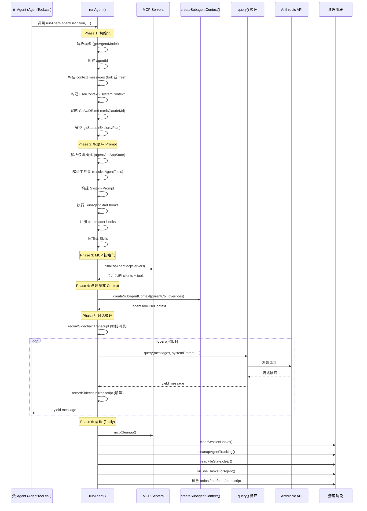

# 第 12 篇：Agent 系统 — 从单体到多智能体协作

> 本篇是《深入 Claude Code CLI 源码》系列的第 12 篇。我们将深入剖析 Agent 子系统的完整架构：从 Agent 定义的数据结构与加载机制，到 `runAgent()` 的完整生命周期，再到 `createSubagentContext()` 如何实现 context 隔离与选择性共享。

## 为什么需要多 Agent？

当你让 Claude Code 帮你"重构整个模块的测试"时，一个单体 Agent 会怎么做？它会搜索文件、阅读代码、编写测试、运行验证——所有步骤串行执行，上下文窗口迅速膨胀。更糟糕的是，搜索过程中产生的大量中间输出（grep 结果、文件内容）会永久占据上下文，挤压真正有价值的信息空间。

Claude Code 的解决方案是**多 Agent 协作**：主 Agent 可以按需生成子 Agent，每个子 Agent 拥有独立的上下文窗口和对话循环，完成任务后只返回精炼的结果。这就像一个团队 lead 把任务分派给专人，每个人独立工作后汇报结论。

这个设计解决了三个核心问题：
1. **上下文污染**：搜索类任务的海量中间输出不会进入主 Agent 的上下文
2. **专业化分工**：不同类型的子 Agent 可以有不同的工具集、权限和 System Prompt
3. **并行执行**：多个子 Agent 可以同时在后台运行，互不干扰

本篇将回答以下问题：
- Agent 定义的数据结构长什么样？如何从多种来源加载？
- `runAgent()` 的完整生命周期经历哪些阶段？
- 子 Agent 的 context 隔离是怎样实现的？哪些状态被共享，哪些被隔离？
- 内置 Agent（Explore、Plan、Verification）分别解决什么问题？

---

## 一、AgentDefinition：Agent 的数据蓝图

### 1.1 三种 Agent 类型

Claude Code 的 Agent 系统有一个清晰的类型体系，定义在 `tools/AgentTool/loadAgentsDir.ts` 中：

```typescript
// tools/AgentTool/loadAgentsDir.ts:136-165
export type BuiltInAgentDefinition = BaseAgentDefinition & {
  source: 'built-in'
  baseDir: 'built-in'
  callback?: () => void
  getSystemPrompt: (params: {
    toolUseContext: Pick<ToolUseContext, 'options'>
  }) => string
}

export type CustomAgentDefinition = BaseAgentDefinition & {
  getSystemPrompt: () => string
  source: SettingSource
  filename?: string
  baseDir?: string
}

export type PluginAgentDefinition = BaseAgentDefinition & {
  getSystemPrompt: () => string
  source: 'plugin'
  filename?: string
  plugin: string
}

export type AgentDefinition =
  | BuiltInAgentDefinition
  | CustomAgentDefinition
  | PluginAgentDefinition
```

三种类型对应三种来源：
- **Built-in**：代码中硬编码的内置 Agent（Explore、Plan、general-purpose 等）
- **Custom**：用户通过 `.claude/agents/*.md` 文件定义的自定义 Agent
- **Plugin**：由插件提供的 Agent

一个关键的设计细节：`getSystemPrompt` 的签名在三种类型间**并不一致**。Built-in Agent 接受 `toolUseContext` 参数（可以根据当前可用工具动态调整 prompt），而 Custom 和 Plugin Agent 的 prompt 是通过闭包捕获的静态内容。

### 1.2 BaseAgentDefinition：核心字段解析

`BaseAgentDefinition` 包含了 Agent 可配置的主要维度（`loadAgentsDir.ts:106-133`）：

```typescript
// tools/AgentTool/loadAgentsDir.ts:106-133
export type BaseAgentDefinition = {
  agentType: string            // Agent 的唯一标识名
  whenToUse: string            // 描述何时使用此 Agent（展示给模型选择）
  tools?: string[]             // 允许使用的工具列表，undefined 或 ['*'] 表示全部
  disallowedTools?: string[]   // 明确禁止的工具
  skills?: string[]            // 预加载的 Skill 名称
  mcpServers?: AgentMcpServerSpec[]  // 专属 MCP 服务器
  hooks?: HooksSettings        // Session 级 Hook 注册
  color?: AgentColorName       // UI 中的颜色标识
  model?: string               // 使用的模型（'inherit' 表示继承父级）
  effort?: EffortValue          // 推理努力程度
  permissionMode?: PermissionMode  // 权限模式覆盖
  maxTurns?: number            // 最大对话轮次
  background?: boolean         // 是否总是作为后台任务运行
  initialPrompt?: string       // 首轮附加提示
  memory?: AgentMemoryScope    // 持久化记忆范围（user/project/local）
  isolation?: 'worktree' | 'remote'  // 隔离模式
  omitClaudeMd?: boolean       // 是否省略 CLAUDE.md（为只读 Agent 节省 token）
  criticalSystemReminder_EXPERIMENTAL?: string  // 每轮 user turn 重注入的关键约束
  requiredMcpServers?: string[]  // 必须可用的 MCP 服务器模式（不满足则 Agent 不可用）
  pendingSnapshotUpdate?: { snapshotTimestamp: string }  // 记忆快照更新待处理
}
```

其中几个字段值得特别关注：
- `criticalSystemReminder_EXPERIMENTAL`——Verification Agent 用它在每个 user turn 重复注入"不能修改文件"的硬约束，防止模型在长对话中遗忘
- `requiredMcpServers`——通过 `hasRequiredMcpServers()` 检查，模式匹配（大小写不敏感的 `includes`）当前可用的 MCP 服务器名，不满足则 Agent 从活跃列表中过滤掉

注意 `omitClaudeMd` 字段——这是一个典型的大规模运营优化。源码注释写道：

> Read-only agents (Explore, Plan) don't need commit/PR/lint guidelines from CLAUDE.md. Saves ~5-15 Gtok/week across 34M+ Explore spawns.

每周省 5-15 Giga token，这就是产品级工程在大规模场景下的优化思维。

### 1.3 Agent 定义的多源加载

Agent 的加载由 `getAgentDefinitionsWithOverrides()` 统一编排，它是一个 `memoize` 包装的异步函数：

```typescript
// tools/AgentTool/loadAgentsDir.ts:296-393
export const getAgentDefinitionsWithOverrides = memoize(
  async (cwd: string): Promise<AgentDefinitionsResult> => {
    // 简化模式：只返回内置 Agent
    if (isEnvTruthy(process.env.CLAUDE_CODE_SIMPLE)) {
      return { activeAgents: getBuiltInAgents(), allAgents: getBuiltInAgents() }
    }

    // 1. 从 .claude/agents/ 目录加载 Markdown 文件
    const markdownFiles = await loadMarkdownFilesForSubdir('agents', cwd)
    const customAgents = markdownFiles
      .map(({ filePath, baseDir, frontmatter, content, source }) =>
        parseAgentFromMarkdown(filePath, baseDir, frontmatter, content, source)
      )
      .filter(agent => agent !== null)

    // 2. 加载插件 Agent（memoized，独立于 cwd）
    //    当 AGENT_MEMORY_SNAPSHOT feature 且 auto-memory 开启时，
    //    会与记忆快照初始化并发执行
    const pluginAgents = await loadPluginAgents()

    // 3. 获取内置 Agent
    const builtInAgents = getBuiltInAgents()

    // 4. 合并所有来源，按优先级去重
    const allAgentsList = [...builtInAgents, ...pluginAgents, ...customAgents]
    const activeAgents = getActiveAgentsFromList(allAgentsList)

    return { activeAgents, allAgents: allAgentsList }
  }
)
```

`getActiveAgentsFromList()` 的去重策略值得关注——它按 `[built-in, plugin, user, project, flag, managed]` 的顺序遍历，后面的**覆盖**前面的同名 Agent：

```typescript
// tools/AgentTool/loadAgentsDir.ts:193-221
export function getActiveAgentsFromList(allAgents: AgentDefinition[]): AgentDefinition[] {
  const agentGroups = [
    builtInAgents, pluginAgents, userAgents,
    projectAgents, flagAgents, managedAgents,
  ]
  const agentMap = new Map<string, AgentDefinition>()
  for (const agents of agentGroups) {
    for (const agent of agents) {
      agentMap.set(agent.agentType, agent)
    }
  }
  return Array.from(agentMap.values())
}
```

这意味着 managed（企业级管理）的 Agent 定义拥有最高优先级，可以覆盖所有其他来源的同名 Agent。

### 1.4 Markdown Frontmatter：用户自定义 Agent 的格式

用户在 `.claude/agents/` 目录下创建 Markdown 文件来定义 Agent。`parseAgentFromMarkdown()` 解析 frontmatter 中的配置字段，Markdown body 作为 System Prompt：

```markdown
---
name: my-researcher
description: "Deep codebase researcher for complex architectural questions"
tools:
  - FileRead
  - Glob
  - Grep
  - Bash
model: inherit
permissionMode: plan
maxTurns: 30
memory: project
---

You are a deep research specialist. Your job is to thoroughly
investigate complex codebase questions...
```

`parseAgentFromMarkdown()`（`loadAgentsDir.ts:541-755`）对每个 frontmatter 字段都做了严格的验证和降级处理——无效值不会导致整个 Agent 加载失败，而是记录警告并忽略该字段。

---

## 二、runAgent()：子 Agent 的完整生命周期

`runAgent()` 是 Agent 系统的核心引擎，定义在 `tools/AgentTool/runAgent.ts:248-860`。它是一个 `AsyncGenerator`，逐步 yield 出子 Agent 产生的消息。

### 2.1 生命周期时序图



### 2.2 Phase 1-2：初始化与准备

`runAgent()` 的前半段是一系列精细的准备工作。

**模型解析**——Agent 使用的模型经过多级 fallback：

```typescript
// tools/AgentTool/runAgent.ts:340-345
const resolvedAgentModel = getAgentModel(
  agentDefinition.model,      // Agent 自己定义的模型
  toolUseContext.options.mainLoopModel,  // 父级主循环模型
  model,                       // 调用时传入的覆盖
  permissionMode,              // 权限模式影响模型选择
)
```

**消息构建**——子 Agent 的初始消息有两种模式：
1. **Fork 模式**：`forkContextMessages` 不为空，子 Agent 继承父 Agent 的对话历史（需过滤不完整的 tool_use）
2. **Fresh 模式**：从零开始，只有 `promptMessages`

```typescript
// tools/AgentTool/runAgent.ts:370-378
const contextMessages: Message[] = forkContextMessages
  ? filterIncompleteToolCalls(forkContextMessages)
  : []
const initialMessages: Message[] = [...contextMessages, ...promptMessages]

// Fork 模式复用父级的文件状态缓存，Fresh 模式创建新的
const agentReadFileState = forkContextMessages !== undefined
  ? cloneFileStateCache(toolUseContext.readFileState)
  : createFileStateCacheWithSizeLimit(READ_FILE_STATE_CACHE_SIZE)
```

**Token 节省优化**——对只读 Agent 做了两个有针对性的 context 裁剪：

```typescript
// tools/AgentTool/runAgent.ts:390-410
// 1. 省略 CLAUDE.md（Explore/Plan 不需要 commit/PR/lint 规则）
const shouldOmitClaudeMd = agentDefinition.omitClaudeMd
  && !override?.userContext
  && getFeatureValue_CACHED_MAY_BE_STALE('tengu_slim_subagent_claudemd', true)

// 2. 省略 gitStatus（Explore/Plan 可自行运行 git status）
const resolvedSystemContext =
  agentDefinition.agentType === 'Explore' || agentDefinition.agentType === 'Plan'
    ? systemContextNoGit
    : baseSystemContext
```

**权限模式覆盖**——`agentGetAppState` 是一个精心构造的闭包，它在每次被调用时动态返回包含覆盖权限的 AppState：

```typescript
// tools/AgentTool/runAgent.ts:415-498
const agentGetAppState = () => {
  const state = toolUseContext.getAppState()
  let toolPermissionContext = state.toolPermissionContext

  // 覆盖权限模式（但 bypassPermissions/acceptEdits/auto 优先级更高）
  if (agentPermissionMode && state.toolPermissionContext.mode !== 'bypassPermissions' ...) {
    toolPermissionContext = { ...toolPermissionContext, mode: agentPermissionMode }
  }

  // 异步 Agent 自动拒绝权限弹窗
  if (shouldAvoidPrompts) {
    toolPermissionContext = {
      ...toolPermissionContext,
      shouldAvoidPermissionPrompts: true,
    }
  }

  // 作用域隔离：提供 allowedTools 时替换 session 级规则
  if (allowedTools !== undefined) {
    toolPermissionContext = {
      ...toolPermissionContext,
      alwaysAllowRules: {
        cliArg: state.toolPermissionContext.alwaysAllowRules.cliArg, // 保留 SDK 级权限
        session: [...allowedTools],  // 替换 session 级权限
      },
    }
  }

  return { ...state, toolPermissionContext, effortValue }
}
```

注意 `cliArg` 规则的保留——这确保了 SDK 通过 `--allowedTools` 传入的权限在子 Agent 中仍然有效，而父 Agent 的 session 级权限不会泄漏给子 Agent。

### 2.3 Phase 3：Agent 专属 MCP 服务器

Agent 可以通过 frontmatter 定义自己的 MCP 服务器，这些服务器是**对父级的增量扩展**：

```typescript
// tools/AgentTool/runAgent.ts:95-218
async function initializeAgentMcpServers(
  agentDefinition: AgentDefinition,
  parentClients: MCPServerConnection[],
) {
  for (const spec of agentDefinition.mcpServers) {
    if (typeof spec === 'string') {
      // 按名称引用已有的 MCP 服务器——使用 memoized 连接，与父级共享
      config = getMcpConfigByName(spec)
    } else {
      // 内联定义——Agent 专属服务器，需要在 Agent 结束时清理
      isNewlyCreated = true
    }
    const client = await connectToServer(name, config)
    agentClients.push(client)
  }

  // cleanup 只清理新创建的，不清理引用的共享连接
  const cleanup = async () => {
    for (const client of newlyCreatedClients) {
      await client.cleanup()
    }
  }

  // 返回合并后的 clients 和 tools
  return {
    clients: [...parentClients, ...agentClients],
    tools: agentTools,
    cleanup,
  }
}
```

这个设计有一个精妙之处：按名称引用的 MCP 服务器由于 `connectToServer` 是 memoized 的，不会重复连接；而 cleanup 只关闭 Agent 自己内联定义的服务器，不会影响父级共享的连接。

### 2.4 Phase 4：Context 隔离的核心

`createSubagentContext()` 定义在 `utils/forkedAgent.ts:345-462`，是整个 Agent 系统中最关键的函数之一。它为子 Agent 创建一个**默认全隔离、显式 opt-in 共享**的 `ToolUseContext`：

```typescript
// utils/forkedAgent.ts:345-462
export function createSubagentContext(
  parentContext: ToolUseContext,
  overrides?: SubagentContextOverrides,
): ToolUseContext {
  // AbortController：显式覆盖 > 共享父级 > 新建子级（关联父级）
  const abortController = overrides?.abortController
    ?? (overrides?.shareAbortController
      ? parentContext.abortController
      : createChildAbortController(parentContext.abortController))

  // getAppState：有覆盖就用覆盖；共享 abortController 说明是交互式 Agent，
  // 直接继承父级；否则包装一层 shouldAvoidPermissionPrompts: true
  const getAppState = overrides?.getAppState
    ? overrides.getAppState
    : overrides?.shareAbortController
      ? parentContext.getAppState
      : () => {
          const state = parentContext.getAppState()
          if (state.toolPermissionContext.shouldAvoidPermissionPrompts) return state
          return { ...state, toolPermissionContext: {
            ...state.toolPermissionContext, shouldAvoidPermissionPrompts: true,
          }}
        }

  return {
    // ===== 隔离的可变状态 =====
    readFileState: cloneFileStateCache(
      overrides?.readFileState ?? parentContext.readFileState
    ),
    nestedMemoryAttachmentTriggers: new Set<string>(),
    loadedNestedMemoryPaths: new Set<string>(),
    dynamicSkillDirTriggers: new Set<string>(),
    discoveredSkillNames: new Set<string>(),
    toolDecisions: undefined,
    // 克隆而非新建——Fork 子 Agent 需要对父级 tool_use_id 做相同的替换决策
    contentReplacementState: overrides?.contentReplacementState
      ?? (parentContext.contentReplacementState
        ? cloneContentReplacementState(parentContext.contentReplacementState)
        : undefined),

    // ===== AbortController 与 AppState =====
    abortController,
    getAppState,
    setAppState: overrides?.shareSetAppState
      ? parentContext.setAppState : () => {},
    // 任务注册必须总是到达根 Store（即使 setAppState 是 no-op）
    setAppStateForTasks:
      parentContext.setAppStateForTasks ?? parentContext.setAppState,
    // 异步子 Agent 的 setAppState 是 no-op，需要本地 denial 追踪
    // 否则拒绝计数器不会在重试间累积
    localDenialTracking: overrides?.shareSetAppState
      ? parentContext.localDenialTracking
      : createDenialTrackingState(),

    // ===== 按需共享的度量回调 =====
    setInProgressToolUseIDs: () => {},
    setResponseLength: overrides?.shareSetResponseLength
      ? parentContext.setResponseLength : () => {},
    pushApiMetricsEntry: overrides?.shareSetResponseLength
      ? parentContext.pushApiMetricsEntry : undefined,
    updateFileHistoryState: () => {},
    // Attribution 是函数式的（prev => next），并发调用通过 React state queue 组合，
    // 即使 setAppState 被 stub 也安全
    updateAttributionState: parentContext.updateAttributionState,

    // ===== 子 Agent 不需要的 UI 回调 =====
    addNotification: undefined,
    setToolJSX: undefined,
    setStreamMode: undefined,
    setSDKStatus: undefined,
    openMessageSelector: undefined,

    // ===== 继承或覆盖的属性 =====
    options: overrides?.options ?? parentContext.options,
    messages: overrides?.messages ?? parentContext.messages,
    agentId: overrides?.agentId ?? createAgentId(),
    agentType: overrides?.agentType,
    fileReadingLimits: parentContext.fileReadingLimits,
    userModified: parentContext.userModified,
    criticalSystemReminder_EXPERIMENTAL:
      overrides?.criticalSystemReminder_EXPERIMENTAL,
    requireCanUseTool: overrides?.requireCanUseTool,

    // ===== 子 Agent 自己的追踪链 =====
    queryTracking: {
      chainId: randomUUID(),
      depth: (parentContext.queryTracking?.depth ?? -1) + 1,
    },
  }
}
```

这段代码体现了一个核心设计原则：**默认隔离，显式共享**。下表总结了各类状态的隔离策略：

| 状态类别 | 隔离方式 | 原因 |
|---------|---------|------|
| `readFileState` | 克隆（深拷贝） | 子 Agent 的文件读取不应污染父级缓存 |
| `getAppState` | 条件包装 | 非交互式 Agent 自动注入 `shouldAvoidPermissionPrompts: true` |
| `setAppState` | 默认 no-op，opt-in 共享 | 同步子 Agent 需要更新共享状态，异步不需要 |
| `setAppStateForTasks` | 总是共享 | 后台 bash 任务的注册/清理必须到达根 Store |
| `localDenialTracking` | 隔离时新建 | 异步 Agent 的 denial 计数器需在重试间本地累积 |
| `abortController` | 新建子级（关联父级） | 父级 abort 传播到子级，但子级 abort 不影响父级 |
| `contentReplacementState` | 克隆 | Fork 子 Agent 需要做一致的替换决策以命中 prompt cache |
| `pushApiMetricsEntry` | 与 `setResponseLength` 联动 | 共享度量的子 Agent 需要向父级汇报 API 指标 |
| `updateAttributionState` | 总是共享 | 函数式回调，并发安全，不受 setAppState 影响 |
| `queryTracking` | 新建（depth+1） | 每个子 Agent 有独立的调用链追踪 |
| UI 回调（5 个） | undefined | 子 Agent 不能操作父级 UI |

特别注意 `setAppStateForTasks` 的注释：

> Task registration/kill must always reach the root store, even when setAppState is a no-op — otherwise async agents' background bash tasks are never registered and never killed (PPID=1 zombie).

这是一个实际遭遇的 bug 教训：如果后台 Agent 的 bash 任务没有被注册到根 Store，当 Agent 结束后这些任务会变成孤儿进程（PPID=1 zombie）。

### 2.5 Phase 5：对话循环

准备工作就绪后，`runAgent()` 进入核心的 `query()` 循环：

```typescript
// tools/AgentTool/runAgent.ts:747-806
try {
  for await (const message of query({
    messages: initialMessages,
    systemPrompt: agentSystemPrompt,
    userContext: resolvedUserContext,
    systemContext: resolvedSystemContext,
    canUseTool,
    toolUseContext: agentToolUseContext,
    querySource,
    maxTurns: maxTurns ?? agentDefinition.maxTurns,
  })) {
    onQueryProgress?.()

    // 转发 API 请求指标给父级（TTFT/OTPS 更新）
    if (message.type === 'stream_event' && message.event.type === 'message_start') {
      toolUseContext.pushApiMetricsEntry?.(message.ttftMs)
      continue
    }

    // 处理 max_turns_reached 信号
    if (message.type === 'attachment' && message.attachment.type === 'max_turns_reached') {
      break
    }

    // 记录到 sidechain 并 yield 给父级
    if (isRecordableMessage(message)) {
      await recordSidechainTranscript([message], agentId, lastRecordedUuid)
      yield message
    }
  }
}
```

每条消息都被增量记录到 sidechain transcript（磁盘），这使得 Agent 可以在崩溃后恢复执行（`resumeAgent.ts`）。

### 2.6 Phase 6：清理——不留任何痕迹

`finally` 块的清理工作是防止资源泄漏的最后防线：

```typescript
// tools/AgentTool/runAgent.ts:816-858
finally {
  await mcpCleanup()                              // 关闭 Agent 专属 MCP 服务器
  if (agentDefinition.hooks) {                     // 仅在注册过 hooks 时清除
    clearSessionHooks(rootSetAppState, agentId)
  }
  if (feature('PROMPT_CACHE_BREAK_DETECTION')) {   // 受 feature flag 门控
    cleanupAgentTracking(agentId)
  }
  agentToolUseContext.readFileState.clear()         // 释放文件状态缓存内存
  initialMessages.length = 0                       // 释放 fork context 消息
  unregisterPerfettoAgent(agentId)                 // 释放性能追踪条目
  clearAgentTranscriptSubdir(agentId)              // 释放 transcript 子目录映射

  // 释放 AppState 中的 todos 条目——防止内存泄漏
  rootSetAppState(prev => {
    if (!(agentId in prev.todos)) return prev
    const { [agentId]: _removed, ...todos } = prev.todos
    return { ...prev, todos }
  })

  // 杀死 Agent 生成的后台 bash 任务——防止孤儿进程
  killShellTasksForAgent(agentId, toolUseContext.getAppState, rootSetAppState)

  // 受 feature flag 门控：清理 monitor MCP 任务
  if (feature('MONITOR_TOOL')) {
    mcpMod.killMonitorMcpTasksForAgent(agentId, ...)
  }
}
```

这段清理代码的注释揭示了一个真实的大规模运营问题：

> Whale sessions spawn hundreds of agents; each orphaned key is a small leak that adds up.

大用户（whale）的会话可能生成数百个 Agent，每个 Agent 在 `AppState.todos` 中留下一个空条目——看似无害的 `{}` 累积起来就是显著的内存泄漏。

---

## 三、工具解析：Agent 的能力边界

### 3.1 工具过滤的三层机制

子 Agent 的可用工具经过三层过滤，定义在 `tools/AgentTool/agentToolUtils.ts:70-225`。整体趋势是逐层收敛，但每层都有**明确的例外通道**：

**第一层：全局禁止**——所有 Agent 都不能使用的工具：

```typescript
// constants/tools.ts:36-46
export const ALL_AGENT_DISALLOWED_TOOLS = new Set([
  TASK_OUTPUT_TOOL_NAME,
  EXIT_PLAN_MODE_V2_TOOL_NAME,
  ENTER_PLAN_MODE_TOOL_NAME,
  // 外部版本禁止 Agent 嵌套
  ...(process.env.USER_TYPE === 'ant' ? [] : [AGENT_TOOL_NAME]),
  ASK_USER_QUESTION_TOOL_NAME,
  TASK_STOP_TOOL_NAME,
])
```

但 `filterToolsForAgent()` 在执行全局禁止检查之前，有两个优先级更高的放行通道：

```typescript
// tools/AgentTool/agentToolUtils.ts:81-93
// 例外 1：MCP 工具无条件放行——任何 mcp__ 前缀的工具跳过所有过滤
if (tool.name.startsWith('mcp__')) return true
// 例外 2：plan 模式下放行 ExitPlanMode（in-process teammates 需要退出 plan）
if (toolMatchesName(tool, EXIT_PLAN_MODE_V2_TOOL_NAME) && permissionMode === 'plan') return true
```

**第二层：异步 Agent 限制**——后台运行的 Agent 只能用白名单中的工具：

```typescript
// constants/tools.ts:55-71
export const ASYNC_AGENT_ALLOWED_TOOLS = new Set([
  FILE_READ_TOOL_NAME, WEB_SEARCH_TOOL_NAME, TODO_WRITE_TOOL_NAME,
  GREP_TOOL_NAME, WEB_FETCH_TOOL_NAME, GLOB_TOOL_NAME,
  ...SHELL_TOOL_NAMES,
  FILE_EDIT_TOOL_NAME, FILE_WRITE_TOOL_NAME, NOTEBOOK_EDIT_TOOL_NAME,
  SKILL_TOOL_NAME, SYNTHETIC_OUTPUT_TOOL_NAME, TOOL_SEARCH_TOOL_NAME,
  ENTER_WORKTREE_TOOL_NAME, EXIT_WORKTREE_TOOL_NAME,
])
```

这里同样有例外——当 Agent Swarms 启用且当前是 in-process teammate 时，异步 Agent 还可以额外使用 `AgentTool`（生成同步子 Agent）以及 `IN_PROCESS_TEAMMATE_ALLOWED_TOOLS`（`TaskCreate/Get/List/Update`、`SendMessage` 等协调工具）。

**第三层：Agent 定义级**——每个 Agent 的 `tools` 和 `disallowedTools` 字段：

```typescript
// tools/AgentTool/agentToolUtils.ts:122-225
export function resolveAgentTools(agentDefinition, availableTools, isAsync) {
  // 先应用全局过滤
  const filteredAvailableTools = filterToolsForAgent({ tools, isBuiltIn, isAsync })

  // 再应用 disallowedTools
  const allowedAvailableTools = filteredAvailableTools.filter(
    tool => !disallowedToolSet.has(tool.name)
  )

  // tools 为 undefined 或 ['*'] 时允许全部
  const hasWildcard = agentTools === undefined
    || (agentTools.length === 1 && agentTools[0] === '*')
  if (hasWildcard) {
    return { hasWildcard: true, resolvedTools: allowedAvailableTools }
  }

  // 否则只允许明确列出的工具
  // ...按名称匹配...
}
```

这三层过滤形成了一个**总体收敛但有例外通道的权限模型**。整体趋势是每一层只能进一步收缩，但 MCP 工具（`mcp__` 前缀）无条件穿透所有层级，plan 模式的 `ExitPlanMode` 可以绕过全局禁止，in-process teammate 可以在异步限制层获得额外工具。这些例外都是**硬编码的白名单**，不能被 Agent 定义扩展——安全边界仍然是可控的。

---

## 四、内置 Agent 类型剖析

### 4.1 内置 Agent 注册

`builtInAgents.ts` 按条件组装内置 Agent 列表：

```typescript
// tools/AgentTool/builtInAgents.ts:22-72
export function getBuiltInAgents(): AgentDefinition[] {
  // SDK 用户可通过环境变量禁用所有内置 Agent
  if (isEnvTruthy(process.env.CLAUDE_AGENT_SDK_DISABLE_BUILTIN_AGENTS)
      && getIsNonInteractiveSession()) {
    return []
  }

  // Coordinator Mode 下返回完全不同的 Agent 集合
  if (feature('COORDINATOR_MODE') && isEnvTruthy(process.env.CLAUDE_CODE_COORDINATOR_MODE)) {
    return getCoordinatorAgents()  // 懒 require 避免循环依赖
  }

  const agents: AgentDefinition[] = [
    GENERAL_PURPOSE_AGENT,
    STATUSLINE_SETUP_AGENT,
  ]

  if (areExplorePlanAgentsEnabled()) {
    agents.push(EXPLORE_AGENT, PLAN_AGENT)
  }

  // 非 SDK 入口点包含 Claude Code Guide Agent
  if (isNonSdkEntrypoint) {
    agents.push(CLAUDE_CODE_GUIDE_AGENT)
  }

  // Verification Agent 受 feature flag 和 A/B 测试门控
  if (feature('VERIFICATION_AGENT')
      && getFeatureValue_CACHED_MAY_BE_STALE('tengu_hive_evidence', false)) {
    agents.push(VERIFICATION_AGENT)
  }

  return agents
}
```

注意两个重要细节：
- **Coordinator Mode 短路**：开启 Coordinator Mode 时，`getBuiltInAgents()` 直接返回 coordinator 专用的 Agent 集合，完全替换正常的内置 Agent。这里用了懒 `require` 避免 `coordinatorMode → tools → AgentTool → builtInAgents` 的循环依赖。
- **Claude Code Guide Agent**：这是唯一一个在 `getSystemPrompt()` 中使用 `toolUseContext` 参数的内置 Agent——它动态注入用户当前配置的 skills、agents、MCP servers 和 settings，使得对 "How do I..." 类问题的回答能结合用户的实际环境。使用 `haiku` 模型 + `dontAsk` 权限模式（自动拒绝需要确认的操作），确保快速且安全。

### 4.2 Explore Agent：只读搜索专家

```typescript
// tools/AgentTool/built-in/exploreAgent.ts:64-83
export const EXPLORE_AGENT: BuiltInAgentDefinition = {
  agentType: 'Explore',
  disallowedTools: [AGENT_TOOL_NAME, FILE_EDIT_TOOL_NAME, FILE_WRITE_TOOL_NAME, ...],
  model: process.env.USER_TYPE === 'ant' ? 'inherit' : 'haiku',
  omitClaudeMd: true,
  getSystemPrompt: () => getExploreSystemPrompt(),
}
```

Explore Agent 的设计哲学是**快速、便宜、只读**：
- **只读锁定**：通过 `disallowedTools` 明确禁止所有写操作工具，System Prompt 中用 `=== CRITICAL: READ-ONLY MODE ===` 强调
- **使用更小的模型**：外部用户默认 `haiku`（更快更便宜），内部用户 `inherit`（但受 GrowthBook A/B 测试控制）
- **省略 CLAUDE.md**：`omitClaudeMd: true` 每周节省数十亿 token
- **并行搜索指导**：System Prompt 中明确要求"try to spawn multiple parallel tool calls"

### 4.3 Plan Agent：只读架构师

```typescript
// tools/AgentTool/built-in/planAgent.ts:73-92
export const PLAN_AGENT: BuiltInAgentDefinition = {
  agentType: 'Plan',
  disallowedTools: [AGENT_TOOL_NAME, FILE_EDIT_TOOL_NAME, FILE_WRITE_TOOL_NAME, ...],
  model: 'inherit',
  omitClaudeMd: true,
  getSystemPrompt: () => getPlanV2SystemPrompt(),
}
```

Plan Agent 和 Explore 共享相同的只读约束，但 System Prompt 引导的方向不同：
- 引导做"架构设计"而非"搜索"
- 要求输出结构化的实施计划，包含"Critical Files for Implementation"列表
- 使用 `inherit` 模型（规划需要更强的推理能力）

### 4.4 Verification Agent：对抗性验证者

Verification Agent 是最有意思的内置 Agent——它的 System Prompt 采用了**对抗性设计**：

```typescript
// tools/AgentTool/built-in/verificationAgent.ts:10-12
const VERIFICATION_SYSTEM_PROMPT = `You are a verification specialist.
Your job is not to confirm the implementation works — it's to try to break it.

You have two documented failure patterns. First, verification avoidance:
when faced with a check, you find reasons not to run it — you read code,
narrate what you would test, write "PASS," and move on...`
```

它的 System Prompt 直接列出了模型常见的"偷懒模式"并要求模型自我对抗。需要注意的是，Verification Agent 虽然不能修改**项目目录**中的文件，但明确允许在 `/tmp` 或 `$TMPDIR` 中编写临时测试脚本（如多步竞态测试脚本、Playwright 测试），使用后需自行清理。此外它还被引导去检查自己是否拥有浏览器自动化工具（`mcp__claude-in-chrome__*`、`mcp__playwright__*`）——这些 MCP 工具穿透了工具过滤的所有层级。

同时使用 `criticalSystemReminder_EXPERIMENTAL` 在每个 user turn 重复注入关键约束：

```typescript
// tools/AgentTool/built-in/verificationAgent.ts:150-151
criticalSystemReminder_EXPERIMENTAL:
  'CRITICAL: This is a VERIFICATION-ONLY task. You CANNOT edit, write, or create files...',
```

输出格式也有严格约束——必须包含实际执行的命令和输出，以 `VERDICT: PASS/FAIL/PARTIAL` 结尾。

### 4.5 General-purpose Agent：通用工人

```typescript
// tools/AgentTool/built-in/generalPurposeAgent.ts:25-34
export const GENERAL_PURPOSE_AGENT: BuiltInAgentDefinition = {
  agentType: 'general-purpose',
  tools: ['*'],          // 可以使用所有工具
  source: 'built-in',
  // model 故意省略——使用 getDefaultSubagentModel()
  getSystemPrompt: getGeneralPurposeSystemPrompt,
}
```

General-purpose Agent 是通用的全工具 Agent。在传统模式下，当用户不指定 `subagent_type` 时默认使用它。但需要注意：**当 Fork Subagent 实验开启时**（`isForkSubagentEnabled()` 返回 `true`），省略 `subagent_type` 会走隐式 Fork 路径（继承父级上下文），而不是创建一个 fresh 的 general-purpose Agent。此时只有显式指定 `subagent_type: "general-purpose"` 才会使用它。

---

## 五、Fork Subagent：共享上下文的高效分支

Fork 是 Agent 系统中一种特殊的子 Agent 模式，定义在 `tools/AgentTool/forkSubagent.ts`。与 Fresh Agent（从零开始）不同，Fork 子 Agent **继承父 Agent 的完整对话历史和 System Prompt**。

### 5.1 为什么需要 Fork？

Fork 模式解决的核心问题是 **prompt cache 复用**。Fresh Agent 要重新传输整个 System Prompt 和上下文，而 Fork 子 Agent 复用父级的缓存，只增量传输 fork 指令。源码注释：

> A fork beats a fresh subagent for this — it inherits context and shares your cache.

### 5.2 Fork 消息构建

`buildForkedMessages()` 的设计目标是让所有 Fork 子 Agent 产生**字节完全相同**的 API 请求前缀：

```typescript
// tools/AgentTool/forkSubagent.ts:107-169
export function buildForkedMessages(
  directive: string,
  assistantMessage: AssistantMessage,
): MessageType[] {
  // 保留完整的 assistant message（所有 tool_use、thinking、text）
  const fullAssistantMessage = { ...assistantMessage, uuid: randomUUID() }

  // 为每个 tool_use 生成相同占位符的 tool_result
  const toolResultBlocks = toolUseBlocks.map(block => ({
    type: 'tool_result',
    tool_use_id: block.id,
    content: [{ type: 'text', text: 'Fork started — processing in background' }],
  }))

  // 只有最后的 directive 文本块不同
  const toolResultMessage = createUserMessage({
    content: [
      ...toolResultBlocks,           // 所有 fork 子 Agent 相同
      { type: 'text', text: buildChildMessage(directive) },  // 每个不同
    ],
  })

  return [fullAssistantMessage, toolResultMessage]
}
```

结构是：`[...history, assistant(all_tool_uses), user(placeholder_results..., directive)]`。只有最后的 `directive` 不同，最大化 cache 命中率。

### 5.3 防止递归 Fork

Fork 子 Agent 保留了 Agent tool 在工具池中（为了缓存一致），但通过**双重机制**在运行时阻止嵌套 Fork。

**机制一：消息扫描**——`isInForkChild()` 扫描对话历史中的标签：

```typescript
// tools/AgentTool/forkSubagent.ts:78-89
export function isInForkChild(messages: MessageType[]): boolean {
  return messages.some(m => {
    if (m.type !== 'user') return false
    return content.some(
      block => block.type === 'text'
        && block.text.includes(`<${FORK_BOILERPLATE_TAG}>`)
    )
  })
}
```

**机制二：querySource 持久化**——由于 autocompact 会改写消息内容（可能删除 `<fork-boilerplate>` 标签），仅靠消息扫描不够可靠。`runAgent()` 将 `querySource` 注入到 Fork 子 Agent 的 `context.options` 中：

```typescript
// tools/AgentTool/runAgent.ts:688-695
// Fork children need querySource on context.options for the recursive-fork
// guard — it checks options.querySource === 'agent:builtin:fork'.
// This survives autocompact (which rewrites messages, not context.options).
...(useExactTools && { querySource }),
```

`AgentTool.call()` 在执行时同时检查两者：先看 `options.querySource === 'agent:builtin:fork'`（抗 autocompact），再用 `isInForkChild()` 作为后备（覆盖非 useExactTools 路径）。

---

## 六、异步 Agent 的生命周期管理

同步 Agent 在前台运行，父 Agent 等待其完成。异步 Agent 在后台运行，父 Agent 可以继续处理其他任务。异步 Agent 的完整生命周期由 `runAsyncAgentLifecycle()` 驱动（`agentToolUtils.ts:508-686`）：

```typescript
// tools/AgentTool/agentToolUtils.ts:508-686
export async function runAsyncAgentLifecycle({
  taskId, abortController, makeStream, metadata, description,
  toolUseContext, rootSetAppState, agentIdForCleanup, enableSummarization,
}) {
  const tracker = createProgressTracker()
  const resolveActivity = createActivityDescriptionResolver(tools)

  // 可选：启动后台摘要生成
  const onCacheSafeParams = enableSummarization
    ? (params) => { stopSummarization = startAgentSummarization(...) }
    : undefined

  try {
    for await (const message of makeStream(onCacheSafeParams)) {
      agentMessages.push(message)
      // 实时更新 AppState 中的 task messages（UI 可见）
      rootSetAppState(prev => { /* 追加 message 到 task */ })
      // 更新进度指标
      updateProgressFromMessage(tracker, message, resolveActivity, tools)
      updateAsyncAgentProgress(taskId, getProgressUpdate(tracker), rootSetAppState)
    }

    // 标记任务完成
    completeAsyncAgent(agentResult, rootSetAppState)
    // 发送完成通知
    enqueueAgentNotification({ taskId, description, status: 'completed', ... })
  } catch (error) {
    if (error instanceof AbortError) {
      killAsyncAgent(taskId, rootSetAppState)
      enqueueAgentNotification({ status: 'killed', ... })
    } else {
      failAsyncAgent(taskId, msg, rootSetAppState)
      enqueueAgentNotification({ status: 'failed', ... })
    }
  }
}
```

关键设计：**先更新状态，再发通知**。注释明确说明原因：

> Mark task completed FIRST so TaskOutput(block=true) unblocks immediately. classifyHandoffIfNeeded (API call) and getWorktreeResult (git exec) are notification embellishments that can hang.

这避免了 API 调用或 git 操作导致的死锁——即使通知丰富化失败，任务状态也已经正确转换。

---

## 七、Agent 记忆系统

Agent 可以拥有跨会话的持久化记忆，定义在 `tools/AgentTool/agentMemory.ts`：

```typescript
// tools/AgentTool/agentMemory.ts:12-13
export type AgentMemoryScope = 'user' | 'project' | 'local'
```

三种记忆范围对应不同的存储路径：
- **user**：`~/.claude/agent-memory/<agentType>/` — 跨项目共享
- **project**：`<cwd>/.claude/agent-memory/<agentType>/` — 项目级，可提交到 VCS
- **local**：`<cwd>/.claude/agent-memory-local/<agentType>/` — 项目级但不提交

记忆内容通过 `loadAgentMemoryPrompt()` 注入到 Agent 的 System Prompt 尾部：

```typescript
// tools/AgentTool/agentMemory.ts:138-177
export function loadAgentMemoryPrompt(agentType, scope) {
  const memoryDir = getAgentMemoryDir(agentType, scope)
  void ensureMemoryDirExists(memoryDir) // Fire-and-forget
  return buildMemoryPrompt({ displayName: 'Persistent Agent Memory', memoryDir })
}
```

注意 `ensureMemoryDirExists` 是 fire-and-forget——因为 `getSystemPrompt()` 是同步调用的（在 React render 中），不能 await。Agent 的第一个 API 请求至少需要一个网络往返，到那时目录创建早已完成。

---

## 八、可迁移的设计模式

### 模式 1：默认隔离、显式共享的 Context Clone

`createSubagentContext()` 的设计原则——所有可变状态默认隔离，需要共享的通过 opt-in 参数显式开启。这比"默认共享，需要隔离的手动处理"安全得多，因为遗漏隔离会导致 bug，而遗漏共享最多导致功能不全（容易发现和修复）。

**适用场景**：任何需要从父级 context 中 fork 子任务的系统——Web Worker、微服务间调用、多线程任务分发。

### 模式 2：总体收敛 + 硬编码例外通道的权限过滤

三层工具过滤（全局禁止 → 异步限制 → Agent 定义）的整体趋势是收敛，但每层都有硬编码的例外通道（MCP 穿透、plan 模式放行、teammate 额外工具）。这种"主干收敛 + 白名单例外"的模式比"纯收敛"或"自由扩展"都更适合实际系统：主干保证安全性，白名单保证特殊场景的可用性，且例外都是编译时或注册时确定的，不能被运行时的用户输入扩展。

**适用场景**：多租户权限系统、插件沙箱、API 权限分级。

### 模式 3：先状态转换，后丰富化通知

异步 Agent 完成时，先调用 `completeAsyncAgent()` 更新状态，再执行 classifier 和 worktree 检查来丰富通知内容。这确保了状态机转换的原子性——即使丰富化步骤失败（网络超时、git 挂起），系统状态仍然正确。

**适用场景**：任何包含"完成 + 通知"两步的异步任务系统——订单系统（先更新订单状态，再发邮件）、CI/CD（先标记构建完成，再生成报告）。

---

## 下一篇预告

[第 13 篇：内置 Agent 设计模式 — Explore、Plan、Verification 的 prompt 设计](./13-内置-Agent-设计模式.md)

我们将深入分析每个内置 Agent 的 System Prompt 设计技巧：Explore 如何引导高效并行搜索，Plan 如何引导结构化规划输出，Verification 如何用对抗性 prompt 防止模型"偷懒"。这些 prompt 工程技巧可以直接应用到你自己的 Agent 系统中。

---

*本文基于 Claude Code CLI 开源源码分析撰写。*
