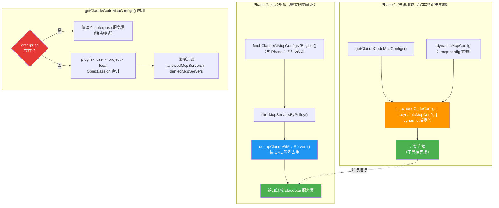
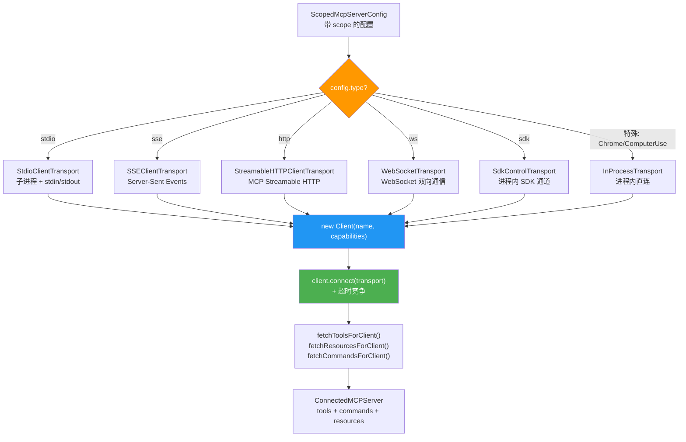

# 第 15 篇：MCP 协议实现 — 连接外部工具的标准化桥梁

> 本篇是《深入 Claude Code CLI 源码》系列的第 15 篇。我们将剖析 Claude Code 如何实现 Model Context Protocol（MCP），包括类型系统设计、多层配置合并、传输层适配、连接生命周期管理、Tool 发现与代理，以及认证体系。

## 为什么需要 MCP？

Claude Code 内置了 40+ 个工具（BashTool、FileEditTool、GlobTool 等），足以覆盖大部分编程场景。但真实世界的开发远不止于此——你可能需要查询 Jira 看板、操作 Slack 消息、调用公司内部的 API 网关、访问 GitHub Issues……这些能力不可能全部内置，也不应该内置。

**Model Context Protocol（MCP）** 就是这个问题的答案。它是 Anthropic 提出的一个开放标准，定义了 AI 应用（Client）与外部工具/数据服务（Server）之间的通信协议。可以把 MCP 理解为 AI 世界的 "USB 接口"——只要服务实现了 MCP 协议，Claude Code 就能自动发现并使用它提供的工具，无需修改 Claude Code 本身的代码。

Claude Code 的 MCP 实现涵盖了一个完整的客户端系统，需要解决以下核心问题：

1. **类型安全**：如何用 TypeScript + Zod 精确定义 8 种服务器配置和 5 种连接状态？
2. **多层配置**：多来源配置（local / user / project / plugin / dynamic / enterprise / claudeai）如何分两阶段加载、合并与去重？
3. **传输适配**：stdio / SSE / HTTP / WebSocket / SDK / InProcess 六种传输方式如何统一抽象？
4. **连接管理**：30+ 个 MCP 服务器如何并发连接、错误恢复、自动重连？
5. **Tool 代理**：外部 MCP Tool 如何无缝融入 Claude Code 的内置工具系统？
6. **安全认证**：OAuth / XAA（Cross-App Access）如何保护远程服务器的访问？

---

## 一、类型系统设计：精确建模 MCP 的一切

MCP 的类型定义集中在 `services/mcp/types.ts`（约 259 行），这个文件是整个 MCP 子系统的**数据契约层**。

### 1.1 配置作用域与传输类型

首先是两个核心枚举：

```typescript
// services/mcp/types.ts:10-26
export const ConfigScopeSchema = lazySchema(() =>
  z.enum([
    'local',      // .claude/settings.local.json
    'user',       // ~/.claude/settings.json
    'project',    // .mcp.json（从 CWD 向上遍历）
    'dynamic',    // 运行时动态注入（--mcp-config）
    'enterprise', // managed-mcp.json（企业管控）
    'claudeai',   // claude.ai 连接器
    'managed',    // 企业 managed settings
  ]),
)

export const TransportSchema = lazySchema(() =>
  z.enum(['stdio', 'sse', 'sse-ide', 'http', 'ws', 'sdk']),
)
```

`ConfigScope` 定义了配置可以来自 7 个层级。`TransportSchema` 枚举了 6 种公开的传输类型字面量（`stdio | sse | sse-ide | http | ws | sdk`），但 `McpServerConfigSchema` 的 union 实际支持 8 类 server config——额外包含了内部使用的 `ws-ide`（IDE WebSocket）和 `claudeai-proxy`（claude.ai 代理）两种类型。换言之，`Transport` 类型和"可连接的 server config 类型"并非一一对应，后者是前者的超集。这里使用了 `lazySchema()` 包装 Zod schema，延迟 schema 的构建以优化启动性能。

### 1.2 每种传输的精确配置 Schema

每种传输方式有独立的 Zod schema，精确描述其所需的配置字段：

```typescript
// services/mcp/types.ts:28-113（简化展示）
// stdio：本地进程
export const McpStdioServerConfigSchema = lazySchema(() =>
  z.object({
    type: z.literal('stdio').optional(), // 可选，向后兼容
    command: z.string().min(1, 'Command cannot be empty'),
    args: z.array(z.string()).default([]),
    env: z.record(z.string(), z.string()).optional(),
  }),
)

// SSE：Server-Sent Events（远程）
export const McpSSEServerConfigSchema = lazySchema(() =>
  z.object({
    type: z.literal('sse'),
    url: z.string(),
    headers: z.record(z.string(), z.string()).optional(),
    headersHelper: z.string().optional(),  // 动态 header 脚本
    oauth: McpOAuthConfigSchema().optional(),
  }),
)

// HTTP：Streamable HTTP（MCP 2025-03-26 规范推荐）
export const McpHTTPServerConfigSchema = lazySchema(() =>
  z.object({
    type: z.literal('http'),
    url: z.string(),
    headers: z.record(z.string(), z.string()).optional(),
    headersHelper: z.string().optional(),
    oauth: McpOAuthConfigSchema().optional(),
  }),
)

// SDK：进程内 SDK 传输（Agent SDK 使用）
export const McpSdkServerConfigSchema = lazySchema(() =>
  z.object({
    type: z.literal('sdk'),
    name: z.string(),
  }),
)
```

最终，所有配置通过 union 类型统一：

```typescript
// services/mcp/types.ts:124-135
export const McpServerConfigSchema = lazySchema(() =>
  z.union([
    McpStdioServerConfigSchema(),
    McpSSEServerConfigSchema(),
    McpSSEIDEServerConfigSchema(),
    McpWebSocketIDEServerConfigSchema(),
    McpHTTPServerConfigSchema(),
    McpWebSocketServerConfigSchema(),
    McpSdkServerConfigSchema(),
    McpClaudeAIProxyServerConfigSchema(),
  ]),
)
```

### 1.3 连接状态：代数数据类型

服务器连接有 5 种状态，使用 TypeScript 的 discriminated union 精确建模：

```typescript
// services/mcp/types.ts:180-227
export type ConnectedMCPServer = {
  client: Client           // MCP SDK 客户端实例
  name: string
  type: 'connected'
  capabilities: ServerCapabilities
  serverInfo?: { name: string; version: string }
  instructions?: string    // 服务器提供的使用指南
  config: ScopedMcpServerConfig
  cleanup: () => Promise<void>  // 清理函数
}

export type FailedMCPServer = {
  name: string; type: 'failed'; config: ScopedMcpServerConfig; error?: string
}

export type NeedsAuthMCPServer = {
  name: string; type: 'needs-auth'; config: ScopedMcpServerConfig
}

export type PendingMCPServer = {
  name: string; type: 'pending'; config: ScopedMcpServerConfig
  reconnectAttempt?: number; maxReconnectAttempts?: number
}

export type DisabledMCPServer = {
  name: string; type: 'disabled'; config: ScopedMcpServerConfig
}

export type MCPServerConnection =
  | ConnectedMCPServer
  | FailedMCPServer
  | NeedsAuthMCPServer
  | PendingMCPServer
  | DisabledMCPServer
```

这种 discriminated union 设计的好处在于：在任何使用 `MCPServerConnection` 的地方，TypeScript 编译器会强制你用 `type` 字段做判别，确保每种状态都被妥善处理。

---

## 二、两阶段配置加载：快启动 + 延迟补充

MCP 的配置来源比 Claude Code 的 Settings 系统还要复杂。`services/mcp/config.ts`（约 1400 行）负责从多个层级收集、验证、去重和合并 MCP 服务器配置。但这个合并**并非一个函数一次性完成**，而是分为两个阶段、由多个调用方协作实现。

### 2.1 两阶段加载架构

理解 MCP 配置的关键在于：**`getClaudeCodeMcpConfigs()` 明确排除了 claude.ai 服务器**（注释写道 *"excludes claude.ai servers from the returned set — they're fetched separately and merged by callers"*）。claude.ai 连接器需要网络请求，放在主函数中会拖慢启动速度。

真正的加载流程发生在 `useManageMCPConnections` Hook 中，分为两个阶段：



```typescript
// services/mcp/useManageMCPConnections.ts:856-964（简化展示）
async function loadAndConnectMcpConfigs() {
  // claude.ai fetch 提前发起，与 Phase 1 并行
  const claudeaiPromise = fetchClaudeAIMcpConfigsIfEligible()

  // Phase 1: 仅本地文件读取，快速
  const { servers: claudeCodeConfigs } = isStrictMcpConfig
    ? { servers: {}, errors: [] }
    : await getClaudeCodeMcpConfigs(dynamicMcpConfig, claudeaiPromise)

  // dynamic 后覆盖 Claude Code 配置（优先级最高）
  const configs = { ...claudeCodeConfigs, ...dynamicMcpConfig }

  // 开始连接，不等待完成（fire-and-forget）
  getMcpToolsCommandsAndResources(onConnectionAttempt, enabledConfigs)

  // Phase 2: 等待 claude.ai 结果
  const claudeaiConfigs = filterMcpServersByPolicy(await claudeaiPromise).allowed
  // 按 URL 签名去重，手动配置优先于 claude.ai 连接器
  const { servers: dedupedClaudeAi } = dedupClaudeAiMcpServers(claudeaiConfigs, configs)
  // 追加连接 claude.ai 服务器
  getMcpToolsCommandsAndResources(onConnectionAttempt, dedupedClaudeAi)
}
```

这个两阶段设计的核心价值在于**启动性能隔离**：Phase 1 只涉及本地文件读取，通常在几毫秒内完成；Phase 2 的 claude.ai fetch 是网络请求，可能需要数百毫秒甚至数秒，但它在 Phase 1 执行期间就已经并行发起了。

另一个重要的分支是 **`isStrictMcpConfig` 模式**：当调用方（如 SDK print mode）设置了 strict 标志时，所有常规配置加载都被跳过，仅保留 `dynamicMcpConfig` 中传入的配置。这是 Agent SDK 场景需要的——SDK 消费者完全控制可用的 MCP 服务器。

### 2.2 getClaudeCodeMcpConfigs() 内部优先级

在 `getClaudeCodeMcpConfigs()` 内部，配置通过 `Object.assign` 按优先级从低到高合并：

```typescript
// services/mcp/config.ts:1231-1238
// plugin < user < project < local
const configs = Object.assign(
  {},
  dedupedPluginServers,    // 最低：插件提供的服务器
  userServers,             // ~/.claude/settings.json
  approvedProjectServers,  // .mcp.json（需通过审批）
  localServers,            // .claude/settings.local.json（最高）
)
```

然后，调用方（`useManageMCPConnections`）再做 `{ ...claudeCodeConfigs, ...dynamicMcpConfig }`，使 dynamic 配置覆盖上述所有层级。最后，claude.ai 连接器在 Phase 2 作为**最低优先级**合并（`Object.assign({}, dedupedClaudeAi, claudeCodeServers)` —— claude.ai 先放，被后者覆盖）。

完整的优先级从低到高为：

| 优先级 | 来源 | 加载阶段 |
|--------|------|----------|
| 最低 | claude.ai 连接器 | Phase 2（网络请求） |
| ↓ | plugin 服务器 | Phase 1（缓存读取） |
| ↓ | user 配置 | Phase 1（本地文件） |
| ↓ | project 配置（需审批） | Phase 1（本地文件） |
| ↓ | local 配置 | Phase 1（本地文件） |
| 最高 | dynamic（--mcp-config） | Phase 1（调用方覆盖） |
| 独占 | enterprise（managed-mcp.json） | 独占模式，跳过其他所有 |

### 2.3 Enterprise 独占模式

当 enterprise 配置文件（`managed-mcp.json`）存在时，`getClaudeCodeMcpConfigs()` 直接返回，跳过 user/project/local/plugin 配置加载。`getAllMcpConfigs()` 也会跳过 claude.ai fetch：

```typescript
// services/mcp/config.ts:1082-1096
if (doesEnterpriseMcpConfigExist()) {
  const filtered: Record<string, ScopedMcpServerConfig> = {}
  for (const [name, serverConfig] of Object.entries(enterpriseServers)) {
    if (!isMcpServerAllowedByPolicy(name, serverConfig)) {
      continue
    }
    filtered[name] = serverConfig
  }
  return { servers: filtered, errors: [] }
}
```

需要注意的是，enterprise 独占模式并不完全排斥所有外部配置。SDK 类型的服务器（`type: 'sdk'`）在策略过滤时被豁免（`filterMcpServersByPolicy` 中 `c.type === 'sdk'` 直接放行），因为 SDK 服务器是进程内传输的占位符，CLI 不会为它们 spawn 进程或打开网络连接，URL/command 形式的 allowlist 对它们也无意义。

### 2.2 Project 配置的向上遍历

Project 级别的 `.mcp.json` 有一个特殊行为：**从 CWD 开始，向上遍历到文件系统根目录**，越靠近 CWD 的配置优先级越高：

```typescript
// services/mcp/config.ts:913-955
case 'project': {
  const dirs: string[] = []
  let currentDir = getCwd()
  while (currentDir !== parse(currentDir).root) {
    dirs.push(currentDir)
    currentDir = dirname(currentDir)
  }
  // 从根目录向 CWD 方向处理，靠近 CWD 的文件覆盖远端
  for (const dir of dirs.reverse()) {
    const mcpJsonPath = join(dir, '.mcp.json')
    const { config, errors } = parseMcpConfigFromFilePath({
      filePath: mcpJsonPath, expandVars: true, scope: 'project',
    })
    if (config?.mcpServers) {
      Object.assign(allServers, addScopeToServers(config.mcpServers, scope))
    }
  }
}
```

这意味着 monorepo 的根目录可以定义通用的 MCP 服务器，子项目目录可以覆盖或添加自己的。

### 2.3 插件去重：基于签名的内容比对

当多个来源定义了指向同一个底层服务的 MCP 服务器时（例如，用户手动配置了 Slack MCP，插件也提供了 Slack MCP），需要智能去重。

去重的关键是**服务器签名**——不依赖名称，而是根据实际的命令或 URL 生成唯一标识：

```typescript
// services/mcp/config.ts:202-212
export function getMcpServerSignature(config: McpServerConfig): string | null {
  const cmd = getServerCommandArray(config)
  if (cmd) {
    return `stdio:${jsonStringify(cmd)}`  // 本地进程：按命令+参数签名
  }
  const url = getServerUrl(config)
  if (url) {
    return `url:${unwrapCcrProxyUrl(url)}`  // 远程服务：按 URL 签名
  }
  return null  // sdk 类型没有签名
}
```

去重规则：
- **手动配置 > 插件配置**：手动添加的服务器总是优先
- **插件内先到先得**：多个插件提供相同服务器时，先加载的赢
- **手动配置 > claude.ai 连接器**：用户手动配置表达了更强的意图

### 2.4 环境变量展开

MCP 配置支持 `${VAR}` 和 `${VAR:-default}` 语法的环境变量展开：

```typescript
// services/mcp/envExpansion.ts:10-38
export function expandEnvVarsInString(value: string): {
  expanded: string; missingVars: string[]
} {
  const missingVars: string[] = []
  const expanded = value.replace(/\$\{([^}]+)\}/g, (match, varContent) => {
    const [varName, defaultValue] = varContent.split(':-', 2)
    const envValue = process.env[varName]
    if (envValue !== undefined) return envValue
    if (defaultValue !== undefined) return defaultValue
    missingVars.push(varName)
    return match  // 保留原文，便于调试
  })
  return { expanded, missingVars }
}
```

这个展开会递归应用到 stdio 服务器的 `command`、`args`、`env`，以及远程服务器的 `url`、`headers` 上。

### 2.5 企业策略过滤：Allowlist 与 Denylist

企业管理员可以通过 `allowedMcpServers` 和 `deniedMcpServers` 控制哪些 MCP 服务器可以使用。策略支持三种匹配方式：

- **按名称**：`{ serverName: "my-server" }`
- **按命令**：`{ serverCommand: ["npx", "mcp-server-git"] }`（仅 stdio）
- **按 URL 通配符**：`{ serverUrl: "https://*.example.com/*" }`（仅远程）

```typescript
// services/mcp/config.ts:364-408
function isMcpServerDenied(serverName: string, config?: McpServerConfig): boolean {
  const settings = getMcpDenylistSettings()
  if (!settings.deniedMcpServers) return false

  // 按名称匹配
  for (const entry of settings.deniedMcpServers) {
    if (isMcpServerNameEntry(entry) && entry.serverName === serverName) {
      return true
    }
  }
  // 按命令匹配（stdio 服务器）
  // 按 URL 通配符匹配（远程服务器）
  // ...
}
```

**Denylist 拥有绝对优先权**——即使服务器在 allowlist 中，只要被 denylist 匹配就会被拒绝。

---

## 三、传输层：六种方式统一连接

`services/mcp/client.ts` 是整个 MCP 子系统最大的文件（约 3200+ 行），其中 `connectToServer()` 函数是核心——它根据配置类型创建对应的传输层，然后建立连接。

### 3.1 连接流程全景



### 3.2 stdio 传输：最常见的本地 MCP

stdio 是最常用的传输方式——MCP 服务器作为子进程启动，通过 stdin/stdout 交换 JSON-RPC 消息：

```typescript
// services/mcp/client.ts:944-958
} else if (serverRef.type === 'stdio' || !serverRef.type) {
  const finalCommand =
    process.env.CLAUDE_CODE_SHELL_PREFIX || serverRef.command
  const finalArgs = process.env.CLAUDE_CODE_SHELL_PREFIX
    ? [[serverRef.command, ...serverRef.args].join(' ')]
    : serverRef.args
  transport = new StdioClientTransport({
    command: finalCommand,
    args: finalArgs,
    env: {
      ...subprocessEnv(),   // 继承环境变量
      ...serverRef.env,     // 用户自定义环境变量
    } as Record<string, string>,
    stderr: 'pipe',  // 拦截 stderr，防止污染终端 UI
  })
}
```

注意 `stderr: 'pipe'` 的设计——MCP 服务器的 stderr 输出会被捕获并记录到调试日志，而不是直接打印到终端，避免干扰 Claude Code 的 Ink UI。

### 3.3 HTTP 传输：MCP 2025-03-26 规范推荐

HTTP 传输（Streamable HTTP）是 MCP 规范推荐的远程传输方式。Claude Code 的实现有一个精妙的 `wrapFetchWithTimeout` 包装器，解决了 AbortSignal 的内存泄漏问题：

```typescript
// services/mcp/client.ts:492-549
export function wrapFetchWithTimeout(baseFetch: FetchLike): FetchLike {
  return async (url: string | URL, init?: RequestInit) => {
    const method = (init?.method ?? 'GET').toUpperCase()
    // GET 请求不设超时——MCP 中 GET 是长连接的 SSE 流
    if (method === 'GET') {
      return baseFetch(url, init)
    }
    // 用 setTimeout 而非 AbortSignal.timeout()
    // 因为 Bun 中 AbortSignal.timeout 的内部定时器在 GC 前不释放，
    // 每个请求泄漏 ~2.4KB 原生内存
    const controller = new AbortController()
    const timer = setTimeout(
      c => c.abort(new DOMException('The operation timed out.', 'TimeoutError')),
      MCP_REQUEST_TIMEOUT_MS, // 60 秒
      controller,
    )
    timer.unref?.()  // 不阻止 Node.js 退出
    // ... 清理逻辑
  }
}
```

这里有两个关键细节：
1. **GET 请求豁免超时**：在 MCP 中，GET 请求是长连接的 SSE 流，不应该被 60 秒超时打断
2. **手动 setTimeout 替代 AbortSignal.timeout()**：因为 Bun 运行时中 `AbortSignal.timeout()` 的内存释放是惰性的，每个请求会泄漏约 2.4KB

### 3.4 InProcess 传输：避免 325MB 子进程

对于某些特殊的内置 MCP 服务器（如 Chrome MCP），Claude Code 不启动子进程，而是在**进程内直连**：

```typescript
// services/mcp/InProcessTransport.ts:11-49
class InProcessTransport implements Transport {
  private peer: InProcessTransport | undefined
  private closed = false

  async send(message: JSONRPCMessage): Promise<void> {
    if (this.closed) throw new Error('Transport is closed')
    // 异步投递到对端，避免同步请求/响应导致栈溢出
    queueMicrotask(() => {
      this.peer?.onmessage?.(message)
    })
  }

  async close(): Promise<void> {
    if (this.closed) return
    this.closed = true
    this.onclose?.()
    // 关闭对端
    if (this.peer && !this.peer.closed) {
      this.peer.closed = true
      this.peer.onclose?.()
    }
  }
}

// 创建一对连接的传输通道
export function createLinkedTransportPair(): [Transport, Transport] {
  const a = new InProcessTransport()
  const b = new InProcessTransport()
  a._setPeer(b)
  b._setPeer(a)
  return [a, b]
}
```

使用方式非常优雅——创建一对链接的传输，一端给客户端，一端给服务器：

```typescript
// services/mcp/client.ts:910-924
const { createLinkedTransportPair } = await import('./InProcessTransport.js')
const context = createChromeContext(serverRef.env)
inProcessServer = createClaudeForChromeMcpServer(context)
const [clientTransport, serverTransport] = createLinkedTransportPair()
await inProcessServer.connect(serverTransport)
transport = clientTransport
```

注释中说明了原因：*"Run the Chrome MCP server in-process to avoid spawning a ~325 MB subprocess"*。这是一个务实的优化——如果每个 MCP 都启动独立进程，内存开销将不可接受。

### 3.5 连接超时与竞争

连接使用 `Promise.race` 实现超时控制（默认 30 秒）：

```typescript
// services/mcp/client.ts:1048-1077
const connectPromise = client.connect(transport)
const timeoutPromise = new Promise<never>((_, reject) => {
  const timeoutId = setTimeout(() => {
    if (inProcessServer) inProcessServer.close().catch(() => {})
    transport.close().catch(() => {})
    reject(new TelemetrySafeError_I_VERIFIED_THIS_IS_NOT_CODE_OR_FILEPATHS(
      `MCP server "${name}" connection timed out after ${getConnectionTimeoutMs()}ms`,
      'MCP connection timeout',
    ))
  }, getConnectionTimeoutMs())
  // 如果 connect 先完成，取消超时
  connectPromise.then(() => clearTimeout(timeoutId), () => clearTimeout(timeoutId))
})

await Promise.race([connectPromise, timeoutPromise])
```

---

## 四、并发连接调度：本地与远程分治

当用户配置了 30+ 个 MCP 服务器时，如何高效地并发连接是一个重要问题。

### 4.1 分治策略

`getMcpToolsCommandsAndResources()` 将服务器分为**本地**和**远程**两组，各自使用不同的并发度：

```typescript
// services/mcp/client.ts:2264-2399
// 本地服务器（stdio/sdk）：低并发（默认 3），避免进程 spawn 资源争抢
const localServers = configEntries.filter(([_, config]) => isLocalMcpServer(config))
// 远程服务器：高并发（默认 20），只是网络连接
const remoteServers = configEntries.filter(([_, config]) => !isLocalMcpServer(config))

// 两组并行处理，各自有自己的并发上限
await Promise.all([
  processBatched(localServers, getMcpServerConnectionBatchSize(), processServer),    // 3
  processBatched(remoteServers, getRemoteMcpServerConnectionBatchSize(), processServer), // 20
])
```

### 4.2 pMap 替代固定批次

源码注释中记录了一次重要的优化演进：

```typescript
// services/mcp/client.ts:2212-2224
// 2026-03 重构：之前的实现是固定大小的顺序批次
// （等 batch 1 全部完成，再启动 batch 2）。这意味着 batch N 中
// 一个慢服务器会阻塞 batch N+1 的所有服务器，即使其他 19 个
// 槽位是空闲的。pMap 在每个服务器完成时立即释放槽位，所以
// 一个慢服务器只占用一个槽位，而不会阻塞整个批次边界。
async function processBatched<T>(
  items: T[], concurrency: number, processor: (item: T) => Promise<void>,
): Promise<void> {
  await pMap(items, processor, { concurrency })
}
```

这是一个经典的并发优化：从"固定批次"（batch 1 全完 → batch 2 全完）变为"滑动窗口"（任何一个完成立即启动下一个）。同样的并发上限，更好的调度效率。

### 4.3 needs-auth 缓存：避免重复 401

对于需要认证的远程服务器，Claude Code 维护了一个 15 分钟 TTL 的缓存，避免每次连接都发起一轮 HTTP 401 + OAuth 发现的网络往返：

```typescript
// services/mcp/client.ts:2300-2322
if (
  (config.type === 'claudeai-proxy' || config.type === 'http' || config.type === 'sse') &&
  ((await isMcpAuthCached(name)) ||
   ((config.type === 'http' || config.type === 'sse') &&
    hasMcpDiscoveryButNoToken(name, config)))
) {
  logMCPDebug(name, `Skipping connection (cached needs-auth)`)
  onConnectionAttempt({
    client: { name, type: 'needs-auth' as const, config },
    tools: [createMcpAuthTool(name, config)],  // 提供一个认证工具
    commands: [],
  })
  return
}
```

被标记为 `needs-auth` 的服务器不会尝试连接，而是直接注入一个 `McpAuthTool`，引导用户通过 `/mcp` 命令完成认证。

---

## 五、Tool 发现与代理：MCP 工具融入内置体系

连接建立后，Claude Code 需要**发现**远端服务器提供的工具，并将它们**包装**成内置工具系统可以理解的 `Tool` 接口。

### 5.1 fetchToolsForClient：发现与包装

`fetchToolsForClient` 通过 MCP 协议的 `tools/list` 方法获取工具列表，然后将每个工具包装为 Claude Code 的 `Tool` 接口：

```typescript
// services/mcp/client.ts:1743-1998（简化展示）
export const fetchToolsForClient = memoizeWithLRU(
  async (client: MCPServerConnection): Promise<Tool[]> => {
    if (client.type !== 'connected') return []
    if (!client.capabilities?.tools) return []

    const result = await client.client.request(
      { method: 'tools/list' }, ListToolsResultSchema,
    )

    return result.tools.map((tool): Tool => {
      const fullyQualifiedName = buildMcpToolName(client.name, tool.name)
      return {
        ...MCPTool,  // 继承 MCPTool 的基础实现
        name: fullyQualifiedName,  // mcp__serverName__toolName
        mcpInfo: { serverName: client.name, toolName: tool.name },
        isMcp: true,

        // 描述截断：防止 OpenAPI 生成的 MCP 服务器倾倒 15-60KB 的文档
        async prompt() {
          const desc = tool.description ?? ''
          return desc.length > MAX_MCP_DESCRIPTION_LENGTH  // 2048 字符
            ? desc.slice(0, MAX_MCP_DESCRIPTION_LENGTH) + '… [truncated]'
            : desc
        },

        // 利用 MCP 的 annotations 机制
        isConcurrencySafe() { return tool.annotations?.readOnlyHint ?? false },
        isReadOnly() { return tool.annotations?.readOnlyHint ?? false },
        isDestructive() { return tool.annotations?.destructiveHint ?? false },

        inputJSONSchema: tool.inputSchema as Tool['inputJSONSchema'],

        // 工具调用代理
        async call(args, context, _canUseTool, parentMessage, onProgress) {
          const connectedClient = await ensureConnectedClient(client)
          const mcpResult = await callMCPToolWithUrlElicitationRetry({
            client: connectedClient,
            tool: tool.name,
            args,
            signal: context.abortController.signal,
            // ...
          })
          return { data: mcpResult.content }
        },
      }
    })
  },
  (client: MCPServerConnection) => client.name,  // 缓存 key：服务器名称
  MCP_FETCH_CACHE_SIZE,  // LRU 缓存上限：20
)
```

### 5.2 工具命名规范

MCP 工具遵循 `mcp__<serverName>__<toolName>` 的命名规范，由 `mcpStringUtils.ts` 管理：

```typescript
// services/mcp/mcpStringUtils.ts:50-52
export function buildMcpToolName(serverName: string, toolName: string): string {
  return `${getMcpPrefix(serverName)}${normalizeNameForMCP(toolName)}`
}
// 示例：mcp__slack__send_message, mcp__github__list_issues
```

名称归一化（`normalization.ts`）将所有非字母数字字符替换为下划线，确保符合 API 的 `^[a-zA-Z0-9_-]{1,64}$` 模式约束。

### 5.3 MCP Prompts → 斜杠命令

MCP 不仅可以提供工具，还可以提供 **Prompts**（提示模板），Claude Code 将它们包装为斜杠命令：

```typescript
// services/mcp/client.ts:2054-2096
return promptsToProcess.map(prompt => {
  return {
    type: 'prompt' as const,
    name: 'mcp__' + normalizeNameForMCP(client.name) + '__' + prompt.name,
    description: prompt.description ?? '',
    isMcp: true,
    source: 'mcp',
    async getPromptForCommand(args: string) {
      const connectedClient = await ensureConnectedClient(client)
      const result = await connectedClient.client.getPrompt({
        name: prompt.name,
        arguments: zipObject(argNames, argsArray),
      })
      return result.messages.map(message =>
        transformResultContent(message.content, connectedClient.name),
      ).flat()
    },
  }
})
```

这意味着如果 MCP 服务器提供了一个叫 `code_review` 的 prompt，用户可以在 Claude Code 中通过 `/mcp__github__code_review` 来调用它。

---

## 六、连接生命周期管理：错误恢复与自动重连

### 6.1 错误检测与分级

`connectToServer()` 安装了增强的 `onerror` 处理器，将错误分为多个级别：

```typescript
// services/mcp/client.ts:1249-1365（简化展示）
const isTerminalConnectionError = (msg: string): boolean => {
  return (
    msg.includes('ECONNRESET') ||
    msg.includes('ETIMEDOUT') ||
    msg.includes('EPIPE') ||
    msg.includes('EHOSTUNREACH') ||
    msg.includes('ECONNREFUSED') ||
    msg.includes('Body Timeout Error') ||
    msg.includes('terminated') ||
    msg.includes('SSE stream disconnected') ||
    msg.includes('Failed to reconnect SSE stream')
  )
}

client.onerror = (error: Error) => {
  // 1. HTTP Session 过期（404 + JSON-RPC -32001）→ 立即重连
  if (isMcpSessionExpiredError(error)) {
    closeTransportAndRejectPending('session expired')
    return
  }

  // 2. SDK SSE 重连耗尽 → 触发关闭
  if (error.message.includes('Maximum reconnection attempts')) {
    closeTransportAndRejectPending('SSE reconnection exhausted')
    return
  }

  // 3. 终端连接错误 → 计数，连续 3 次后触发重连
  if (isTerminalConnectionError(error.message)) {
    consecutiveConnectionErrors++
    if (consecutiveConnectionErrors >= MAX_ERRORS_BEFORE_RECONNECT) {
      closeTransportAndRejectPending('max consecutive terminal errors')
    }
  } else {
    consecutiveConnectionErrors = 0  // 非终端错误重置计数
  }
}
```

### 6.2 onclose 的缓存清理

当连接关闭时，必须清理所有 memoize 缓存，确保下次操作会触发重连：

```typescript
// services/mcp/client.ts:1374-1397
client.onclose = () => {
  // 清理连接缓存
  const key = getServerCacheKey(name, serverRef)
  connectToServer.cache.delete(key)

  // 同时清理 fetch 缓存——否则重连后会拿到旧工具/资源
  fetchToolsForClient.cache.delete(name)
  fetchResourcesForClient.cache.delete(name)
  fetchCommandsForClient.cache.delete(name)
}
```

### 6.3 stdio 进程的优雅退出

对于 stdio 类型的 MCP 服务器，清理时会执行一个三级信号升级：

```
SIGINT → (等 100ms) → SIGTERM → (等 400ms) → SIGKILL
```

```typescript
// services/mcp/client.ts:1429-1562（简化）
// 1. 先发 SIGINT（像 Ctrl+C）
process.kill(childPid, 'SIGINT')
await sleep(100)
// 2. 如果还活着，发 SIGTERM
process.kill(childPid, 'SIGTERM')
await sleep(400)
// 3. 如果还活着，强制 SIGKILL
process.kill(childPid, 'SIGKILL')
```

总超时 500ms——保持 CLI 响应性，同时给 MCP 服务器足够的清理时间（特别是 Docker 容器需要 SIGTERM 来触发优雅关闭）。

### 6.4 自动重连：指数退避

`useManageMCPConnections` Hook 实现了自动重连，使用指数退避策略：

```typescript
// services/mcp/useManageMCPConnections.ts:87-90
const MAX_RECONNECT_ATTEMPTS = 5
const INITIAL_BACKOFF_MS = 1000
const MAX_BACKOFF_MS = 30000
```

当连接断开时（`onclose` 触发），Hook 会自动尝试重连，退避时间从 1 秒指数增长到最多 30 秒，最多重试 5 次。

---

## 七、认证体系：OAuth 与 XAA

### 7.1 OAuth 认证流程

对于远程 MCP 服务器，Claude Code 实现了完整的 OAuth 2.0 客户端（`services/mcp/auth.ts`，约 2000+ 行），包括：

- **ClaudeAuthProvider**：实现 MCP SDK 的 `OAuthClientProvider` 接口
- **PKCE**：使用 S256 Code Challenge 防止授权码拦截
- **Token 刷新**：自动检测过期并刷新 access token
- **Keychain 存储**：通过 macOS Keychain / Windows Credential Manager 安全存储 token
- **动态客户端注册**：RFC 7591 协议，自动向 MCP 服务器注册为 OAuth 客户端

### 7.2 XAA：企业免浏览器认证

XAA（Cross-App Access）是一种企业场景下的认证方式，**无需打开浏览器**即可获取 access token。它通过两步 token 交换实现：

```typescript
// services/mcp/xaa.ts:1-17
// 1. RFC 8693 Token Exchange at the IdP: id_token → ID-JAG
// 2. RFC 7523 JWT Bearer Grant at the AS: ID-JAG → access_token
```

这对于 CI/CD 环境和无头（headless）部署特别重要——传统 OAuth 需要浏览器弹窗，而 XAA 通过 IdP（Identity Provider）的 token 交换完全在后台完成。

### 7.3 headersHelper：动态认证头

对于不使用 OAuth 的认证方案，Claude Code 支持 `headersHelper` 配置——一个返回 JSON headers 的 shell 脚本：

```typescript
// services/mcp/headersHelper.ts:59-103
const execResult = await execFileNoThrowWithCwd(config.headersHelper, [], {
  shell: true,
  timeout: 10000,
  env: {
    ...process.env,
    CLAUDE_CODE_MCP_SERVER_NAME: serverName,
    CLAUDE_CODE_MCP_SERVER_URL: config.url,
  },
})
const headers = jsonParse(execResult.stdout.trim())
```

headersHelper 脚本会收到 `CLAUDE_CODE_MCP_SERVER_NAME` 和 `CLAUDE_CODE_MCP_SERVER_URL` 环境变量，因此一个脚本可以为多个 MCP 服务器提供不同的认证头（类似 git credential-helper 的设计）。

安全细节：如果配置来自 project/local scope，headersHelper 会检查**工作区信任状态**——用户必须先确认信任当前项目，才能执行项目级的 headersHelper 脚本。

---

## 八、Agent 的 MCP 扩展

自定义 Agent（`.claude/agents/*.md`）可以在 frontmatter 中声明自己需要的 MCP 服务器：

```typescript
// tools/AgentTool/runAgent.ts:95-150（简化）
async function initializeAgentMcpServers(
  agentDefinition: AgentDefinition,
  parentClients: MCPServerConnection[],
) {
  if (!agentDefinition.mcpServers?.length) {
    return { clients: parentClients, tools: [], cleanup: async () => {} }
  }

  for (const spec of agentDefinition.mcpServers) {
    if (typeof spec === 'string') {
      // 引用现有配置：name → getMcpConfigByName(spec)
      config = getMcpConfigByName(spec)
    } else {
      // 内联定义：直接在 frontmatter 中提供完整配置
      // ...
    }
  }
}
```

Agent 可以用两种方式引用 MCP 服务器：
1. **按名称引用**：引用已配置的 MCP 服务器，使用 memoized 的共享连接
2. **内联定义**：在 Agent 定义中直接提供完整的 MCP 配置，Agent 结束时自动清理

企业策略同样适用于 Agent 的 MCP——当 `strictPluginOnlyCustomization` 启用时，用户自定义 Agent 的 MCP 声明会被忽略，只有管理员信任的 Agent（plugin/built-in）才能使用 MCP。

---

## 九、MCPConnectionManager：React 层的连接管理

`MCPConnectionManager.tsx` 是 MCP 与 React UI 层的桥梁。它通过 React Context 暴露 `reconnectMcpServer` 和 `toggleMcpServer` 两个操作：

```typescript
// services/mcp/MCPConnectionManager.tsx:38-72
export function MCPConnectionManager({ children, dynamicMcpConfig, isStrictMcpConfig }) {
  const { reconnectMcpServer, toggleMcpServer } = useManageMCPConnections(
    dynamicMcpConfig, isStrictMcpConfig,
  )
  return (
    <MCPConnectionContext.Provider value={{ reconnectMcpServer, toggleMcpServer }}>
      {children}
    </MCPConnectionContext.Provider>
  )
}
```

`useManageMCPConnections` Hook（约 1000+ 行）是 MCP 生命周期管理的核心，职责远不止"连接管理"：

1. **两阶段配置加载与连接**：Phase 1 加载 Claude Code 配置并开始连接；Phase 2 等待 claude.ai 配置并追加连接（详见第二节）
2. **同步 AppState**：将连接状态（clients, tools, commands, resources）同步到全局状态
3. **list_changed 通知监听**：响应 MCP 服务器的 `tools/list_changed`、`prompts/list_changed`、`resources/list_changed` 通知，自动刷新对应的 fetch 缓存并更新 AppState
4. **自动重连**：连接断开后按指数退避策略自动重连
5. **注册 Elicitation Handler**：处理 MCP 服务器请求用户输入的场景（如 OAuth 授权确认），通过 `registerElicitationHandler()` 注册
6. **Channel Push/Permission Relay**：当启用 Kairos/Channels feature 时，`onConnectionAttempt` 会根据 `gateChannelServer()` 的结果决定是否注册 `notifications/claude/channel` 和 `notifications/claude/channel/permission` 处理器，实现 MCP 服务器向 Claude Code 推送消息和权限请求的能力
7. **MCP Skills 发现**：当启用 `MCP_SKILLS` feature 时，除了 `fetchToolsForClient` 和 `fetchCommandsForClient`，还会调用 `fetchMcpSkillsForClient` 从支持 resources 能力的服务器发现 `skill://` 资源，将其转换为斜杠命令

Channel 通知的注册逻辑尤其值得关注——它经过多层门控（`gateChannelServer`），检查服务器能力声明、认证状态、企业策略、marketplace 白名单等条件后才会激活，并且在条件不满足时会向用户显示提示 toast（如"Channels require claude.ai authentication · run /login"）。

---

## 十、可迁移的设计模式

### 模式 1：Discriminated Union 建模连接状态

用 `type` 字段区分 5 种连接状态（connected/failed/needs-auth/pending/disabled），编译器强制完整处理每种状态。

**适用场景**：任何有多种状态的连接/资源管理系统，如数据库连接池、WebSocket 管理器。

### 模式 2：签名去重 vs 名称去重

用内容签名（命令行或 URL）而非名称来判断两个配置是否指向同一服务。这解决了多来源配置（手动 vs 插件 vs claude.ai 连接器）的冲突问题。

**适用场景**：任何需要合并多来源配置的系统，如 package manager 的依赖解析、CI/CD 的 service mesh 配置。

### 模式 3：本地/远程分治并发

按资源消耗特性将连接分组（本地进程 spawn vs 远程网络请求），每组使用不同的并发上限，再通过 `pMap` 实现滑动窗口调度。

**适用场景**：任何需要批量连接异构资源的系统，如微服务编排器、分布式任务调度器。

---

## 下一篇预告

[第 16 篇：权限系统 — AI 安全的最后一道防线](./16-权限系统.md)

我们将深入分析 Claude Code 的多层权限系统，包括 `alwaysAllowRules` / `alwaysDenyRules` / `alwaysAskRules` 的规则链、三种权限模式（default / plan / bypass）的决策流程，以及 Bash 工具的细粒度权限匹配机制。

---

*本文基于 Claude Code CLI 开源源码分析撰写。*
