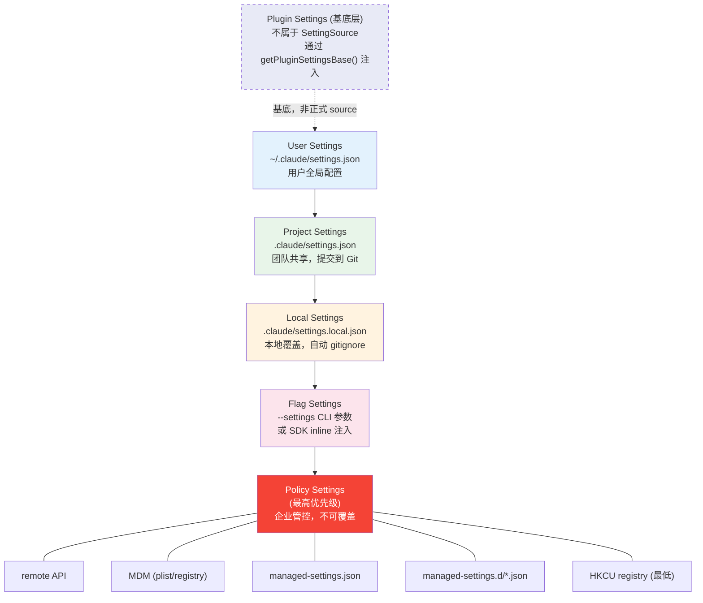

# 第 17 篇：Settings 系统 — 多层配置的合并之道

> 本篇是《深入 Claude Code CLI 源码》系列第 17 篇。我们将剖析 Settings 系统如何从 5 个正式配置源（加 1 个 Plugin 基底层）中读取、验证、合并配置，以及如何在运行时监听变更并热更新 —— 一个面向企业级部署的多层配置合并架构。

## 为什么需要多层配置？

一个 CLI 工具的配置需求看似简单 —— 用户写一个 JSON 文件就行了。但 Claude Code 面对的现实远比这复杂：

1. **个人偏好** —— 用户想全局设置自己偏好的模型、权限规则
2. **团队共享** —— 项目组要把 MCP 服务器、Hook 脚本提交到 Git 仓库共享
3. **本地覆盖** —— 个人本地调试需要覆盖项目设置，但不能提交到 Git
4. **企业管控** —— 安全团队需要强制启用沙箱、禁用危险权限，且用户不能覆盖
5. **远程策略** —— 企业管理员通过 API 远程下发配置，无需触碰每台机器
6. **平台差异** —— macOS 用 plist + MDM、Windows 用注册表、Linux 用文件

这些需求层层叠加，任何单一配置文件都无法满足。Claude Code 的 Settings 系统通过**多层配置源 + 优先级合并 + 变更检测热更新**的架构，优雅地解决了这个问题。

---

## 一、配置源全景：5 + 1 层优先级

Settings 系统的核心设计是一条明确的优先级链。配置从多个来源读取，按照优先级从低到高逐层合并，高优先级覆盖低优先级：



正式的配置源类型定义在 `utils/settings/constants.ts` 中，只有 **5 个** `SettingSource`：

```typescript
// utils/settings/constants.ts:7-22
export const SETTING_SOURCES = [
  'userSettings',      // 用户全局
  'projectSettings',   // 项目共享
  'localSettings',     // 本地覆盖（gitignored）
  'flagSettings',      // CLI --settings 参数
  'policySettings',    // 企业管控（最高优先级）
] as const
```

数组的顺序就是合并顺序 —— **后面的覆盖前面的**。`policySettings` 排在最后，意味着企业管控策略拥有最终决定权。

此外还有一个**非正式的第 0 层** —— Plugin Settings。它不是 `SettingSource` 类型成员，而是通过 `getPluginSettingsBase()` 在 `loadSettingsFromDisk()` 中作为最低优先级基底注入（`settingsCache.ts:61-80`）。Plugin 只包含白名单内的字段（如 `agent` 配置），所有正式的 file-based sources 都会覆盖它。

### 1.1 各层配置源的文件位置与用途

| 层级 | 配置源 | 文件位置 | 典型用途 |
|------|--------|---------|---------|
| 基底 | Plugin（非 SettingSource） | 内存注入 | 插件提供的默认 Agent 配置等 |
| 1 | User | `~/.claude/settings.json` | 个人全局偏好（模型、权限） |
| 2 | Project | `$PROJECT/.claude/settings.json` | 团队共享配置（Hook、MCP） |
| 3 | Local | `$PROJECT/.claude/settings.local.json` | 本地覆盖（自动加入 `.gitignore`） |
| 4 | Flag | `--settings` CLI 参数 | SDK / IDE 注入的临时配置 |
| 5（最高） | Policy | 多种来源（见下文） | 企业安全管控 |

其中 Policy Settings 最为特殊 —— 它本身就是一个内部有优先级的多源系统，采用 **first-source-wins** 策略。

### 1.2 Policy Settings 的内部优先级

Policy Settings 不像其他层级那样简单地从一个文件读取。它有自己的**4 层子优先级链**，使用 "first source wins"（第一个有内容的来源胜出）策略：

```typescript
// utils/settings/settings.ts:322-345
function getSettingsForSourceUncached(source: SettingSource): SettingsJson | null {
  if (source === 'policySettings') {
    // 1. Remote API（最高优先级）
    const remoteSettings = getRemoteManagedSettingsSyncFromCache()
    if (remoteSettings && Object.keys(remoteSettings).length > 0) {
      return remoteSettings
    }

    // 2. Admin-only MDM (HKLM/plist)
    const mdmResult = getMdmSettings()
    if (Object.keys(mdmResult.settings).length > 0) {
      return mdmResult.settings
    }

    // 3. File-based managed settings
    const { settings: fileSettings } = loadManagedFileSettings()
    if (fileSettings) {
      return fileSettings
    }

    // 4. HKCU registry（最低 — 用户可写）
    const hkcu = getHkcuSettings()
    if (Object.keys(hkcu.settings).length > 0) {
      return hkcu.settings
    }

    return null
  }
  // ...
}
```

注意这与外层的合并策略不同：外层是所有层级**逐层合并**（merge），Policy 内部是**第一个胜出**（first-source-wins）。设计意图很明确 —— 如果企业通过 Remote API 下发了策略，就不应该再考虑本地 managed-settings.json 的内容，避免策略冲突。

---

## 二、核心合并算法：loadSettingsFromDisk()

整个 Settings 系统最核心的函数是 `loadSettingsFromDisk()`，它负责按优先级顺序读取并合并所有配置源：

```typescript
// utils/settings/settings.ts:645-796
function loadSettingsFromDisk(): SettingsWithErrors {
  // 防止递归调用（某些验证函数可能间接触发 settings 读取）
  if (isLoadingSettings) {
    return { settings: {}, errors: [] }
  }

  isLoadingSettings = true
  try {
    // 从 Plugin Settings 开始（最低优先级基底）
    const pluginSettings = getPluginSettingsBase()
    let mergedSettings: SettingsJson = {}
    if (pluginSettings) {
      mergedSettings = mergeWith(mergedSettings, pluginSettings, settingsMergeCustomizer)
    }

    const allErrors: ValidationError[] = []
    const seenFiles = new Set<string>()

    // 按优先级顺序逐层合并
    for (const source of getEnabledSettingSources()) {
      if (source === 'policySettings') {
        // Policy 使用 first-source-wins（特殊逻辑）
        // ...
        continue
      }

      const filePath = getSettingsFilePathForSource(source)
      if (filePath) {
        const resolvedPath = resolve(filePath)
        // 去重：同一文件不会被加载两次
        if (!seenFiles.has(resolvedPath)) {
          seenFiles.add(resolvedPath)
          const { settings, errors } = parseSettingsFile(filePath)
          if (settings) {
            mergedSettings = mergeWith(mergedSettings, settings, settingsMergeCustomizer)
          }
        }
      }
    }

    return { settings: mergedSettings, errors: allErrors }
  } finally {
    isLoadingSettings = false
  }
}
```

这里有几个精巧的设计值得注意：

**防递归守卫**：`isLoadingSettings` 标志位防止递归。某些验证逻辑（如权限校验）可能间接触发 `getSettings()`，如果不做守卫就会无限递归。

**文件去重**：`seenFiles` 集合确保同一个物理文件不会被加载两次。这在实际中主要防御的是通过 `--setting-sources` CLI 参数控制后、某些源恰好解析到相同的 resolved path 的边缘情况（例如符号链接导致两个逻辑路径指向同一物理文件）。

**数组合并策略**：合并时使用自定义的 `settingsMergeCustomizer`：

```typescript
// utils/settings/settings.ts:538-547
export function settingsMergeCustomizer(objValue: unknown, srcValue: unknown): unknown {
  if (Array.isArray(objValue) && Array.isArray(srcValue)) {
    return mergeArrays(objValue, srcValue)  // 去重拼接
  }
  return undefined  // 其他值让 lodash 默认处理（深度 merge 对象，覆盖标量）
}
```

数组是**拼接去重**（而非替换），这个决策对权限系统至关重要 —— 多层的 `allow` 和 `deny` 规则会合并在一起，而不是高层完全覆盖低层。

---

## 三、配置文件解析与验证

### 3.1 Zod Schema 验证

每个配置文件在加载后，都要通过 `SettingsSchema` 进行 Zod 运行时验证：

```typescript
// utils/settings/settings.ts:201-231
function parseSettingsFileUncached(path: string): {
  settings: SettingsJson | null
  errors: ValidationError[]
} {
  try {
    const content = readFileSync(resolvedPath)
    if (content.trim() === '') {
      return { settings: {}, errors: [] }
    }

    const data = safeParseJSON(content, false)

    // 在 schema 验证前先过滤无效的权限规则
    const ruleWarnings = filterInvalidPermissionRules(data, path)

    const result = SettingsSchema().safeParse(data)
    if (!result.success) {
      const errors = formatZodError(result.error, path)
      return { settings: null, errors: [...ruleWarnings, ...errors] }
    }

    return { settings: result.data, errors: ruleWarnings }
  } catch (error) {
    handleFileSystemError(error, path)
    return { settings: null, errors: [] }
  }
}
```

这里有一个关键的**容错设计**：`filterInvalidPermissionRules()` 在 schema 验证之前运行，将无效的权限规则单独过滤掉。这样一条坏规则不会导致整个配置文件被拒绝 —— 其他有效的设置仍然生效，只是会产生警告。

### 3.2 SettingsSchema 的向后兼容设计

`SettingsSchema` 定义在 `utils/settings/types.ts` 中，使用 `lazySchema()` 延迟构造（与工具系统一致的模式，见第 9 篇）。它的设计严格遵循向后兼容原则：

```typescript
// utils/settings/types.ts:210-241（注释节选）
// ✅ 允许的变更：
// - 添加新的可选字段（始终使用 .optional()）
// - 添加新的 enum 值（保留现有值）
// - 使验证更宽松

// ❌ 应避免的破坏性变更：
// - 删除字段（改为标记 deprecated）
// - 删除 enum 值
// - 将可选字段改为必需
// - 使类型更严格
```

Schema 覆盖了丰富的配置项 —— 从基础的 `model`、`env` 到复杂的 `permissions`（权限规则）、`hooks`（生命周期钩子）、`sandbox`（沙箱配置）、`allowedMcpServers`（MCP 服务器白名单）等超过 40 个配置字段。每个字段都有 `.describe()` 注释，这些注释会被导出为 JSON Schema 供编辑器提供自动补全。

一个特别有趣的容错设计是 `strictPluginOnlyCustomization` 字段：

```typescript
// utils/settings/types.ts:519-540
strictPluginOnlyCustomization: z
  .preprocess(
    // 前向兼容：过滤掉未知的 surface 名称，这样未来新增的枚举值
    // （如 'commands'）不会导致旧客户端 safeParse 失败，
    // 进而导致整个 managed-settings 文件被丢弃
    v => Array.isArray(v)
      ? v.filter(x => (CUSTOMIZATION_SURFACES as readonly string[]).includes(x))
      : v,
    z.union([z.boolean(), z.array(z.enum(CUSTOMIZATION_SURFACES))]),
  )
  .optional()
  // 非数组无效值通过 preprocess 后仍然不合法，.catch 将其降级为 undefined
  // 而不是让整个 managed-settings 文件验证失败
  .catch(undefined)
```

这体现了一个重要原则：**配置解析应该 degrade gracefully，而不是 fail catastrophically**。一个未知字段值不应该让整个企业策略文件失效。

### 3.3 三级缓存体系

频繁读取配置文件会带来性能问题。Settings 系统使用三级缓存来避免重复 I/O：

```typescript
// utils/settings/settingsCache.ts

// 第 1 级：最终合并结果缓存
let sessionSettingsCache: SettingsWithErrors | null = null

// 第 2 级：单个配置源缓存
const perSourceCache = new Map<SettingSource, SettingsJson | null>()

// 第 3 级：文件解析缓存（去重同一文件被多路径引用时的重复解析）
const parseFileCache = new Map<string, ParsedSettings>()

export function resetSettingsCache(): void {
  sessionSettingsCache = null
  perSourceCache.clear()
  parseFileCache.clear()
}
```

三级缓存覆盖了不同粒度：
- **parseFileCache** 避免同一个文件被重复解析（`parseSettingsFile()` 和 `getSettingsForSource()` 可能从不同路径命中同一文件）
- **perSourceCache** 避免单源重复计算（如 `policySettings` 的 4 层子源查找）
- **sessionSettingsCache** 避免整体合并的重复计算

所有缓存通过 `resetSettingsCache()` 统一失效，保证一致性。

---

## 四、MDM 集成：跨平台的企业设备管理

Claude Code 支持通过操作系统原生的设备管理机制下发配置，这是面向大型企业部署的关键特性。

### 4.1 三模块分层架构

MDM 的实现被拆分为三个模块，每个模块有明确的职责和 import 约束：

```
mdm/
├── constants.ts  — 零重量 import（只有 os），共享常量和路径构建器
├── rawRead.ts    — 最小 import（child_process + fs），子进程 I/O
└── settings.ts   — 解析、缓存、first-source-wins 逻辑
```

**为什么要这样拆？** 因为 `rawRead.ts` 在 `main.tsx` 模块求值阶段就被调用（第 2 篇提到的侧效果前置），此时不能引入任何重量级模块。MDM 读取分为**两个阶段**：

**阶段一：预启动子进程**（`main.tsx:3-4`，模块求值期）

```typescript
// utils/settings/mdm/rawRead.ts:120-123
export function startMdmRawRead(): void {
  if (rawReadPromise) return
  rawReadPromise = fireRawRead()  // 立即启动 plutil/reg query 子进程
}
```

`startMdmRawRead()` 在 `main.tsx` 顶层调用，利用后续 ~135ms 的 import 求值时间并行完成子进程 I/O。此时只产生一个 Promise，不做任何解析。

**阶段二：等待并消费结果**（`main.tsx:914`，`preAction` hook 中）

```typescript
// utils/settings/mdm/settings.ts:67-98
export function startMdmSettingsLoad(): void {
  mdmLoadPromise = (async () => {
    // 使用阶段一的 Promise（如果已启动），否则重新 fire
    const rawPromise = getMdmRawReadPromise() ?? fireRawRead()
    const { mdm, hkcu } = consumeRawReadResult(await rawPromise)  // 解析 + 写缓存
    mdmCache = mdm
    hkcuCache = hkcu
  })()
}
```

`ensureMdmSettingsLoaded()` 在首次 settings 读取前被 await —— 如果阶段一的子进程已经完成，这里几乎零等待。

### 4.2 跨平台读取策略

```typescript
// utils/settings/mdm/rawRead.ts:55-113
export function fireRawRead(): Promise<RawReadResult> {
  return (async (): Promise<RawReadResult> => {
    if (process.platform === 'darwin') {
      // macOS: 多路径 plist 并行读取（plutil 转换为 JSON）
      const plistPaths = getMacOSPlistPaths()
      const allResults = await Promise.all(
        plistPaths.map(async ({ path, label }) => {
          // 快速路径：文件不存在就跳过（省 ~5ms 的 plutil 启动时间）
          if (!existsSync(path)) {
            return { stdout: '', label, ok: false }
          }
          const { stdout, code } = await execFilePromise(PLUTIL_PATH, [
            ...PLUTIL_ARGS_PREFIX, path,
          ])
          return { stdout, label, ok: code === 0 && !!stdout }
        }),
      )
      // First source wins（数组按优先级排序）
      const winner = allResults.find(r => r.ok)
      return { plistStdouts: winner ? [{ stdout: winner.stdout, label: winner.label }] : [] }
    }

    if (process.platform === 'win32') {
      // Windows: HKLM 和 HKCU 并行读取
      const [hklm, hkcu] = await Promise.all([
        execFilePromise('reg', ['query', WINDOWS_REGISTRY_KEY_PATH_HKLM, '/v', 'Settings']),
        execFilePromise('reg', ['query', WINDOWS_REGISTRY_KEY_PATH_HKCU, '/v', 'Settings']),
      ])
      return { hklmStdout: hklm.code === 0 ? hklm.stdout : null, hkcuStdout: hkcu.code === 0 ? hkcu.stdout : null }
    }

    // Linux: 无 MDM（使用 /etc/claude-code/managed-settings.json）
    return { plistStdouts: null, hklmStdout: null, hkcuStdout: null }
  })()
}
```

macOS 的 plist 路径有明确的优先级（定义在 `constants.ts`）：

```typescript
// utils/settings/mdm/constants.ts:45-81
export function getMacOSPlistPaths(): Array<{ path: string; label: string }> {
  const paths = []

  // 1. 最高优先级：每用户 Managed Preferences
  paths.push({
    path: `/Library/Managed Preferences/${username}/com.anthropic.claudecode.plist`,
    label: 'per-user managed preferences',
  })

  // 2. 设备级 Managed Preferences
  paths.push({
    path: `/Library/Managed Preferences/com.anthropic.claudecode.plist`,
    label: 'device-level managed preferences',
  })

  // 3. 仅限内部构建：用户可写的 Preferences（用于本地 MDM 测试）
  if (process.env.USER_TYPE === 'ant') {
    paths.push({
      path: join(homedir(), 'Library', 'Preferences', 'com.anthropic.claudecode.plist'),
      label: 'user preferences (ant-only)',
    })
  }

  return paths
}
```

Windows 的注册表路径放在 `SOFTWARE\Policies` 下而不是 `SOFTWARE` 下 —— 源码注释解释了原因：`SOFTWARE` 在 WOW64 下会被重定向（32 位进程读到的是 `WOW6432Node` 下的值），而 `SOFTWARE\Policies` 是共享键，不受重定向影响。

### 4.3 Drop-in 目录模式

除了单一的 `managed-settings.json`，系统还支持 `managed-settings.d/` 目录，允许多个独立的策略片段：

```typescript
// utils/settings/settings.ts:63-121
export function loadManagedFileSettings(): { settings: SettingsJson | null; errors: ValidationError[] } {
  let merged: SettingsJson = {}

  // 1. 先加载 managed-settings.json 作为基底（最低优先级）
  const { settings } = parseSettingsFile(getManagedSettingsFilePath())
  if (settings && Object.keys(settings).length > 0) {
    merged = mergeWith(merged, settings, settingsMergeCustomizer)
  }

  // 2. 扫描 managed-settings.d/ 下的 .json 文件
  //    按文件名字母序排列，后面的覆盖前面的
  const dropInDir = getManagedSettingsDropInDir()
  const entries = fs.readdirSync(dropInDir)
    .filter(d => d.isFile() && d.name.endsWith('.json') && !d.name.startsWith('.'))
    .map(d => d.name)
    .sort()

  for (const name of entries) {
    const { settings } = parseSettingsFile(join(dropInDir, name))
    if (settings && Object.keys(settings).length > 0) {
      merged = mergeWith(merged, settings, settingsMergeCustomizer)
    }
  }

  return { settings: found ? merged : null, errors }
}
```

这是对 Linux `systemd`/`sudoers` drop-in 模式的借鉴：
- 基础文件提供默认值
- 不同团队可以独立地提交策略片段（如 `10-otel.json`、`20-security.json`）
- 不需要协调对同一个文件的编辑

---

## 五、远程策略：Remote Managed Settings

Policy Settings 的最高优先级来源是 Remote API —— 企业管理员通过 Anthropic API 下发配置，无需物理访问每台设备。

### 5.1 资格检查与 Fail-Open 设计

`isRemoteManagedSettingsEligible()` 决定当前用户是否应该向 API 查询远程策略。它的判断逻辑分为**前置排除**和**三路放行**两个阶段：

```typescript
// services/remoteManagedSettings/syncCache.ts:49-112
export function isRemoteManagedSettingsEligible(): boolean {
  // ── 前置排除 ──
  // 3P provider / 自定义 base URL → 不查询
  if (getAPIProvider() !== 'firstParty') return false
  if (!isFirstPartyAnthropicBaseUrl()) return false
  // Cowork VM → 不适用（server-managed settings 不适合 VM 场景）
  if (process.env.CLAUDE_CODE_ENTRYPOINT === 'local-agent') return false

  // ── 路径 1：外部注入 OAuth token（subscriptionType === null）──
  // CCD/CCR 通过环境变量注入的 token 没有 subscriptionType 元数据，
  // 直接放行 —— 让 API 决定是否返回空设置（false positive 成本仅一次网络往返）
  const tokens = getClaudeAIOAuthTokens()
  if (tokens?.accessToken && tokens.subscriptionType === null) return true

  // ── 路径 2：OAuth Enterprise 或 Team 用户 ──
  // 除了 Enterprise，Team 订阅也有资格；还要求 scope 包含 CLAUDE_AI_INFERENCE_SCOPE
  if (
    tokens?.accessToken &&
    tokens.scopes?.includes(CLAUDE_AI_INFERENCE_SCOPE) &&
    (tokens.subscriptionType === 'enterprise' || tokens.subscriptionType === 'team')
  ) return true

  // ── 路径 3：Console API Key 用户 ──
  // 跳过 apiKeyHelper 以避免循环依赖
  const { key: apiKey } = getAnthropicApiKeyWithSource({
    skipRetrievingKeyFromApiKeyHelper: true,
  })
  if (apiKey) return true

  return false
}
```

这里有一个值得注意的设计选择：对于 `subscriptionType === null`（外部注入 token，缺少元数据）的情况，系统**宁可多发一次 API 请求也不漏掉有资格的用户**。API 对无策略的 org 返回 204/404 空响应，`settings.ts` 的合并逻辑会正常 fallthrough 到 MDM/file —— 误判的成本极低（一次往返），但漏判会导致企业策略完全不生效。

远程设置的核心设计原则是 **fail-open**：获取失败时不阻塞启动，继续使用本地缓存或者不应用远程策略。

### 5.2 双层缓存 + ETag 优化

远程设置使用文件缓存 + 内存缓存的双层机制：

1. **文件缓存**：`~/.claude/remote-settings.json`，跨 session 持久化
2. **内存缓存**：session 级别的 `sessionCache`，避免重复读文件
3. **HTTP ETag**：通过 `If-None-Match` 头和 SHA-256 checksum 实现增量更新，304 响应表示无变化

```typescript
// services/remoteManagedSettings/index.ts:131-137
export function computeChecksumFromSettings(settings: SettingsJson): string {
  const sorted = sortKeysDeep(settings)
  // 无空格分隔符，匹配 Python 的 json.dumps(separators=(",", ":"))
  const normalized = jsonStringify(sorted)
  const hash = createHash('sha256').update(normalized).digest('hex')
  return `sha256:${hash}`
}
```

注意 checksum 的计算要求与服务端 Python 实现完全一致（`sort_keys=True, separators=(",", ":")`），这是跨语言协作中容易出错的细节。

### 5.3 安全确认：新策略落地前的校验

在将新获取的远程设置应用到 session 之前，系统会执行一层安全检查：

```typescript
// services/remoteManagedSettings/index.ts:456-468
if (hasContent) {
  // 检查新设置是否包含危险变更（如权限降级、沙箱关闭等）
  const securityResult = await checkManagedSettingsSecurity(cachedSettings, newSettings)
  if (!handleSecurityCheckResult(securityResult)) {
    // 用户拒绝 → 不应用新设置，保留缓存的旧版本
    logForDebugging('Remote settings: User rejected new settings, using cached settings')
    return cachedSettings
  }

  setSessionCache(newSettings)
  await saveSettings(newSettings)
  return newSettings
}
```

`checkManagedSettingsSecurity()` 对比新旧设置中的安全相关字段（权限规则、沙箱配置等），如果检测到敏感变更，会通过 `handleSecurityCheckResult()` 提示用户确认。这确保了即使企业管理员远程推送了策略变更，用户也不会在不知情的情况下被降低安全等级。

### 5.4 后台轮询

初始加载后，还有 1 小时间隔的后台轮询来捕获 mid-session 的策略变更：

```typescript
// services/remoteManagedSettings/index.ts:612-628
export function startBackgroundPolling(): void {
  pollingIntervalId = setInterval(() => {
    void pollRemoteSettings()
  }, POLLING_INTERVAL_MS)  // 60 * 60 * 1000 = 1 小时
  pollingIntervalId.unref()  // 不阻止进程退出
}
```

---

## 六、变更检测与热更新

Settings 系统不是"启动时读一次就完了"—— 它支持运行时的配置文件变更检测和热更新。

### 6.1 文件监听架构

`changeDetector.ts` 使用 `chokidar` 库监听配置文件变更：

```typescript
// utils/settings/changeDetector.ts:84-146
export async function initialize(): Promise<void> {
  // 启动 MDM 轮询（独立于文件系统监听）
  startMdmPoll()

  const { dirs, settingsFiles, dropInDir } = await getWatchTargets()

  watcher = chokidar.watch(dirs, {
    persistent: true,
    ignoreInitial: true,
    depth: 0,  // 只监听直接子级
    awaitWriteFinish: {
      stabilityThreshold: 1000,   // 等待写入稳定
      pollInterval: 500,
    },
    ignored: (path, stats) => {
      // 只监听已知的配置文件路径
      if (settingsFiles.has(normalized)) return false
      // 也接受 drop-in 目录中的 .json 文件
      if (dropInDir && normalized.startsWith(dropInDir) && normalized.endsWith('.json')) {
        return false
      }
      return true  // 忽略其他文件
    },
  })

  watcher.on('change', handleChange)
  watcher.on('unlink', handleDelete)
  watcher.on('add', handleAdd)
}
```

### 6.2 内部写入过滤

当 Claude Code 自身修改配置文件时（比如用户通过 UI 添加权限规则），不应该触发变更通知。系统通过一个时间戳 Map 来过滤：

```typescript
// utils/settings/internalWrites.ts
const timestamps = new Map<string, number>()

export function markInternalWrite(path: string): void {
  timestamps.set(path, Date.now())
}

export function consumeInternalWrite(path: string, windowMs: number): boolean {
  const ts = timestamps.get(path)
  if (ts !== undefined && Date.now() - ts < windowMs) {
    timestamps.delete(path)  // 消费后删除，不影响下次真正的外部变更
    return true
  }
  return false
}
```

在 `updateSettingsForSource()` 中写文件前，先调用 `markInternalWrite(filePath)`，然后 `handleChange()` 中 5 秒内的变更会被识别为内部写入并跳过。

### 6.3 删除-重建模式的优雅处理

配置文件经常被 "删除然后重新创建"（auto-updater 或另一个 session 启动时），如果把删除事件直接当作配置清空处理会导致闪烁。系统引入了一个优雅的 grace period 机制：

```typescript
// utils/settings/changeDetector.ts:62-64
const DELETION_GRACE_MS =
  FILE_STABILITY_THRESHOLD_MS + FILE_STABILITY_POLL_INTERVAL_MS + 200
  // = 1000 + 500 + 200 = 1700ms

function handleDelete(path: string): void {
  // 不立即处理删除，设置 grace timer
  const timer = setTimeout(() => {
    pendingDeletions.delete(path)
    fanOut(source)  // 超时后才真正处理
  }, DELETION_GRACE_MS, path, source)
  pendingDeletions.set(path, timer)
}

function handleAdd(path: string): void {
  // 文件被重新创建了 → 取消 pending 的删除
  const pendingTimer = pendingDeletions.get(path)
  if (pendingTimer) {
    clearTimeout(pendingTimer)
    pendingDeletions.delete(path)
  }
  handleChange(path)  // 当作普通变更处理
}
```

如果在 1700ms 内文件被重新创建（`add` 事件触发），删除事件被取消 —— 只有 `add`（作为 change）被处理。

### 6.4 集中式缓存刷新

变更检测到后，通知通过 `fanOut()` 统一分发：

```typescript
// utils/settings/changeDetector.ts:437-439
function fanOut(source: SettingSource): void {
  resetSettingsCache()     // 先刷新缓存
  settingsChanged.emit(source)  // 再通知所有监听者
}
```

源码注释特别提到了一个性能教训：之前缓存重置分散在每个监听者中，导致 N 个监听者 = N 次磁盘重读。集中到 `fanOut()` 后，只有第一个监听者触发一次磁盘读取，后续监听者命中缓存。

### 6.5 热更新应用

变更通知最终通过 `applySettingsChange()` 作用到 AppState：

```typescript
// utils/settings/applySettingsChange.ts:33-92
export function applySettingsChange(
  source: SettingSource,
  setAppState: (f: (prev: AppState) => AppState) => void,
): void {
  const newSettings = getInitialSettings()
  const updatedRules = loadAllPermissionRulesFromDisk()
  updateHooksConfigSnapshot()

  setAppState(prev => {
    let newContext = syncPermissionRulesFromDisk(prev.toolPermissionContext, updatedRules)

    // 重新检查 bypass mode 是否被禁用
    if (newContext.isBypassPermissionsModeAvailable && isBypassPermissionsModeDisabled()) {
      newContext = createDisabledBypassPermissionsContext(newContext)
    }

    return {
      ...prev,
      settings: newSettings,
      toolPermissionContext: newContext,
    }
  })
}
```

一次配置变更会级联触发：设置刷新 → 权限规则重新加载 → Hooks 快照更新 → AppState 更新 → React UI 重渲染。

---

## 七、安全设计：防止恶意项目配置

Settings 系统中有多处安全防线，防止恶意项目通过配置文件获取过高权限：

### 7.1 Project Settings 的信任限制

某些敏感设置**刻意排除 projectSettings**，只信任用户自己的设置：

```typescript
// utils/settings/settings.ts:882-889
export function hasSkipDangerousModePermissionPrompt(): boolean {
  return !!(
    getSettingsForSource('userSettings')?.skipDangerousModePermissionPrompt ||
    getSettingsForSource('localSettings')?.skipDangerousModePermissionPrompt ||
    getSettingsForSource('flagSettings')?.skipDangerousModePermissionPrompt ||
    getSettingsForSource('policySettings')?.skipDangerousModePermissionPrompt
    // 注意：没有 projectSettings！
  )
}
```

注释解释了原因：`projectSettings is intentionally excluded — a malicious project could otherwise auto-bypass the dialog (RCE risk).` 一个恶意项目的 `.claude/settings.json` 可以被提交到 Git 仓库，如果允许它跳过权限确认对话框，就构成远程代码执行（RCE）风险。

### 7.2 Local Settings 自动 Gitignore

当写入 `settings.local.json` 时，自动将其加入 `.gitignore`：

```typescript
// utils/settings/settings.ts:508-514
if (source === 'localSettings') {
  void addFileGlobRuleToGitignore(
    getRelativeSettingsFilePathForSource('localSettings'),
    getOriginalCwd(),
  )
}
```

这防止了包含本地调试配置（可能含有 API Key 路径等敏感信息）的文件被意外提交。

### 7.3 可编辑源的类型约束

通过 TypeScript 类型系统限制哪些配置源可以被程序修改：

```typescript
// utils/settings/constants.ts:182-185
export type EditableSettingSource = Exclude<
  SettingSource,
  'policySettings' | 'flagSettings'
>
```

`policySettings` 和 `flagSettings` 在类型层面就被排除在可编辑范围之外。`updateSettingsForSource()` 函数在运行时也会检查这一约束。

---

## 八、MDM 轮询：注册表和 plist 的变更检测

文件系统的变更可以用 chokidar 监听，但 macOS plist 和 Windows 注册表的变更无法通过文件系统事件捕获。系统通过 30 分钟间隔的轮询来解决：

```typescript
// utils/settings/changeDetector.ts:381-418
function startMdmPoll(): void {
  // 拍快照
  const initial = getMdmSettings()
  const initialHkcu = getHkcuSettings()
  lastMdmSnapshot = jsonStringify({ mdm: initial.settings, hkcu: initialHkcu.settings })

  mdmPollTimer = setInterval(() => {
    void (async () => {
      const { mdm: current, hkcu: currentHkcu } = await refreshMdmSettings()
      const currentSnapshot = jsonStringify({ mdm: current.settings, hkcu: currentHkcu.settings })

      if (currentSnapshot !== lastMdmSnapshot) {
        lastMdmSnapshot = currentSnapshot
        setMdmSettingsCache(current, currentHkcu)
        fanOut('policySettings')
      }
    })()
  }, MDM_POLL_INTERVAL_MS)  // 30 分钟

  mdmPollTimer.unref()  // 不阻止进程退出
}
```

原理很简单：将整个 MDM 设置 JSON 序列化为字符串做快照比较。虽然不够精细，但完全可靠且实现简单。

---

## 九、可迁移的设计模式

### 模式 1：多层配置合并 + 类型安全

用一个有序数组定义配置源优先级，配合 lodash `mergeWith` 自定义合并策略。数组用 `as const` + `SettingSource` 类型保护，合并逻辑集中在一个函数中。

**关键决策**：数组是拼接去重还是替换？标量是覆盖还是追加？不同的场景需要不同的策略。Claude Code 选择了"数组拼接去重 + 标量覆盖" —— 权限规则叠加，模型配置覆盖。

**适用场景**：任何需要多层配置的应用 —— CLI 工具、SDK、企业级 SaaS 产品。

### 模式 2：变更检测的内部写入过滤

用时间戳 Map 标记"自己的写入"，在变更回调中消费标记来过滤回声。关键设计：标记消费后删除（一次性），有时间窗口约束（5 秒），防止过期标记误伤真正的外部变更。

**适用场景**：任何 "监听文件变更但需要忽略自身写入" 的场景 —— 配置热重载、文件同步工具、IDE 插件。

### 模式 3：Fail-Open 降级策略

远程配置获取失败时，优先使用本地文件缓存的旧版本，而不是阻塞启动或完全放弃策略。这是 "cache-first + eventual consistency" 模式在配置管理中的应用。

**适用场景**：任何依赖远程服务的配置加载 —— feature flag 系统、A/B 测试配置、远程策略引擎。

---

## 下一篇预告

[第 18 篇：Hooks 系统 — 用 Shell 命令扩展 AI 行为](./18-Hooks-系统.md)

我们将深入 Hooks 系统，看 Claude Code 如何让用户通过简单的 Shell 命令（和 HTTP 请求），在工具执行前后、会话开始/结束、compact 前后等关键时机注入自定义逻辑。你会看到一套精巧的事件匹配、输出协议和安全边界设计。

---

*本文基于 Claude Code CLI 开源源码分析撰写。*
