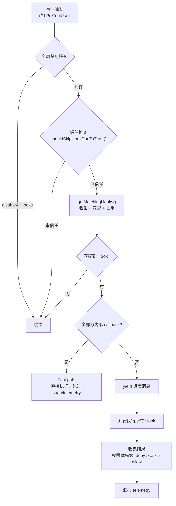

# 第 18 篇：Hooks 系统 — 用 Shell 命令扩展 AI 行为

> 本篇是《深入 Claude Code CLI 源码》系列第 18 篇。我们将深入 Hooks 系统的完整实现，揭示 Claude Code 如何让用户在 AI 生命周期的关键节点注入自定义逻辑，以及这套系统在安全性、可扩展性和性能上的精巧设计。

## 为什么需要 Hooks？

想象一个场景：你希望 Claude Code 在每次执行 `Write` 工具后自动运行 `prettier` 格式化代码，或者在 Session 启动时自动加载项目特定的环境变量，又或者在模型即将结束回答时用一个验证脚本检查代码质量。

这些需求有一个共同特征：**它们不是 AI 本身的能力，而是用户希望在 AI 工作流的特定节点注入的自定义行为**。

Hooks 系统正是为此而生。它是 Claude Code 的"生命周期钩子"框架 —— 类似于 Git Hooks、Webpack Plugins 或 React 的 `useEffect`，但面向的是 AI Agent 的执行周期。用户通过 `settings.json` 声明：在哪个事件（event）、匹配什么条件（matcher）时，执行什么命令（hook）。

---

## 一、事件类型全景：27 个生命周期节点

Hooks 系统定义了 **27 个事件类型**，覆盖了 AI 交互的完整生命周期。这些事件在 `entrypoints/sdk/coreSchemas.ts:355-383` 中以 `as const` 数组定义：

```typescript
// entrypoints/sdk/coreSchemas.ts:355-383
export const HOOK_EVENTS = [
  'PreToolUse',         // 工具执行前
  'PostToolUse',        // 工具执行后
  'PostToolUseFailure', // 工具执行失败后
  'Notification',       // 通知发送时
  'UserPromptSubmit',   // 用户提交 prompt 时
  'SessionStart',       // 会话开始
  'SessionEnd',         // 会话结束
  'Stop',               // 模型即将结束回答
  'StopFailure',        // 因 API 错误结束 turn
  'SubagentStart',      // 子 Agent 启动
  'SubagentStop',       // 子 Agent 结束
  'PreCompact',         // 对话压缩前
  'PostCompact',        // 对话压缩后
  'PermissionRequest',  // 权限对话框显示时
  'PermissionDenied',   // auto mode 拒绝工具调用后
  'Setup',              // 仓库 setup（init/maintenance）
  'TeammateIdle',       // Teammate 即将空闲
  'TaskCreated',        // 任务创建时
  'TaskCompleted',      // 任务完成时
  'Elicitation',        // MCP 请求用户输入时
  'ElicitationResult',  // 用户响应 MCP elicitation 后
  'ConfigChange',       // 配置文件变更时
  'WorktreeCreate',     // 创建 worktree 时
  'WorktreeRemove',     // 删除 worktree 时
  'InstructionsLoaded', // 指令文件加载时
  'CwdChanged',         // 工作目录变更后
  'FileChanged',        // 被监视文件变更时
] as const
```

这些事件可以按功能域分为六大类：

| 类别 | 事件 | 用途 |
|------|------|------|
| 工具生命周期 | `PreToolUse`, `PostToolUse`, `PostToolUseFailure` | 拦截/审计/增强工具调用 |
| 会话生命周期 | `SessionStart`, `SessionEnd`, `Setup`, `Stop`, `StopFailure`, `UserPromptSubmit` | 初始化/清理/验证 |
| 权限与安全 | `PermissionRequest`, `PermissionDenied` | 自定义权限决策 |
| Agent 协作 | `SubagentStart`, `SubagentStop`, `TeammateIdle`, `TaskCreated`, `TaskCompleted` | 多 Agent 编排 |
| 上下文管理 | `PreCompact`, `PostCompact`, `Notification` | 压缩/通知控制 |
| 环境感知 | `ConfigChange`, `CwdChanged`, `FileChanged`, `InstructionsLoaded`, `Elicitation`, `ElicitationResult`, `WorktreeCreate`, `WorktreeRemove` | 响应外部变化 |

---

## 二、配置模型：Event → Matcher → Hook 的三层结构

Hooks 的配置通过 `settings.json` 声明，采用三层嵌套结构。其 Zod Schema 定义在 `schemas/hooks.ts:194-213`：

```typescript
// schemas/hooks.ts:194-213
export const HookMatcherSchema = lazySchema(() =>
  z.object({
    matcher: z.string().optional()
      .describe('String pattern to match (e.g. tool names like "Write")'),
    hooks: z.array(HookCommandSchema())
      .describe('List of hooks to execute when the matcher matches'),
  }),
)

export const HooksSchema = lazySchema(() =>
  z.partialRecord(z.enum(HOOK_EVENTS), z.array(HookMatcherSchema())),
)
```

一个实际配置示例：

```json
{
  "hooks": {
    "PreToolUse": [
      {
        "matcher": "Write|Edit",
        "hooks": [
          {
            "type": "command",
            "command": "echo 'About to write file' | tee -a /tmp/audit.log"
          }
        ]
      }
    ],
    "Stop": [
      {
        "hooks": [
          {
            "type": "command",
            "command": "npm test 2>&1 | tail -20"
          }
        ]
      }
    ]
  }
}
```

### 2.1 四种 Hook 类型

`HookCommand` 是一个 **discriminated union**，通过 `type` 字段区分四种持久化类型（`schemas/hooks.ts:31-189`）：

```typescript
// schemas/hooks.ts:176-189
export const HookCommandSchema = lazySchema(() => {
  return z.discriminatedUnion('type', [
    BashCommandHookSchema,   // type: 'command' — Shell 命令
    PromptHookSchema,        // type: 'prompt'  — LLM 评估
    AgentHookSchema,         // type: 'agent'   — 多轮 Agent 验证
    HttpHookSchema,          // type: 'http'    — HTTP POST
  ])
})
```

| 类型 | 执行方式 | 典型场景 |
|------|---------|---------|
| `command` | `spawn()` 启动 Shell 进程 | 运行 lint/test/格式化脚本 |
| `prompt` | 调用 LLM（默认 `getSmallFastModel()`，通常为 Haiku）评估条件 | "检查代码是否有安全漏洞" |
| `agent` | 启动多轮 Agent 对话验证 | "验证单元测试是否通过" |
| `http` | HTTP POST 到指定 URL | 调用外部审批/CI 系统 |

除了这四种可持久化类型，运行时还有两种内存级类型：

- **`callback`**：TypeScript 回调函数，用于 SDK 注册和内部监控（如文件访问追踪、commit attribution）
- **`function`**：Session 级 TypeScript 回调，用于结构化输出强制校验

### 2.2 Matcher 匹配逻辑

`matcher` 字段控制 Hook 何时触发。`matchesPattern()` 函数（`utils/hooks.ts:1346-1381`）支持三种模式：

```typescript
// utils/hooks.ts:1346-1381
function matchesPattern(matchQuery: string, matcher: string): boolean {
  if (!matcher || matcher === '*') {
    return true  // 空或 * 匹配一切
  }
  // 纯字母数字 + 管道符 → 精确匹配或多值匹配
  if (/^[a-zA-Z0-9_|]+$/.test(matcher)) {
    if (matcher.includes('|')) {
      const patterns = matcher.split('|').map(p => normalizeLegacyToolName(p.trim()))
      return patterns.includes(matchQuery)
    }
    return matchQuery === normalizeLegacyToolName(matcher)
  }
  // 否则作为正则表达式
  try {
    const regex = new RegExp(matcher)
    if (regex.test(matchQuery)) return true
    // 兼容旧工具名
    for (const legacyName of getLegacyToolNames(matchQuery)) {
      if (regex.test(legacyName)) return true
    }
    return false
  } catch { return false }
}
```

三种匹配模式：
1. **精确匹配**：`"Write"` — 精确匹配工具名
2. **多值匹配**：`"Write|Edit"` — 管道分隔的多个精确值
3. **正则匹配**：`"^Bash.*"` — 完整的正则表达式

此外，`if` 条件字段提供了更细粒度的过滤（`schemas/hooks.ts:19-27`），使用权限规则语法（如 `"Bash(git *)"` 只匹配 git 命令），避免为不匹配的工具调用启动进程。

---

## 三、执行引擎：从事件触发到结果收集

### 3.1 核心执行流程

整个 Hook 执行由 `executeHooks()` 这个 AsyncGenerator 函数驱动（`utils/hooks.ts:1952-2972`）。它的完整流程如下：



### 3.2 安全防线：信任检查

所有 Hook 执行的第一道关卡是 **workspace trust 检查**（`utils/hooks.ts:267-296`）：

```typescript
// utils/hooks.ts:286-296
export function shouldSkipHookDueToTrust(): boolean {
  // 非交互模式（SDK）中，信任是隐式的
  const isInteractive = !getIsNonInteractiveSession()
  if (!isInteractive) {
    return false
  }
  // 交互模式下，所有 Hook 都需要 workspace trust
  const hasTrust = checkHasTrustDialogAccepted()
  return !hasTrust
}
```

这段代码背后有深刻的安全考量。注释（`utils/hooks.ts:267-285`）记录了两个曾经存在的历史漏洞：
- SessionEnd hooks 在用户**拒绝**信任对话框时仍会执行
- SubagentStop hooks 在 subagent 在信任确认**之前**完成时会执行

因此，当前设计采用了**集中式防御**：无论是哪种事件类型，只要在交互模式下未通过信任对话框，一律跳过。这是典型的 defense-in-depth 策略。

### 3.3 Hook 配置来源的多路合并

`getHooksConfig()` 函数（`utils/hooks.ts:1492-1566`）从三个来源合并 Hook 配置：

```typescript
// utils/hooks.ts:1492-1566（简化）
function getHooksConfig(appState, sessionId, hookEvent) {
  // 来源 1：Settings 快照（startup 时捕获）
  const hooks = [...(getHooksConfigFromSnapshot()?.[hookEvent] ?? [])]

  // 来源 2：注册的 Hook（SDK callback + Plugin native hooks）
  const registeredHooks = getRegisteredHooks()?.[hookEvent]
  if (registeredHooks) {
    for (const matcher of registeredHooks) {
      if (managedOnly && 'pluginRoot' in matcher) continue  // 受管模式跳过插件
      hooks.push(matcher)
    }
  }

  // 来源 3：Session 级 Hook（Agent/Skill frontmatter 注册的临时 Hook）
  if (!managedOnly && appState !== undefined) {
    const sessionHooks = getSessionHooks(appState, sessionId, hookEvent)
    // ... 合并 session hooks 和 function hooks
  }

  return hooks
}
```

**来源 1 — Settings 快照**：在 `setup()` 阶段由 `captureHooksConfigSnapshot()` 捕获（`utils/hooks/hooksConfigSnapshot.ts:95-97`），默认按快照执行。但在特定流程中会通过 `updateHooksConfigSnapshot()` 刷新：进入 worktree 后重新读取（`setup.ts:284`）、退出 worktree 时恢复（`ExitWorktreeTool.ts:140`）、以及设置文件变更时同步（`applySettingsChange.ts:42`）。这种"快照 + 定点刷新"的设计在防止 mid-session 随意注入的同时，保证了配置变更能在合理的时机生效。

**来源 2 — 注册 Hook**：SDK 回调和 Plugin 原生 Hook 通过 `bootstrap/state.ts` 的 `getRegisteredHooks()` 获取。

**来源 3 — Session Hook**：Agent 和 Skill 通过 frontmatter 定义的 Hook，在运行时注册到 `AppState.sessionHooks` 中（一个 `Map<string, SessionStore>`）。关键的设计决策是：Session Hook 使用 `Map` 而非 `Record`（`utils/hooks/sessionHooks.ts:48-62`），原因是并发性能 —— 在 parallel() 模式下，N 个 Agent 可能在同一个 tick 中注册 Hook。`Map.set()` 是 O(1)，而 Record + spread 是 O(N)。

### 3.4 去重与 if 条件过滤

`getMatchingHooks()` 在匹配后会进行去重（`utils/hooks.ts:1720-1806`）。去重的关键设计是**按来源命名空间隔离**：

```typescript
// utils/hooks.ts:1453-1455
function hookDedupKey(m: MatchedHook, payload: string): string {
  return `${m.pluginRoot ?? m.skillRoot ?? ''}\0${payload}`
}
```

同一个 Plugin 的重复 Hook 会被合并，但来自不同 Plugin 的相同命令模板不会 —— 因为 `${CLAUDE_PLUGIN_ROOT}/hook.sh` 展开后指向不同的文件。

对于 callback 和 function 类型的 Hook，直接跳过去重逻辑（`utils/hooks.ts:1723-1729`）—— 这是一个性能优化，对内部 Hook（如 `sessionFileAccessHooks`）来说，跳过 6 轮 filter + 4 个 Map + 4 个 Array.from 带来了 44 倍的微基准性能提升。

---

## 四、Shell 命令执行：execCommandHook 的完整链路

`execCommandHook()`（`utils/hooks.ts:747-1335`）是整个 Hooks 系统中最复杂的函数，约 590 行。它处理的不只是"跑一个 Shell 命令"这么简单 —— 它需要应对跨平台 Shell 差异、异步后台化、Prompt Elicitation 协议、超时控制等多种场景。

### 4.1 Shell 选择与跨平台适配

Hook 支持两种 Shell（`utils/hooks.ts:790-984`）：

```typescript
// utils/hooks.ts:790-791
const shellType = hook.shell ?? DEFAULT_HOOK_SHELL  // 默认 'bash'
const isPowerShell = shellType === 'powershell'
```

两种 Shell 的 spawn 方式完全不同：

```typescript
// utils/hooks.ts:958-984
if (shellType === 'powershell') {
  // PowerShell：显式 argv，不使用 shell option
  child = spawn(pwshPath, buildPowerShellArgs(finalCommand), {
    env: envVars, cwd: safeCwd, windowsHide: true,
  })
} else {
  // Bash：shell option 让 Node 用 shell 解析整个命令字符串
  // 注意：Windows 上显式使用 Git Bash，非 Windows 上 shell: true 实际使用 /bin/sh
  const shell = isWindows ? findGitBashPath() : true
  child = spawn(finalCommand, [], {
    env: envVars, cwd: safeCwd, shell, windowsHide: true,
  })
}
```

在 Windows 上，Bash Hook 通过 Git Bash 执行（而非 cmd.exe），所有路径都需要转换为 POSIX 格式（`C:\Users\foo` → `/c/Users/foo`）。PowerShell Hook 则保持原生 Windows 路径。

> **实现细节**：虽然配置中叫 `shell: 'bash'`，但在非 Windows 平台上，Node.js 的 `spawn(..., { shell: true })` 实际使用的是 `/bin/sh`（源码注释 `utils/hooks.ts:975` 明确写到 "On other platforms, shell: true uses /bin/sh"）。这意味着 Hook 命令应该使用 POSIX shell 兼容语法，而非依赖 GNU bash 特有的特性（如 `[[` 条件表达式、数组等）。如果确实需要 bash，应在命令中显式调用 `bash -c '...'`。

### 4.2 环境变量注入

每个 Hook 进程都会收到一组精心准备的环境变量（`utils/hooks.ts:882-926`）：

```typescript
// utils/hooks.ts:882-926（简化）
const envVars: NodeJS.ProcessEnv = {
  ...subprocessEnv(),                      // 继承进程环境
  CLAUDE_PROJECT_DIR: toHookPath(projectDir), // 项目根目录
}

// Plugin/Skill Hook 额外变量
if (pluginRoot) {
  envVars.CLAUDE_PLUGIN_ROOT = toHookPath(pluginRoot)
  envVars.CLAUDE_PLUGIN_DATA = toHookPath(getPluginDataDir(pluginId))
}
// Plugin 配置项作为 env var 暴露
if (pluginOpts) {
  for (const [key, value] of Object.entries(pluginOpts)) {
    const envKey = key.replace(/[^A-Za-z0-9_]/g, '_').toUpperCase()
    envVars[`CLAUDE_PLUGIN_OPTION_${envKey}`] = String(value)
  }
}

// SessionStart/Setup/CwdChanged/FileChanged Hook 获得 CLAUDE_ENV_FILE
if (!isPowerShell && (hookEvent === 'SessionStart' || ...)) {
  envVars.CLAUDE_ENV_FILE = await getHookEnvFilePath(hookEvent, hookIndex)
}
```

`CLAUDE_ENV_FILE` 是一个特殊机制：Hook 可以向这个文件写入 `export VAR=value` 格式的环境变量定义，后续的 BashTool 命令会自动加载这些变量。这让 SessionStart Hook 可以为整个会话设置环境。

### 4.3 输入输出协议

Hook 通过 **stdin 接收 JSON 输入**，通过 **stdout 返回 JSON 或纯文本输出**：

```
┌──────────┐    stdin (JSON)     ┌──────────┐    stdout (JSON/text)    ┌──────────┐
│ Claude   │ ──────────────────> │   Hook   │ ───────────────────────> │ Claude   │
│ Code     │                    │  Process │                          │ Code     │
└──────────┘                    └──────────┘                          └──────────┘
```

输入是 `HookInput` 的 JSON 序列化，包含事件名、工具名、工具输入、session ID 等上下文信息。

输出的解析由 `parseHookOutput()`（`utils/hooks.ts:399-451`）处理：

```typescript
// utils/hooks.ts:399-451（简化）
function parseHookOutput(stdout: string) {
  const trimmed = stdout.trim()
  if (!trimmed.startsWith('{')) {
    return { plainText: stdout }  // 不以 { 开头 → 纯文本
  }
  // 尝试解析为 JSON 并通过 Zod 验证
  const result = validateHookJson(trimmed)
  if ('json' in result) return result
  return { plainText: stdout, validationError: result.validationError }
}
```

### 4.4 Exit Code 语义

Hook 的 exit code 有明确的语义约定（`utils/hooks.ts:2617-2697`）：

| Exit Code | 含义 | 处理方式 |
|-----------|------|---------|
| 0 | 成功 | stdout 作为成功消息 |
| 2 | 阻塞性错误 | stderr 反馈给模型，阻止操作继续 |
| 其他 | 非阻塞性错误 | stderr 展示给用户，但操作继续 |

Exit code 2 的设计非常巧妙 —— 它让 Hook 可以**阻止 AI 的操作并给出反馈**。比如一个 PreToolUse Hook 返回 exit code 2，AI 会收到错误消息并调整行为：

```typescript
// utils/hooks.ts:2648-2668
if (result.status === 2) {
  yield {
    blockingError: {
      blockingError: `[${hook.command}]: ${result.stderr || 'No stderr output'}`,
      command: hook.command,
    },
    outcome: 'blocking' as const,
    hook,
  }
  return
}
```

### 4.5 JSON 输出协议

当 Hook 输出以 `{` 开头时，系统尝试将其解析为结构化 JSON 响应。`syncHookResponseSchema`（`types/hooks.ts:50-166`）定义了丰富的输出字段：

```typescript
// types/hooks.ts:50-66（简化）
export const syncHookResponseSchema = lazySchema(() =>
  z.object({
    continue: z.boolean().optional(),       // 是否继续
    suppressOutput: z.boolean().optional(),  // 隐藏 stdout
    stopReason: z.string().optional(),       // continue=false 时的原因
    decision: z.enum(['approve', 'block']).optional(),  // 权限决策
    reason: z.string().optional(),           // 决策原因
    systemMessage: z.string().optional(),    // 警告消息
    hookSpecificOutput: z.union([            // 事件特定输出
      // PreToolUse: permissionDecision, updatedInput, additionalContext
      // PostToolUse: additionalContext, updatedMCPToolOutput
      // SessionStart: additionalContext, initialUserMessage, watchPaths
      // PermissionRequest: decision (allow/deny + updatedInput)
      // ...
    ]).optional(),
  }),
)
```

特别值得注意的是 **`updatedInput`** 字段 —— PreToolUse Hook 可以通过它**修改工具的输入参数**。这意味着 Hook 不仅可以拦截，还可以**改写** AI 的工具调用。

---

## 五、异步 Hook：后台执行与唤醒机制

Hooks 支持两种异步模式，由配置字段 `async` 和 `asyncRewake` 控制。

### 5.1 配置级异步

当 `hook.async = true` 时，Hook 在启动后立即后台化（`utils/hooks.ts:995-1030`）：

```typescript
// utils/hooks.ts:995-1030（简化）
if ((hook.async || hook.asyncRewake) && !forceSyncExecution) {
  // 先写入 stdin
  child.stdin.write(jsonInput + '\n', 'utf8')
  child.stdin.end()
  // 后台化
  const backgrounded = executeInBackground({
    processId, hookId, shellCommand,
    asyncResponse: { async: true, asyncTimeout: hookTimeoutMs },
    hookEvent, hookName, command: hook.command,
    asyncRewake: hook.asyncRewake,
  })
  if (backgrounded) {
    return { stdout: '', stderr: '', output: '', status: 0, backgrounded: true }
  }
}
```

### 5.2 协议级异步

Hook 也可以在运行时**动态切换**为异步。当 Hook 的 stdout 第一行输出 `{"async": true}` 时，系统检测到后自动后台化（`utils/hooks.ts:1112-1164`）：

```typescript
// utils/hooks.ts:1117-1143（简化）
if (!initialResponseChecked) {
  const firstLine = firstLineOf(stdout).trim()
  if (!firstLine.includes('}')) return  // 等待完整 JSON
  initialResponseChecked = true
  const parsed = jsonParse(firstLine)
  if (isAsyncHookJSONOutput(parsed) && !forceSyncExecution) {
    const backgrounded = executeInBackground({...})
    if (backgrounded) {
      shellCommandTransferred = true
      asyncResolve?.({ stdout, stderr, output, status: 0 })
    }
  }
}
```

### 5.3 asyncRewake：后台执行 + 唤醒模型

`asyncRewake` 是一个更高级的模式（`utils/hooks.ts:205-246`）。Hook 在后台运行，但如果以 exit code 2 退出，会通过 `enqueuePendingNotification()` 唤醒模型：

```typescript
// utils/hooks.ts:218-243（简化）
void shellCommand.result.then(async result => {
  await new Promise(resolve => setImmediate(resolve))  // 等 I/O 排空
  const stdout = await shellCommand.taskOutput.getStdout()
  const stderr = shellCommand.taskOutput.getStderr()
  shellCommand.cleanup()
  if (result.code === 2) {
    enqueuePendingNotification({
      value: wrapInSystemReminder(
        `Stop hook blocking error from command "${hookName}": ${stderr || stdout}`,
      ),
      mode: 'task-notification',
    })
  }
})
```

### 5.4 Async Hook Registry

后台化的 Hook 被注册到全局的 `AsyncHookRegistry`（`utils/hooks/AsyncHookRegistry.ts`）。`pendingHooks` 是一个 `Map<string, PendingAsyncHook>`：

```typescript
// utils/hooks/AsyncHookRegistry.ts:28
const pendingHooks = new Map<string, PendingAsyncHook>()
```

`checkForAsyncHookResponses()`（`AsyncHookRegistry.ts:113-268`）在每个 query turn 中被调用，检查已完成的异步 Hook 并收集其输出。这个函数使用 `Promise.allSettled()` 而非 `Promise.all()`，确保一个 Hook 的失败不会影响其他 Hook 的结果收集。

---

## 六、Prompt 与 Agent Hook：用 AI 验证 AI

### 6.1 Prompt Hook

Prompt Hook 让用户用自然语言定义验证条件，由一个小模型评估。默认使用 `getSmallFastModel()`（`utils/model/model.ts:36-38`，当前映射到 Haiku，但可通过 `ANTHROPIC_SMALL_FAST_MODEL` 环境变量覆盖）。`execPromptHook()`（`utils/hooks/execPromptHook.ts:21-211`）的核心逻辑：

```typescript
// utils/hooks/execPromptHook.ts:62-100（简化）
const response = await queryModelWithoutStreaming({
  messages: messagesToQuery,
  systemPrompt: asSystemPrompt([
    `You are evaluating a hook in Claude Code.
Your response must be a JSON object matching one of the following schemas:
1. If the condition is met, return: {"ok": true}
2. If the condition is not met, return: {"ok": false, "reason": "..."}`,
  ]),
  thinkingConfig: { type: 'disabled' as const },
  options: {
    model: hook.model ?? getSmallFastModel(),
    outputFormat: {
      type: 'json_schema',
      schema: {
        type: 'object',
        properties: { ok: { type: 'boolean' }, reason: { type: 'string' } },
        required: ['ok'],
        additionalProperties: false,
      },
    },
  },
})
```

关键设计点：
- 使用 `json_schema` 结构化输出确保模型返回可解析的结果
- 禁用 thinking（`type: 'disabled'`）减少延迟
- 默认使用 `getSmallFastModel()`（当前为 Haiku，可通过环境变量覆盖），也允许通过 `hook.model` 指定任意模型
- `$ARGUMENTS` 占位符被替换为 Hook 输入 JSON

### 6.2 Agent Hook

Agent Hook（`utils/hooks/execAgentHook.ts`）更进一步 —— 它启动一个完整的多轮对话，让 Agent 可以调用工具来验证条件。这对于"运行测试并检查结果"这类需要实际执行的验证特别有用。

---

## 七、权限决策协议

PreToolUse Hook 可以做出权限决策，影响工具是否执行。决策优先级遵循严格的层级（`utils/hooks.ts:2820-2847`）：

```typescript
// utils/hooks.ts:2826-2847
switch (result.permissionBehavior) {
  case 'deny':
    // deny 始终优先
    permissionBehavior = 'deny'
    break
  case 'ask':
    // ask 优先于 allow，但不优先于 deny
    if (permissionBehavior !== 'deny') {
      permissionBehavior = 'ask'
    }
    break
  case 'allow':
    // allow 只在无其他决策时生效
    if (!permissionBehavior) {
      permissionBehavior = 'allow'
    }
    break
  case 'passthrough':
    // passthrough 不设置权限行为
    break
}
```

**优先级链：deny > ask > allow > passthrough**。这意味着：
- 如果任何一个 Hook 说 `deny`，操作一定被阻止
- 如果没有 `deny` 但有 `ask`，会弹出确认对话框
- 只有在所有 Hook 都同意（或 passthrough）时，才会自动 `allow`

这是一个安全优先的设计 —— **最严格的决策获胜**。

---

## 八、安全边界：三级管控策略

Hooks 系统的安全管控由 `hooksConfigSnapshot.ts` 实现，分为三个层级：

### 8.1 三级开关

```typescript
// utils/hooks/hooksConfigSnapshot.ts:62-88

// 1. shouldAllowManagedHooksOnly()：只允许管理策略中的 Hook
export function shouldAllowManagedHooksOnly(): boolean {
  const policySettings = getSettingsForSource('policySettings')
  if (policySettings?.allowManagedHooksOnly === true) return true
  // 非管理设置的 disableAllHooks 被解读为"只保留管理 Hook"
  if (getSettings_DEPRECATED().disableAllHooks === true &&
      policySettings?.disableAllHooks !== true) {
    return true
  }
  return false
}

// 2. shouldDisableAllHooksIncludingManaged()：完全禁用所有 Hook
export function shouldDisableAllHooksIncludingManaged(): boolean {
  return getSettingsForSource('policySettings')?.disableAllHooks === true
}
```

层级关系：
- **正常模式**：所有来源的 Hook 都执行
- **managedOnly 模式**：只执行 `policySettings`（企业管理策略）中的 Hook，用户/项目级 Hook 被跳过
- **disableAll 模式**：所有 Hook 都不执行（包括管理 Hook）

### 8.2 快照隔离

Hook 配置在 `setup()` 阶段被捕获为快照（`captureHooksConfigSnapshot()`），默认按快照执行。快照会在特定时机通过 `updateHooksConfigSnapshot()` 刷新（worktree 切换、设置文件变更），但不会因任意的文件修改而实时更新。这种"快照 + 定点刷新"的设计防止了 mid-session 的随意配置注入：

```typescript
// utils/hooks/hooksConfigSnapshot.ts:95-97
export function captureHooksConfigSnapshot(): void {
  initialHooksConfig = getHooksFromAllowedSources()
}

// utils/hooks/hooksConfigSnapshot.ts:104-112
export function updateHooksConfigSnapshot(): void {
  resetSettingsCache()  // 确保从磁盘读取最新设置
  initialHooksConfig = getHooksFromAllowedSources()
}
```

### 8.3 HTTP Hook 的 SSRF 防护

HTTP Hook 内置了 SSRF（Server-Side Request Forgery）防护（`utils/hooks/ssrfGuard.ts`）。`isBlockedAddress()` 函数阻止对私有/链路本地地址的请求（`169.254.0.0/16`、`10.0.0.0/8`、`172.16.0.0/12`、`192.168.0.0/16` 等），但**刻意允许环回地址**（`127.0.0.0/8`）—— 因为本地开发策略服务器是 HTTP Hook 的主要使用场景。

---

## 九、Frontmatter Hook 注册

Agent 和 Skill 可以在 markdown frontmatter 中定义 Hook，这些 Hook 被注册为 Session 级别的临时 Hook。`registerFrontmatterHooks()`（`utils/hooks/registerFrontmatterHooks.ts:18-67`）处理注册逻辑：

```typescript
// utils/hooks/registerFrontmatterHooks.ts:18-67（简化）
export function registerFrontmatterHooks(
  setAppState, sessionId, hooks, sourceName, isAgent = false,
): void {
  for (const event of HOOK_EVENTS) {
    const matchers = hooks[event]
    if (!matchers) continue

    // 关键：Agent 的 Stop hook 自动转换为 SubagentStop
    let targetEvent = event
    if (isAgent && event === 'Stop') {
      targetEvent = 'SubagentStop'
    }

    for (const matcherConfig of matchers) {
      for (const hook of matcherConfig.hooks) {
        addSessionHook(setAppState, sessionId, targetEvent, matcher, hook)
      }
    }
  }
}
```

一个巧妙的设计：Agent 中定义的 `Stop` Hook 自动被转换为 `SubagentStop`，因为子 Agent 结束时触发的是 `SubagentStop` 而非 `Stop` 事件。

---

## 十、性能优化：Fast Path 与惰性序列化

Hooks 在 AI 交互的关键路径上执行，性能至关重要。源码中有几个显著的优化：

### 10.1 内部 Hook 的 Fast Path

当所有匹配的 Hook 都是内部 callback 时（如文件访问追踪），跳过整个 span/progress/telemetry 流程（`utils/hooks.ts:2036-2067`）：

```typescript
// utils/hooks.ts:2036-2067
// Fast-path: all hooks are internal callbacks (sessionFileAccessHooks,
// attributionHooks). Measured: 6.01µs → ~1.8µs per PostToolUse hit (-70%).
if (matchingHooks.every(m => m.hook.type === 'callback' && m.hook.internal)) {
  for (const [i, { hook }] of matchingHooks.entries()) {
    if (hook.type === 'callback') {
      await hook.callback(hookInput, toolUseID, signal, i, context)
    }
  }
  return  // 跳过 telemetry、span、progress 等开销
}
```

### 10.2 惰性 JSON 序列化

`hookInput` 的 JSON 序列化只在需要时执行一次，且多个 Hook 共享（`utils/hooks.ts:2124-2140`）：

```typescript
// utils/hooks.ts:2124-2140
let jsonInputResult: { ok: true; value: string } | { ok: false; error: unknown } | undefined
function getJsonInput() {
  if (jsonInputResult !== undefined) return jsonInputResult
  try {
    return (jsonInputResult = { ok: true, value: jsonStringify(hookInput) })
  } catch (error) {
    return (jsonInputResult = { ok: false, error })
  }
}
```

### 10.3 事件存在性快速检查

`hasHookForEvent()`（`utils/hooks.ts:1582-1593`）提供了一个轻量级的存在性检查，用于跳过无 Hook 配置时的 `createBaseHookInput()` 和 `getMatchingHooks()` 开销：

```typescript
// utils/hooks.ts:1582-1593
function hasHookForEvent(hookEvent, appState, sessionId): boolean {
  const snap = getHooksConfigFromSnapshot()?.[hookEvent]
  if (snap && snap.length > 0) return true
  const reg = getRegisteredHooks()?.[hookEvent]
  if (reg && reg.length > 0) return true
  if (appState?.sessionHooks.get(sessionId)?.hooks[hookEvent]) return true
  return false
}
```

---

## 十一、Prompt Elicitation：Hook 与用户的双向对话

一个极其精巧的特性是 **Prompt Elicitation 协议**（`utils/hooks.ts:1060-1110`）。Hook 进程可以向 stdout 输出一个特殊的 JSON 格式来**向用户提问**，然后通过 stdin 接收回答：

```typescript
// types/hooks.ts:28-40
export const promptRequestSchema = lazySchema(() =>
  z.object({
    prompt: z.string(),          // 请求 ID
    message: z.string(),         // 显示给用户的问题
    options: z.array(z.object({  // 选项列表
      key: z.string(),
      label: z.string(),
      description: z.string().optional(),
    })),
  }),
)
```

当 Hook 进程输出 `{"prompt":"id1","message":"选择分支","options":[...]}` 时，Claude Code 会在终端展示选项给用户，收到用户选择后将 `{"prompt_response":"id1","selected":"option-key"}` 写回 Hook 的 stdin。

这通过 `child.stdout.on('data', ...)` 中的逐行解析实现（`utils/hooks.ts:1068-1110`），使用 `promptChain` 序列化多个异步 Prompt 请求的处理顺序。

---

## 可迁移的设计模式

### 模式 1：Exit Code 语义协议

用 exit code 的不同值表达不同的语义（0=成功, 2=阻塞, 其他=非阻塞错误），让外部脚本可以精细控制系统行为。这比简单的"成功/失败"二元状态提供了更丰富的表达能力。

**适用场景**：任何需要与外部脚本/进程交互的系统，特别是 CI/CD 流水线、构建系统。

### 模式 2：安全优先的权限聚合

当多个来源可以对同一操作做出权限决策时，采用"最严格决策获胜"的聚合策略（deny > ask > allow）。这确保了即使有一个检查器发现问题，操作也会被拦截。

**适用场景**：任何多层权限检查系统、多因素审批流程。

### 模式 3：快照隔离的配置加载

在应用启动时捕获配置快照，运行期间使用快照而非实时读取。这既避免了 mid-session 配置变更带来的不一致性，也防止了配置注入攻击。

**适用场景**：安全敏感的配置系统，特别是配置可能来自不可信来源的场景（如项目级 `.claude/settings.json`）。

---

## 下一篇预告

[第 19 篇：Feature Flag 与编译期优化 — 同一份代码构建两个产品](./19-Feature-Flag与编译期优化.md)

我们将深入 `feature()` 编译期机制和 GrowthBook A/B 测试集成，揭示 Claude Code 如何用同一份代码构建出内部版和外部版两个不同的产品。

---

*本文基于 Claude Code CLI 开源源码分析撰写。*
