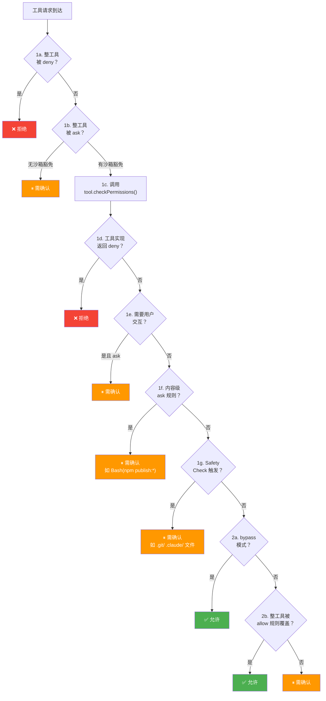

# Claude Code 调研问题回应

> 日期：2026-04-29
> 目的：回应 `RESEARCH_ClaudeCode_OpenClaw.md` 调研文档中的问题
> 依据：基于仓库中已有的 25 章 Claude Code 源码研究文档

---

## 一、Claude Code 沙箱模型：不是容器，而是"用户授权下的纵深防御"

> **交叉引用**：[16-权限系统.md](16-权限系统.md)

Claude Code **不是容器级隔离**，而是**用户授权下的受限执行**。这与你的调研判断完全一致。

### 1.1 七种权限模式 — 从"每次确认"到"完全信任"

| 模式 | 信任级别 | 行为 |
|------|---------|------|
| `default` | 最低 | 每个非只读操作都需要用户确认 |
| `plan` | 只读 | 只能读取和搜索，写入操作需要确认 |
| `acceptEdits` | 中等 | 工作目录内的文件编辑自动允许，其他操作仍需确认 |
| `bypassPermissions` | 高 | 跳过大部分权限检查（但 safety check 仍然生效） |
| `dontAsk` | 特殊 | 不弹出确认对话框，需要确认的操作自动拒绝 |
| `auto` | 内部（Anthropic 专用） | 用 AI Classifier 自动判断操作安全性 |

**关键洞察**：即使在 `bypassPermissions` 模式下，Safety Check 仍然生效。Safety Check 保护 `.git/`、`.claude/`、`.vscode/` 等危险路径，这些路径在 bypass 模式下也会触发确认。这是**"防御纵深"（Defense in Depth）设计** —— bypass 跳过的是"未配置规则时的默认 ask"，而不是用户刻意设置的安全屏障。

### 1.2 权限决策管线 — 7 步判定流程

`hasPermissionsToUseToolInner()` 函数的完整判定管线：



### 1.3 危险权限检测 — Auto Mode 入口的安全门卫

当用户切换到 Auto 模式时，系统会**自动剥离危险的 allow 规则**（`stripDangerousPermissionsForAutoMode()`）。危险权限检测覆盖三类工具：

1. **Bash**：`isDangerousBashPermission()` — 检测脚本解释器、package runner、shell 等
2. **PowerShell**：`isDangerousPowerShellPermission()` — 检测 `iex`、`Invoke-Command` 等 PS 特有代码执行入口
3. **Agent/Task**：任何 Agent allow 规则都被视为危险，因为子 Agent 可以绕过 Classifier 执行委托攻击

危险模式列表：
```typescript
export const CROSS_PLATFORM_CODE_EXEC = [
  'python', 'python3', 'python2',
  'node', 'deno', 'tsx',
  'ruby', 'perl', 'php', 'lua',
  'npx', 'bunx',
  'npm run', 'yarn run', 'pnpm run', 'bun run',
  'bash', 'sh',
  'ssh',
] as const
```

### 1.4 对 Being 的参考价值

Claude Code 的沙箱模型适合 **用户实时监督下的 AI 执行**。对于 Being 的场景（自主运行、无实时监督），需要更强的隔离。但 Claude Code 的**权限系统设计模式**（多层管线、渐进式信任、熔断机制）是可以借鉴的。

---

## 二、工具选择：LLM 自选 (Function Calling)

> **交叉引用**：[09-工具系统设计.md](09-工具系统设计.md)、[12-Agent-系统.md](12-Agent-系统.md)

**答案：LLM 自选**。Claude Code 使用 Claude API 的 Function Calling 机制，模型根据上下文自行决定调用哪个工具。

- 工具通过 `buildTool()` 统一注册
- 工具的 `inputSchema` 定义参数格式
- API 调用时模型从所有可用工具中选择最合适的
- 不是固定顺序，而是模型根据当前任务上下文自主决策

---

## 三、Bash 命令执行：child_process.spawn + 流式输出

> **交叉引用**：[10-BashTool-深度剖析.md](10-BashTool-深度剖析.md)

### 3.1 执行方案

BashTool 使用 **child_process.spawn** 执行命令：

- `runShellCommand` 生成器通过 `spawn` 启动 shell 进程
- stdout/stderr 通过**流式方式**实时返回（不是等命令结束后再返回）
- 后台任务的输出通过**磁盘文件 + 轮询**机制处理（`DiskTaskOutput` 类）

### 3.2 长时间命令处理：卡顿检测（Stall Watchdog）

BashTool 实现了**卡顿检测**机制：

- `STALL_THRESHOLD_MS = 45_000`（45 秒）
- 如果超过 45 秒没有新输出，系统读取文件尾部并检查是否匹配已知的交互式 prompt 模式
- 匹配的典型模式：`(y/n)`、`Press any key`、`Continue?` 等
- 如果匹配，发送 `<task-notification>` 告知模型该任务可能卡在了交互式输入上

### 3.3 timeout 机制

BashTool 支持 `timeout` 参数（在 `inputSchema` 中定义），可以设置命令的最大执行时间。

### 3.4 实时输出：按需轮询架构

File 模式的进度轮询使用**静态注册表 + 按需轮询**架构：

```typescript
static #registry = new Map<string, TaskOutput>()     // 全部已注册
static #activePolling = new Map<string, TaskOutput>() // 当前正在轮询的
static #pollInterval: ReturnType<typeof setInterval> | null = null
```

- React 组件通过 `startPolling(taskId)` / `stopPolling(taskId)` 控制哪些任务需要被轮询
- 当没有任何任务在轮询时，interval 被自动清除（`.unref()` 确保不阻止进程退出）
- 这是一种**UI 驱动的按需资源分配**模式

---

## 四、状态管理：三层架构 + 35 行自研 Store

> **交叉引用**：[03-状态管理.md](03-状态管理.md)、[14-任务系统.md](14-任务系统.md)

### 4.1 三层状态架构

| 层次 | 文件 | 生命周期 | 核心用途 |
|------|------|---------|---------|
| Session 全局 | `bootstrap/state.ts` | 进程级，整个 session 存活 | sessionId、CWD、成本统计、遥测 |
| AppState Store | `state/store.ts` + AppStateStore | REPL 级，跟随 React 树 | UI 状态、权限、工具、插件、MCP |
| ToolUseContext | `Tool.ts:158-254` | 每次交互/工具执行级 | 工具执行所需的全部运行时上下文 |

设计原则：**向下依赖，向上隔离**。ToolUseContext 引用 AppState 的 getter/setter；AppState 可以读取 bootstrap/state 的值；但反过来不成立。

### 4.2 极简 Store 实现（35 行）

```typescript
type Store<T> = {
  getState: () => T
  setState: (updater: (prev: T) => T) => void
  subscribe: (listener: Listener) => () => void
}
```

通过 React 18 的 `useSyncExternalStore` 桥接到 React 组件。关键设计：

- `Object.is` 相等性检查：避免不必要的重渲染
- `updater` 函数式更新：避免 stale closure
- `Set<Listener>` 而非数组：O(1) 的 add/delete 操作

### 4.3 任务状态

任务状态存储在 AppState 的 `tasks` 字段中：

```typescript
tasks: { [taskId: string]: TaskState }
```

任务类型包括：`local_bash`、`local_agent`、`remote_agent`、`in_process_teammate`、`dream` 等。详见 [14-任务系统.md](14-任务系统.md)。

### 4.4 上下文在多次调用间的保持

ToolUseContext 包含：
- `messages: Message[]` — 对话历史
- `readFileState: FileStateCache` — 文件读取缓存
- `getAppState() / setAppState()` — 状态访问

子 Agent 通过 `createSubagentContext()` 创建隔离上下文，默认状态隔离，但某些关键操作（如任务注册）始终穿透到根 Store。

---

## 五、文件修改冲突处理

**状态：需要进一步查看源码确认**

Claude Code 的 FileStateCache 会跟踪文件读取历史（详见 [06-上下文管理.md](06-上下文管理.md)），但对于"外部修改冲突"（用户在他处修改了同一文件）的处理，现有研究文档中没有直接回答。

需要查看的源码位置：
- `filesystem.ts` — 文件工具实现
- `readFileState` 相关的缓存失效逻辑

---

## 六、主循环实现

> **交叉引用**：[05-对话循环.md](05-对话循环.md)

Claude Code 的主循环在 `query.ts` 中实现，使用 AsyncGenerator 模式逐步 yield 事件：

1. 用户输入 → 构建消息
2. 调用 Claude API（带有 thinking、tools 等配置）
3. 处理 API 响应（`tool_use` / `text` 等）
4. 执行工具调用 → 验证权限 → 执行 → 返回结果
5. 循环直到模型产生最终回复

权限验证在工具执行前通过 `hasPermissionsToUseTool()` 完成。

---

## 七、安全设计模式总结

### 模式 1：防御纵深（Defense in Depth）

权限检查是多层串联的管线：deny 规则 → 工具内部检查 → safety check → 模式检查 → allow 规则。关键是某些层（safety check、content-specific ask）在高信任模式下仍然生效，但也留有精确的豁免条件。

**适用场景**：任何需要安全控制的系统。将"高风险安全规则"与"可配置的信任级别"分离。

### 模式 2：渐进式信任 + 快速通道

Auto 模式不是对每个操作都调用昂贵的 Classifier API，而是先通过三层快速通道（acceptEdits 模拟 → 安全工具白名单 → 最后才调 Classifier）过滤掉大部分安全的操作。

**适用场景**：任何使用 AI 做安全判断的系统。将判断成本与风险级别对齐。

### 模式 3：Denial Tracking 与熔断

连续拒绝 3 次或总拒绝 20 次后触发熔断：
- 交互式 CLI：回退到用户确认
- Headless 场景：直接 abort

```typescript
export const DENIAL_LIMITS = {
  maxConsecutive: 3,    // 连续拒绝 3 次 → 回退到用户确认（CLI）或 abort（headless）
  maxTotal: 20,         // 总拒绝 20 次 → 回退到用户确认（CLI）或 abort（headless）
} as const
```

**适用场景**：任何 AI Agent 的自动决策系统。当自动判断连续失败时，根据运行环境选择合适的降级策略。

---

## 八、尚需源码确认的问题

以下问题在现有研究文档中没有直接回答，需要查看 Claude Code 源码确认：

| 问题 | 优先级 | 可能位置 | 说明 |
|-----|-------|---------|------|
| **文件修改冲突处理** | 中 | `filesystem.ts` | 外部修改同一文件时的检测与处理 |
| **长时间命令的 timeout 精确实现** | 中 | `BashTool.tsx` | timeout 参数如何生效 |
| **沙箱模式的具体实现** | 高 | `shouldUseSandbox.ts` | 是否使用 Docker 等容器技术 |
| **LLM 工具选择的决策过程细节** | 中 | `tools.ts` / `Agent` 系统 | 模型选择工具时的内部逻辑 |

---

## 九、调研文档判断验证

| 调研文档中的判断 | 验证结果 |
|-----------------|---------|
| Claude Code 沙箱是用户授权下的受限执行，非容器级隔离 | ✅ 正确 |
| 工具选择是 LLM 自选（Function Calling） | ✅ 正确 |
| Bash 使用 child_process.spawn | ✅ 正确 |
| 主循环是 "思考 → 工具调用 → 验证" 模式 | ✅ 正确 |

---

## 十、结论

Claude Code 的设计哲学是：**在给用户充分控制权的前提下，通过多层安全检查让 AI 能够执行复杂操作，同时保护用户免受意外或恶意的破坏性操作**。

它的安全模型适合 **用户实时监督下的 AI 执行** —— 用户可以通过 Shift+Tab 随时切换权限模式，可以为每个命令设置细粒度的 allow/deny/ask 规则，可以在任何操作前确认。

对于 Being 的场景（自主运行、无实时监督），Claude Code 的**权限系统设计模式**（多层管线、渐进式信任、熔断机制）是可以借鉴的，但沙箱隔离需要比用户授权更强的机制（如 Docker 容器）。

---

*回应日期：2026-04-29*
*依据：Claude-Code-Source-Study 仓库中已有的 25 章研究文档*
