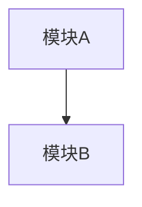

# 计划：基于 Claude Code CLI 源码分析，产出一本面向普通程序员的技术书籍

## Context

用户拥有 Claude Code CLI 的完整源码（~1884 个 TypeScript 文件），想通过系统性地解析这个项目，学习架构设计、Agent 开发、使用模型技巧等，最终产出一本**至少 20 篇技术文档**量级的学习书籍，面向普通程序员。

这个项目非常适合作为学习素材：它是一个真实的、大规模的 AI-native CLI 产品，涵盖了从系统 prompt 工程、多 Agent 编排、工具系统设计、权限安全、到终端 UI 渲染等完整技术栈。

## 用户偏好

- **语言**：中英混合 — 正文中文，技术术语保留英文原文（如 Agent、Tool、Prompt Cache、Dead Code Elimination）
- **执行节奏**：每次 1 篇，追求最高质量，逐篇深度阅读源码后撰写
- **架构图**：关键章节需包含 Mermaid 架构图（详见下方「架构图规范」）

## 书籍设计思路

### 目标读者
有 1-3 年经验的程序员，了解 TypeScript，对 AI 应用开发感兴趣，想从真实产品源码中学习工程实践。

### 核心价值主张
**"从一个真实的 AI 产品源码中，学会构建 AI Agent 应用的全栈技术"**

### 结构设计原则
- 每篇文档独立成文，但有明确的阅读顺序
- 每篇从"为什么需要"开始，带出代码实现，最后总结可复用的模式
- 代码引用精确到文件和行号，附关键代码片段
- 正文使用中文，技术术语（Agent、Tool、System Prompt 等）保留英文
- 在架构关系、数据流、生命周期等需要可视化的地方，使用 Mermaid 架构图辅助说明

### ⚠️ 计划书自修正原则

**本计划书是活文档，必须在撰写过程中持续修正。** 在深入阅读 Claude Code CLI 源码撰写每篇文章时：

1. **发现计划书中的事实错误**（如文件路径不存在、函数名拼写错误、架构理解有误）→ **立即修正计划书中的对应内容**
2. **发现某篇文章的标题不准确**（如实际源码中该模块的作用与标题描述不符）→ **修正标题，并更新目录**
3. **发现某篇文章的内容大纲需要调整**（如某个要点实际源码中不存在，或发现了更重要的设计值得替换）→ **更新大纲要点和关键文件列表**
4. **发现需要新增或删减章节**（如某个主题太薄不足以独立成篇，或发现了计划中遗漏的重要主题）→ **调整篇数和结构，保持整体连贯**

修正时在计划书对应位置直接修改，不需要保留修改历史。每次修正后确保目录（第 00 篇）与计划书保持同步。

### 架构图规范

以下章节**必须**包含 Mermaid 图表：

| 章节 | 图表类型 | 描述 |
|------|---------|------|
| 第 1 篇：项目全景 | `graph TD` | 模块依赖全景图 + 启动链路时序图 |
| 第 3 篇：状态管理 | `graph LR` | Store ↔ React Context ↔ ToolUseContext 的数据流 |
| 第 4 篇：System Prompt | `graph TD` | Prompt 分段组装流程（static → dynamic boundary → session-specific） |
| 第 5 篇：对话循环 | `sequenceDiagram` | User → query.ts → API → Tool → API 的完整交互时序 |
| 第 6 篇：上下文管理 | `graph LR` | Token 预算管理与 Auto-compact 触发流程 |
| 第 9 篇：工具系统 | `classDiagram` | Tool 接口与 buildTool 的类型关系 |
| 第 12 篇：Agent 系统 | `sequenceDiagram` | runAgent() 的完整生命周期时序图 |
| 第 15 篇：MCP | `graph TD` | MCP 连接与 Tool 发现流程 |
| 第 16 篇：权限系统 | `flowchart TD` | Permission check 决策流程图 |
| 第 17 篇：Settings | `graph TD` | 5+1 层配置合并优先级图 + Policy 内部 4 层 first-source-wins |

其他章节视内容需要可选添加 Mermaid 图。

Mermaid 代码块格式：
````markdown

````

---

## 书籍大纲（25 篇，分 5 个 Part）

### Part 1: 全局架构（3 篇）

**第 1 篇：项目全景 — 一个 AI CLI 产品的技术蓝图** ✅
- 技术栈选型分析（Bun + TypeScript + Ink + Commander.js 为什么这样选）
- 启动链路：`cli.tsx` → `main.tsx`（通过 Commander `preAction` 调用 `init()`）→ `setup.ts` → `replLauncher.tsx`
- 模块依赖全景图：`main.tsx` → `commands.ts`/`tools.ts`/`services/`/`components/`
- 关键文件：`main.tsx`, `query.ts`, `Tool.ts`, `commands.ts`, `tools.ts`

**第 2 篇：启动优化 — 毫秒级 CLI 启动的工程艺术** ✅
- 快速路径（Fast Path）：`--version` 零 import 返回，10+ 条瀑布式快速路径链
- 侧效果前置：`startMdmRawRead()`, `startKeychainPrefetch()` 利用 ~135ms 模块求值并行 I/O
- API 预连接：`preconnectAnthropicApi()` 在用户打字时完成 TCP+TLS 握手
- 早期输入捕获：`startCapturingEarlyInput()` 在 REPL 就绪前缓冲用户按键
- `feature()` 编译期 DCE（Dead Code Elimination）+ `require()` 条件加载
- `memoize` 防重复初始化（`init()` 使用 lodash `memoize` 包装）
- 启动性能度量：`profileCheckpoint()` 双模式（采样日志 + 详细分析）
- 关键文件：`entrypoints/cli.tsx`, `main.tsx:1-20,907-967`, `entrypoints/init.ts`, `utils/apiPreconnect.ts`, `utils/earlyInput.ts`, `utils/secureStorage/keychainPrefetch.ts`, `utils/settings/mdm/rawRead.ts`, `utils/startupProfiler.ts`

**第 3 篇：状态管理 — React 与非 React 世界的状态桥接** ✅
- 三层状态架构：bootstrap/state（Session 全局）→ Store + AppState（UI 层）→ ToolUseContext（运行时上下文容器）
- 35 行极简 Store 实现（`state/store.ts`）：`getState/setState/subscribe` + `Object.is` 相等性检查
- `AppState` 类型设计：`DeepImmutable<T>` 包装、70+ 字段按领域分组（mcp, plugins, tasks 等）
- `AppStateProvider` 通过 `useSyncExternalStore` 桥接 React，Context value 放 Store 实例（稳定引用）
- `onChangeAppState`：集中式副作用处理（权限同步、模型持久化、缓存清理）
- `bootstrap/state.ts`：DAG 叶子节点，session 级全局状态（sessionId, projectRoot, CWD, cost, telemetry）
- `ToolUseContext`：面向每次交互/工具执行的运行时上下文容器，`createSubagentContext()` 实现 Agent 隔离 + 选择性共享
- 关键文件：`state/store.ts`, `state/AppStateStore.ts`, `state/AppState.tsx`, `state/onChangeAppState.ts`, `bootstrap/state.ts`, `Tool.ts:158-254`, `utils/forkedAgent.ts`

---

### Part 2: AI 核心（5 篇）

**第 4 篇：System Prompt 工程 — 精密控制模型行为的提示词体系** ✅
- 分段构建与 `systemPromptSection()` / `DANGEROUS_uncachedSystemPromptSection()`
- `SYSTEM_PROMPT_DYNAMIC_BOUNDARY` — 全局缓存与会话特定内容的分界线
- `splitSysPromptPrefix()` 与 `buildSystemPromptBlocks()` 的缓存分块机制
- 条件分支：`USER_TYPE === 'ant'` 的内外版本差异
- 提示词中的行为引导技巧（代码风格约束、安全指令、工具使用优先级、false-claims 缓解）
- 关键文件：`constants/prompts.ts`, `constants/systemPromptSections.ts`, `context.ts`, `utils/systemPrompt.ts`, `utils/api.ts`, `constants/system.ts`, `constants/cyberRiskInstruction.ts`, `tools/AgentTool/forkSubagent.ts`

**第 5 篇：对话循环 — query.ts 如何驱动一次完整的 AI 交互** ✅
- AsyncGenerator 状态机：`query()` / `queryLoop()` 的 `while(true)` 显式状态机设计，`State` 类型与 7+ 个 `continue` 站点，`transition` 字段记录跳转原因
- 消息预处理管线：applyToolResultBudget → snipCompact → microcompact → contextCollapse → autocompact（成本递增顺序）
- API 调用与流式响应：`deps.callModel()` → `queryModelWithStreaming` → `withRetry` AsyncGenerator 重试层（区分前台/后台 529、指数退避、`FallbackTriggeredError`）
- 暂扣-恢复模式：prompt-too-long / max_output_tokens 错误在流中暂扣（withhold），尝试 collapse drain → reactive compact → 多轮恢复
- 工具执行双模式：`StreamingToolExecutor`（流式并行）vs `runTools()`（批量），`partitionToolCalls()` 的并发安全分区
- 附件注入：Memory 预取（`using` 关键字）、Skill 发现预取、queued commands drain
- 依赖注入：`QueryDeps`（4 个方法）+ `QueryConfig`（不可变环境快照，刻意排除 `feature()` gate 以保留 DCE）
- 关键文件：`query.ts`, `query/deps.ts`, `query/config.ts`, `query/stopHooks.ts`, `services/api/claude.ts`, `services/api/withRetry.ts`, `services/tools/toolOrchestration.ts`, `services/tools/StreamingToolExecutor.ts`

**第 6 篇：上下文管理 — 无限对话的秘密** ✅
- Token 预算管理三函数：`getEffectiveContextWindowSize()`, `getAutoCompactThreshold()`, `calculateTokenWarningState()` 四级告警（Warning/Error/AutoCompact/Blocking）
- 本地 Microcompact 两路径：Time-based（构造新消息对象清理冷缓存）、Cached MC（cache_edits API 保护热缓存）
- API-level Context Management：独立于 microcompactMessages() 的并行机制，通过 claude.ts 注入 API 请求参数
- Full Compact：`compactConversation()` 用模型总结对话，9 维结构化 prompt，`<analysis>` chain-of-thought 然后剥离
- Session Memory Compact：免 API 调用，直接复用后台提取的 session memory 作为总结
- 熔断器：连续失败 3 次后停止 auto-compact 尝试（避免每天浪费 25 万次 API 调用）
- 文件读写安全状态追踪：`FileStateCache` LRU（max 100 条 / 25MB），`isPartialView` 约束 Edit/Write 前必须先 Read，compact 后文件恢复索引
- Compact 后上下文重建：最多 5 个文件恢复（5K token/文件），Plan/Skill/MCP 指令重注入
- 关键文件：`services/compact/autoCompact.ts`, `services/compact/compact.ts`, `services/compact/microCompact.ts`, `services/compact/prompt.ts`, `services/compact/sessionMemoryCompact.ts`, `services/compact/apiMicrocompact.ts`, `services/compact/postCompactCleanup.ts`, `utils/fileStateCache.ts`

**第 7 篇：Prompt Cache — 跨模块的缓存策略如何降低 API 成本** ✅
- 横切视角：Prompt Cache 机制如何贯穿 System Prompt（第 4 篇）、对话循环（第 5 篇）、上下文管理（第 6 篇）三个模块
- `cache_control` 标记的两层放置策略：System Prompt 块（global/org scope）、消息历史（每请求仅一个消息级标记，避免 KVCC 页浪费）；工具数组当前不标记 `cache_control`（接口预留但主路径未使用），字节稳定性由 `toolSchemaCache` 保证
- `splitSysPromptPrefix()` 的拆分模式：Global cache（静态 `global` + 动态 `null`，无 MCP 工具时）、有 MCP 工具降级（`skipGlobalCacheForSystemPrompt`，全部 `org`）、默认（`org`）；`GlobalCacheStrategy` 当前仅 `system_prompt` / `none`（`tool_based` 为类型定义保留值）
- `getCacheControl()` 与 `should1hCacheTTL()`：5 分钟 vs 1 小时 TTL，eligibility 在 session 级锁存（latch）
- `CacheSafeParams`：fork agent 与 parent 共享 prompt cache 的 5 要素对齐（system prompt, tools, model, messages prefix, thinking config）
- `saveCacheSafeParams()` / `getLastCacheSafeParams()`：跨 turn 缓存参数复用（模块级 slot，post-turn hooks 写入）
- Fork Subagent 的 byte-exact prompt threading：复用父线程已渲染的 system prompt 字节避免 GrowthBook cold→warm 导致缓存失效
- `contentReplacementState` 克隆：fork 子进程复制父线程的工具结果替换决策，保证序列化字节一致
- `cache_edits` + `cache_reference` 机制：Cached Microcompact 在缓存热态下通过 API 指令删除工具结果，pinned edits 保证后续请求位置一致
- Time-based vs Cached Microcompact 两条路径：缓存冷态直接清理内容 vs 缓存热态使用 cache_edits API
- `skipCacheWrite`：fire-and-forget fork 将 cache_control 标记移至倒数第二条消息，避免污染 KVCC
- Latch 模式：AFK header / cache editing header / fast mode header 一旦开启不关闭，防止 mid-session 翻转破坏缓存
- `toolSchemaCache`：工具 schema session 级缓存，防止 GrowthBook 翻转导致工具定义抖动
- Prompt Cache Break Detection：12 维度的两阶段检测机制（pre-call 快照 + post-call token 对比），`notifyCacheDeletion()` 抑制 false positive
- `systemPromptSection()` vs `DANGEROUS_uncachedSystemPromptSection()`：缓存安全的 section 注册 API
- 关键文件：`utils/forkedAgent.ts`, `utils/api.ts`, `constants/prompts.ts`, `constants/systemPromptSections.ts`, `services/api/claude.ts`, `services/compact/microCompact.ts`, `services/api/promptCacheBreakDetection.ts`, `tools/AgentTool/forkSubagent.ts`, `utils/toolResultStorage.ts`

**第 8 篇：Thinking 与推理控制 — 让模型"想"多少** ✅
- `ThinkingConfig` 三种模式：`adaptive` / `enabled` (带 budget) / `disabled`
- `shouldEnableThinkingByDefault()` 的优先级链：环境变量 → Settings → 默认开启
- 模型能力检测三层：`modelSupportsThinking()` → `modelSupportsAdaptiveThinking()` → `modelSupportsISP()`，3P 模型通过 `get3PModelCapabilityOverride()` 覆盖
- Effort 四级（low/medium/high/max）：`resolveAppliedEffort()` 优先级链（env → appState → model default），`max` 自动降级为 `high`（非 Opus 4.6）
- `ultrathink` 关键词触发：编译期 `feature('ULTRATHINK')` + GrowthBook 运行时门控，通过 Attachment 系统注入 prompt 层指令（不改写 API effort 参数）
- Advisor 机制：server-side tool `advisor`，由 API 服务端将对话转发给更强审阅模型，1P + Foundry 可用（排除 Bedrock/Vertex），Opus/Sonnet 4.6 支持
- Thinking block 的流式处理：签名绑定、孤儿消息过滤、`thinkingClearLatched` 会话级单向锁存器（>1h 空闲后清理旧 thinking，`/clear` 和 `/compact` 重置）
- Effort 与 Thinking 的关系：两个独立的 API 控制面，`configureEffortParams()` 不依赖 `hasThinking` 分支
- 运维逃生阀：6 个 Kill Switch 环境变量（`CLAUDE_CODE_DISABLE_THINKING` 等）+ ant 用户特殊分支
- 关键文件：`utils/thinking.ts`, `utils/effort.ts`, `utils/advisor.ts`, `commands/advisor.ts`, `commands/effort/effort.tsx`, `services/api/claude.ts`, `services/compact/apiMicrocompact.ts`, `utils/model/modelSupportOverrides.ts`, `utils/betas.ts`, `utils/attachments.ts`, `utils/messages.ts`, `components/PromptInput/PromptInput.tsx`

---

### Part 3: 工具、命令与 Agent 系统（7 篇）

**第 9 篇：工具系统设计 — buildTool() 的抽象之美** ✅
- `Tool` 接口全貌：30+ 方法/属性，分为身份标识、Schema、核心方法、安全与权限、UI 渲染协议（6 个 render 方法）、结果序列化
- `buildTool<D>(def: D)` 的 builder 模式：`TOOL_DEFAULTS` 提供 fail-closed 安全默认值，`BuiltTool<D>` 类型层精确模拟 spread 语义
- `ToolDef` 类型：通过 `DefaultableToolKeys` 将 7 个方法变为可选，`satisfies ToolDef<...>` 保留字面量类型
- `lazySchema()`：8 行延迟 Zod Schema 构造，配合 getter 实现按需求值
- 工具注册表：`tools.ts` 的 `getAllBaseTools()` 单一来源，三层条件注册漏斗（编译期 DCE → 模块加载时 env → 运行时 isEnabled()）
- 工具执行编排：`partitionToolCalls()` 按 `isConcurrencySafe` 分区为并发/串行 batch，`assembleToolPool()` 排序保证 prompt cache 稳定性
- ToolSearch 延迟加载：`isDeferredTool()` 判定 + `ToolSearchTool` 关键词/精确搜索 + `tool_reference` 块展开 + 三级启用策略（tst/tst-auto/standard）
- 关键文件：`Tool.ts`, `tools.ts`, `utils/lazySchema.ts`, `services/tools/toolOrchestration.ts`, `tools/ToolSearchTool/ToolSearchTool.ts`, `utils/toolSearch.ts`, `tools/ToolSearchTool/prompt.ts`

**第 10 篇：BashTool 深度剖析 — 最复杂的单个工具** ✅
- 命令语义分类：四组语义集合（`BASH_SEARCH_COMMANDS`, `BASH_READ_COMMANDS`, `BASH_LIST_COMMANDS`, `BASH_SEMANTIC_NEUTRAL_COMMANDS`）+ 退出码语义解释（`commandSemantics.ts`）
- 四层纵深安全防线：输入验证（`validateInput` sleep 检测）→ 安全分析（`bashSecurity.ts` 23 种检查 + `ast.ts` tree-sitter FAIL-CLOSED 白名单）→ 权限判定（`bashPermissions.ts` 规则匹配 + 环境变量/包装器剥离 + 智能规则建议）→ 只读验证（`readOnlyValidation.ts` 100+ 命令的安全标志白名单）
- 沙箱执行：`shouldUseSandbox()` 决策 + `containsExcludedCommand()` 复合命令拆分 + 迭代剥离不动点算法 + Prompt 中注入沙箱配置（规范化 `$TMPDIR` 保护 Prompt Cache）
- AsyncGenerator 执行模型：`runShellCommand` 生成器驱动进度更新，2 秒阈值延迟显示，四种后台化方式（AI 主动 / 超时自动 / 用户 Ctrl+B / Assistant 模式 15s 预算）
- 输出处理：30K 字符触发持久化（硬链接 + 64MB 上限截断 + `<persisted-output>` 预览），图片输出检测与压缩
- sed 编辑特殊处理：`sedEditParser.ts` 解析 → 文件编辑化 UI 渲染 → `_simulatedSedEdit` 模拟执行消除 TOCTOU 竞态（字段从模型 schema 中隐藏防止绕过权限）
- 破坏性命令警告：`destructiveCommandWarning.ts` 为 git reset --hard / force push / rm -rf / kubectl delete 等提供可视化警告
- 关键文件：`tools/BashTool/BashTool.tsx`, `tools/BashTool/bashPermissions.ts`, `tools/BashTool/bashSecurity.ts`, `tools/BashTool/readOnlyValidation.ts`, `tools/BashTool/pathValidation.ts`, `tools/BashTool/shouldUseSandbox.ts`, `tools/BashTool/commandSemantics.ts`, `tools/BashTool/sedEditParser.ts`, `tools/BashTool/prompt.ts`, `utils/bash/ast.ts`

**第 11 篇：命令系统 — 斜杠命令的聚合与扩展架构** ✅
- `Command` 联合类型：`PromptCommand | LocalCommand | LocalJSXCommand` 三种执行模型统一到 `CommandBase`
- `CommandBase` 的发现协议：`availability`（身份门控）vs `isEnabled()`（功能开关）分离
- 懒加载分层：`local`/`local-jsx` 通过 `load()` 延迟 import；内建 `prompt` 命令多数直接导入实现文件（`commit.ts`、`security-review.ts` 等）；特重模块（`/insights` 113KB）用 shim 延迟
- 六源聚合：`loadAllCommands()` 并行加载 Bundled Skill、Builtin Plugin Skill、Skill Dir、Workflow、Plugin Commands、Plugin Skills + 内建 COMMANDS()
- `getCommands()`：memoized 加载 + 每次调用重新过滤 `meetsAvailabilityRequirement()` + `isCommandEnabled()`；动态 Skill 插入到第一个 COMMANDS() 命令之前
- Skill 加载流水线：5 层目录 → `parseSkillFrontmatterFields()` + 独立的 `parseSkillPaths()` → `createSkillCommand()` → realpath 去重 → 条件 Skill 按路径激活
- 动态 Skill 发现：`discoverSkillDirsForPaths()` 从文件路径向上遍历发现嵌套 `.claude/skills/`
- MCP Skill 桥接：`mcpSkillBuilders.ts` 写一次注册表打破循环依赖
- SkillTool 双集合：展示列表 `getSkillToolCommands()`（System Prompt 中给模型看的）vs 执行集合 `SkillTool.getAllCommands()`（额外并入 `AppState.mcp.commands` 中 MCP Skills）
- Plugin 命令命名：`pluginName + 路径命名空间 + 基名`，支持多级嵌套（`plugin:sub:cmd`）
- 缓存管理：多层 `memoize` + Signal 通知 + `clearCommandsCache()` 级联清理
- 关键文件：`commands.ts`, `types/command.ts`, `skills/loadSkillsDir.ts`, `skills/bundledSkills.ts`, `skills/mcpSkillBuilders.ts`, `utils/plugins/loadPluginCommands.ts`, `utils/processUserInput/processSlashCommand.tsx`, `tools/SkillTool/SkillTool.ts`, `tools/SkillTool/prompt.ts`

**第 12 篇：Agent 系统 — 从单体到多智能体协作** ✅
- `AgentDefinition` 三种类型（`BuiltInAgentDefinition` / `CustomAgentDefinition` / `PluginAgentDefinition`）与 `BaseAgentDefinition` 的 20+ 字段
- Agent 定义多源加载：`getAgentDefinitionsWithOverrides()` 聚合 built-in + plugin + custom，`getActiveAgentsFromList()` 按 `[built-in, plugin, user, project, flag, managed]` 优先级去重
- `runAgent()` 六阶段生命周期：初始化（模型/消息/context 裁剪）→ 权限与 Prompt → MCP 初始化 → `createSubagentContext()` 隔离 → `query()` 循环 → `finally` 清理（MCP/hooks/cache/bash tasks/todos/perfetto）
- `createSubagentContext()`：默认全隔离 + 显式 opt-in 共享（`shareSetAppState`/`shareSetResponseLength`/`shareAbortController`），`setAppStateForTasks` 总是共享（防止后台 bash 任务变孤儿进程），`localDenialTracking` 隔离时新建，`pushApiMetricsEntry`/`updateAttributionState` 联动共享
- 工具解析三层过滤：`ALL_AGENT_DISALLOWED_TOOLS` → `ASYNC_AGENT_ALLOWED_TOOLS` → Agent 定义级 `tools`/`disallowedTools`，每层有硬编码例外通道（MCP 穿透、plan ExitPlanMode、in-process teammate 额外工具）
- Fork Subagent：`buildForkedMessages()` 构建 byte-identical API 前缀实现 prompt cache 共享，双重防递归（`isInForkChild()` 消息扫描 + `querySource` 持久化抗 autocompact）
- 内置 Agent 类型：general-purpose（全工具通用工人）、Explore（只读搜索、haiku 模型、`omitClaudeMd`）、Plan（只读架构师）、Verification（对抗性验证、`criticalSystemReminder_EXPERIMENTAL`、允许 /tmp 临时脚本）、Claude Code Guide（动态注入用户配置的唯一 `toolUseContext` 感知 Agent）、Coordinator Mode 短路返回专用集合
- 异步 Agent 生命周期：`runAsyncAgentLifecycle()` 驱动，先状态转换再丰富化通知
- Agent 记忆系统：三种 scope（user/project/local），`loadAgentMemoryPrompt()` fire-and-forget 目录创建
- 关键文件：`tools/AgentTool/runAgent.ts`, `tools/AgentTool/loadAgentsDir.ts`, `tools/AgentTool/AgentTool.tsx`, `tools/AgentTool/forkSubagent.ts`, `tools/AgentTool/agentToolUtils.ts`, `tools/AgentTool/builtInAgents.ts`, `utils/forkedAgent.ts`, `constants/tools.ts`, `tools/AgentTool/agentMemory.ts`

**第 13 篇：内置 Agent 设计模式 — Explore、Plan、Verification 的 Prompt 设计** ✅
- 5 个内置 Agent 注册与门控机制（`builtInAgents.ts` 的 `getBuiltInAgents()`，feature flag + GrowthBook 双重门控）
- Explore Agent：READ-ONLY 硬约束（穷举禁止行为）、Haiku 模型（外部用户）、`omitClaudeMd` 节约 5-15 Gtok/周、彻底程度参数（quick/medium/very thorough）
- Plan Agent：架构师角色、结构化 4 步流程引导、强制 "Critical Files" 输出格式、复用 `EXPLORE_AGENT.tools`
- Verification Agent：对抗性验证 prompt（元认知：预判模型 5 种逃避借口）、按变更类型分类验证策略、PASS/FAIL/PARTIAL 三级 verdict 协议、`criticalSystemReminder_EXPERIMENTAL` 每轮重注入、正反例对比教学
- General-purpose Agent：`tools: ['*']` 通配符、精简 prompt、兜底默认 Agent
- Claude Code Guide Agent：唯一使用运行时 `toolUseContext` 动态生成 prompt 的内置 Agent，注入用户 skills/agents/MCP/settings 配置
- 三种工具约束策略（白名单/黑名单/通配符）与三种 Prompt 约束层级（硬约束/对抗性/软引导）
- 自定义 Agent：markdown frontmatter 15+ 配置字段全解（`loadAgentsDir.ts:541-755`），6 级 Agent 覆盖优先级（built-in → plugin → user → project → flag → managed）
- AgentTool prompt 动态生成（`prompt.ts`）：Agent 列表外置优化（占 fleet cache_creation ~10.2%）、fork subagent 条件性 prompt 段落
- 关键文件：`tools/AgentTool/built-in/exploreAgent.ts`, `planAgent.ts`, `verificationAgent.ts`, `generalPurposeAgent.ts`, `claudeCodeGuideAgent.ts`, `builtInAgents.ts`, `loadAgentsDir.ts`, `prompt.ts`, `runAgent.ts:386-410`

**第 14 篇：任务系统 — Agent 的并发执行引擎** ✅
- 三层分离架构：`Task.ts`（类型/ID）→ `tasks.ts`（kill 注册表，仅 4+2 种任务）→ 具体实现目录，基础设施层 `utils/task/framework.ts`
- 7 种 TaskType：`local_bash`/`local_agent`/`remote_agent`/`in_process_teammate`/`local_workflow`/`monitor_mcp`/`dream`，统一 5 状态机（pending→running→completed/failed/killed）
- 极简 Task 接口：只有 `kill()` 一个多态方法（spawn/render 从未被多态调用，已在 #22546 中移除）
- `DiskTaskOutput`：高性能写队列（`#queue` + `#drain()`），`O_NOFOLLOW` 防 symlink 攻击，5GB 磁盘上限
- `TaskOutput` 双模式：File 模式（bash，stdout 直写文件 fd，静态注册表 + 按需轮询）vs Pipe 模式（hooks，内存缓冲 + 8MB 溢出到磁盘）
- `LocalShellTask`：`agentId` 字段实现生命周期绑定（`killShellTasksForAgent()` 防僵尸进程），`startStallWatchdog()` 45 秒检测交互阻塞（发通知提醒，不自动后台化）
- `LocalAgentTask`：`pendingMessages` 队列（SendMessage → tool-round boundary drain），`retain`/`diskLoaded` 面板保持机制，`ProgressTracker` 区分累积/每轮 token
- `InProcessTeammateTask`：类型/UI 层完整存在但未注册到 `tasks.ts` kill 注册表（kill 由 `spawnInProcess.ts` 直接管理），同进程 AsyncLocalStorage 隔离，双 AbortController（整体 vs 当前轮次），`TEAMMATE_MESSAGES_UI_CAP = 50`（36.8GB RSS 事故驱动）
- `DreamTask`：自动记忆巩固，kill 时回滚 consolidation lock mtime 防止"梦被永久打断"
- `LocalMainSessionTask`：Ctrl+B 双击将主查询转后台，复用 `LocalAgentTaskState` + `agentType='main-session'`
- 通知机制：XML `<task-notification>` 协议，完成通知由各任务实现自行发送（非 framework 层统一），`<result>`/`<usage>` 是 LocalAgentTask 特有扩展；`enqueuePendingNotification()` 以 `'later'` 优先级入队，`notified` 标记原子防重复
- `evictTerminalTask()` 驱逐条件：前两项（终态 + 已通知）对所有任务通用，`evictAfter` 面板保持期仅对带 `retain` 字段的 LocalAgentTask 生效
- 三种 Agent 协作模型：Fork Subagent（byte-identical 前缀 cache 共享 + 递归防护）、Coordinator Mode（370 行编排 prompt）、In-Process Teammate（Swarm）
- `createSubagentContext()` 隔离设计：默认全克隆 + `setAppStateForTasks` 穿透根 store（防 PPID=1 僵尸），`contentReplacementState` 克隆保证 cache 命中
- 关键文件：`Task.ts`, `tasks.ts`, `tasks/LocalShellTask/`, `tasks/LocalAgentTask/LocalAgentTask.tsx`, `tasks/RemoteAgentTask/RemoteAgentTask.tsx`, `tasks/InProcessTeammateTask/`, `tasks/DreamTask/DreamTask.ts`, `tasks/LocalMainSessionTask.ts`, `utils/task/framework.ts`, `utils/task/diskOutput.ts`, `utils/task/TaskOutput.ts`, `tools/AgentTool/forkSubagent.ts`, `coordinator/coordinatorMode.ts`, `utils/forkedAgent.ts`, `utils/messageQueueManager.ts`

**第 15 篇：MCP 协议实现 — 连接外部工具的标准化桥梁** ✅
- 类型系统：`TransportSchema` 6 种公开传输字面量 + `McpServerConfigSchema` union 8 类 server config（额外含 ws-ide/claudeai-proxy）+ 5 种连接状态的 discriminated union（connected/failed/needs-auth/pending/disabled）
- 配置加载：两阶段架构——Phase 1 `getClaudeCodeMcpConfigs()` 快速本地加载（排除 claude.ai），Phase 2 `fetchClaudeAIMcpConfigsIfEligible()` 延迟网络补充；`isStrictMcpConfig` 模式跳过常规加载仅保留 dynamic
- 配置优先级（从低到高）：claude.ai（Phase 2 最低）< plugin < user < project < local < dynamic（调用方后覆盖）；enterprise 独占模式（sdk 类型豁免策略过滤），project 向上遍历合并
- 签名去重：`getMcpServerSignature()` 基于命令行或 URL 的内容签名，手动 > 插件 > claude.ai 连接器优先级
- 传输层适配：stdio（子进程 stdin/stdout）、SSE、HTTP（Streamable HTTP + wrapFetchWithTimeout 解决 Bun AbortSignal 内存泄漏）、WebSocket、SDK、InProcess（进程内直连避免 ~325MB 子进程开销）
- 并发连接调度：本地服务器（默认并发 3）与远程服务器（默认并发 20）分治，pMap 滑动窗口替代固定批次
- 连接生命周期：memoized `connectToServer()` → `fetchToolsForClient()` / `fetchResourcesForClient()` / `fetchCommandsForClient()` → `cleanup()`（三级信号升级 SIGINT→SIGTERM→SIGKILL）
- Tool 代理：MCP 工具包装为内置 Tool 接口，命名规范 `mcp__<server>__<tool>`，描述截断 2048 字符，MCP annotations 映射到 readOnlyHint/destructiveHint
- MCP Prompts 转斜杠命令：`prompts/list` → Command 接口
- 认证：OAuth 2.0 + PKCE + 动态客户端注册、XAA（Cross-App Access，RFC 8693 Token Exchange + RFC 7523 JWT Bearer，企业免浏览器认证）、headersHelper（动态认证头脚本）
- Agent MCP 扩展：frontmatter `mcpServers` 字段，按名称引用 vs 内联定义，企业 `strictPluginOnlyCustomization` 策略
- MCPConnectionManager React Context：`useManageMCPConnections` Hook 管理两阶段加载连接、状态同步、list_changed 通知刷新、指数退避自动重连、Elicitation Handler 注册、Channel Push/Permission Relay（Kairos）、MCP Skills 发现（`skill://` 资源）
- needs-auth 缓存：15 分钟 TTL + `hasMcpDiscoveryButNoToken()` 跳过无效连接尝试
- 关键文件：`services/mcp/types.ts`, `services/mcp/client.ts`, `services/mcp/config.ts`, `services/mcp/auth.ts`, `services/mcp/xaa.ts`, `services/mcp/normalization.ts`, `services/mcp/mcpStringUtils.ts`, `services/mcp/headersHelper.ts`, `services/mcp/InProcessTransport.ts`, `services/mcp/MCPConnectionManager.tsx`, `services/mcp/useManageMCPConnections.ts`, `services/mcp/envExpansion.ts`, `tools/MCPTool/MCPTool.ts`, `tools/AgentTool/runAgent.ts`

---

### Part 4: 安全与工程（5 篇）

**第 16 篇：权限系统 — AI 安全的最后一道防线** ✅
- 七种权限模式：`default` / `plan` / `acceptEdits` / `bypassPermissions` / `dontAsk` / `auto`（内部）/ `bubble`（类型定义），通过 Shift+Tab 循环切换
- 规则系统：`alwaysAllowRules` / `alwaysDenyRules` / `alwaysAskRules`，8 种 source（5 种 settings + cliArg + command + session），`PERMISSION_RULE_SOURCES` 是搜索遍历顺序（非严格优先级语义）
- `hasPermissionsToUseToolInner()` 7 步决策管线：deny 规则 → ask 规则 → tool.checkPermissions() → safety check → bypass 模式 → allow 规则 → passthrough→ask
- 外层 `hasPermissionsToUseTool()` 的模式级变换：dontAsk→deny、auto→Classifier、headless→Hook
- Safety check 的 `classifierApprovable` 分流：非 classifierApprovable 的 safety check 在 auto 模式下仍需人工确认，classifierApprovable 的（如 .claude/ 敏感路径）交给 Classifier 评估
- Session 级 `.claude/**` allow 规则可在 safety check 之前生效（`filesystem.ts:1252-1300`），严格限定 session source + 路径前缀 + 禁止 `..`
- Auto Mode 三层快速通道：acceptEdits 模拟 → 安全工具白名单 → Classifier API
- Denial Tracking 熔断器：连续 3 次或总 20 次拒绝后回退到用户确认（CLI）或 abort（headless）
- 危险权限检测：`isDangerousClassifierPermission()` 覆盖 Bash + PowerShell + Agent/Task 三类工具，Auto Mode 入口自动剥离并暂存，退出时恢复
- 文件路径验证：`isPathAllowed()` 5 步、TOCTOU 防护（shell 展开、tilde 变体、UNC 路径）
- Shell 规则三种匹配模式：exact / prefix（`:*`） / wildcard（`*`）；`Bash()` 和 `Bash(*)` 归约为整工具级规则
- 企业管控 `allowManagedPermissionRulesOnly` 作用于 `loadAllPermissionRulesFromDisk()`，CLI 参数规则在初始化时仍写入 context，后续由 sync 逻辑清理
- 关键文件：`utils/permissions/permissions.ts`, `utils/permissions/PermissionMode.ts`, `types/permissions.ts`, `utils/permissions/permissionSetup.ts`, `utils/permissions/pathValidation.ts`, `utils/permissions/filesystem.ts`, `utils/permissions/shellRuleMatching.ts`, `utils/permissions/dangerousPatterns.ts`, `utils/permissions/denialTracking.ts`, `utils/permissions/permissionsLoader.ts`, `utils/permissions/classifierDecision.ts`, `utils/permissions/yoloClassifier.ts`, `utils/permissions/getNextPermissionMode.ts`, `utils/permissions/permissionRuleParser.ts`

**第 17 篇：Settings 系统 — 多层配置的合并之道** ✅
- 5 + 1 层配置源：Plugin 基底层（非 `SettingSource`，通过 `getPluginSettingsBase()` 注入）+ `SETTING_SOURCES` 5 源（user → project → local → flag → policy），数组顺序即合并优先级（后覆盖前）
- Policy Settings 内部 4 层 first-source-wins 子优先级：remote API → MDM (HKLM/plist) → managed-settings.json + managed-settings.d/ → HKCU
- Remote eligibility 三路放行：外部注入 OAuth token（subscriptionType === null，宁可多发一次请求）/ Enterprise+Team OAuth / Console API Key
- `loadSettingsFromDisk()` 核心合并：`mergeWith` + `settingsMergeCustomizer`（数组拼接去重，标量覆盖），防递归守卫 + 文件去重
- Drop-in 目录模式：`managed-settings.d/*.json` 按字母序合并（systemd/sudoers 模式）
- MDM 两阶段启动：阶段一 `startMdmRawRead()` 预启动子进程（main.tsx 求值期）→ 阶段二 `ensureMdmSettingsLoaded()` await + 解析缓存（preAction hook）
- 三级缓存：parseFileCache → perSourceCache → sessionSettingsCache，`resetSettingsCache()` 统一失效
- 变更检测：chokidar 文件监听 + 30 分钟 MDM 轮询 + `internalWrites.ts` 时间戳 Map 过滤自身写入回声
- 删除-重建 grace period（1700ms）：取消 pending 删除 + 当作 change 处理
- Remote Managed Settings：fail-open + 文件缓存 + ETag/SHA-256 checksum + 1 小时后台轮询 + `checkManagedSettingsSecurity()` 安全确认
- 安全设计：`projectSettings` 被排除在敏感设置信任源之外（防 RCE），`localSettings` 自动 gitignore，远程策略落地前安全校验
- 验证：Zod schema + `filterInvalidPermissionRules()` 容错（坏规则不毒化整个文件）+ `.catch(undefined)` 前向兼容
- 关键文件：`utils/settings/settings.ts`, `utils/settings/types.ts`, `utils/settings/constants.ts`, `utils/settings/changeDetector.ts`, `utils/settings/settingsCache.ts`, `utils/settings/mdm/rawRead.ts`, `utils/settings/mdm/settings.ts`, `utils/settings/internalWrites.ts`, `utils/settings/applySettingsChange.ts`, `services/remoteManagedSettings/index.ts`, `services/remoteManagedSettings/syncCacheState.ts`

**第 18 篇：Hooks 系统 — 用 Shell 命令扩展 AI 行为** ✅
- 27 个 Hook 事件类型：工具生命周期（PreToolUse/PostToolUse/PostToolUseFailure）、会话生命周期（SessionStart/SessionEnd/Setup/Stop/StopFailure/UserPromptSubmit）、权限安全（PermissionRequest/PermissionDenied）、Agent 协作（SubagentStart/SubagentStop/TeammateIdle/TaskCreated/TaskCompleted）、上下文管理（PreCompact/PostCompact/Notification）、环境感知（ConfigChange/CwdChanged/FileChanged/InstructionsLoaded/Elicitation/ElicitationResult/WorktreeCreate/WorktreeRemove）
- 四种可持久化 Hook 类型（`HookCommand` discriminated union）：`command`（Shell）、`prompt`（LLM 评估）、`agent`（多轮 Agent 验证）、`http`（HTTP POST）；两种内存级类型：`callback`（SDK/内部）、`function`（session 级回调）
- 配置三层结构：Event → Matcher（精确/管道多值/正则 + `if` 条件过滤）→ Hook 数组
- 三路配置合并：Settings 快照 + 注册 Hook（SDK/Plugin）+ Session Hook（Agent/Skill frontmatter 临时注册）
- 执行引擎：`executeHooks()` AsyncGenerator，安全检查（disableAll → trust → managedOnly）→ 匹配 + 去重 → 并行执行 → 权限聚合（deny > ask > allow > passthrough）
- Shell 执行（`execCommandHook` ~590 行）：双 Shell（bash/powershell）跨平台适配、CLAUDE_ENV_FILE 环境注入、exit code 语义（0=成功/2=阻塞/其他=非阻塞）、Prompt Elicitation 双向对话协议
- 异步 Hook：配置级 `async`/`asyncRewake` + 协议级（首行 `{"async":true}`）、AsyncHookRegistry 全局注册表、asyncRewake 的 exit code 2 唤醒模型
- 安全边界三级管控：正常模式 → `shouldAllowManagedHooksOnly()`（仅管理策略 Hook）→ `shouldDisableAllHooksIncludingManaged()`（完全禁用）、快照隔离防配置注入、HTTP Hook SSRF 防护（`ssrfGuard.ts`）
- Frontmatter hooks：`registerFrontmatterHooks()` 将 Agent/Skill 的 Stop 自动转换为 SubagentStop
- 性能优化：内部 callback Fast Path（跳过 span/telemetry，-70% 延迟）、惰性 JSON 序列化、`hasHookForEvent()` 快速存在性检查
- 关键文件：`utils/hooks.ts`, `utils/hooks/hooksConfigSnapshot.ts`, `utils/hooks/sessionHooks.ts`, `utils/hooks/AsyncHookRegistry.ts`, `utils/hooks/execPromptHook.ts`, `utils/hooks/execAgentHook.ts`, `utils/hooks/execHttpHook.ts`, `utils/hooks/ssrfGuard.ts`, `utils/hooks/registerFrontmatterHooks.ts`, `types/hooks.ts`, `schemas/hooks.ts`

**第 19 篇：Feature Flag 与编译期优化 — 同一份代码构建两个产品** ✅
- 两类编译期 Flag：`feature()` from `bun:bundle`（功能级 89 个 flag）+ `process.env.USER_TYPE`（`--define` 身份级常量，外部构建替换为 `"external"` 同样触发 DCE）
- `feature()` 的两种搭配：模块顶层 `require()`（tools.ts/commands.ts）+ 函数体内 `await import()`（cli.tsx 快速路径）—— 关键约束是不能用顶层静态 `import`
- `USER_TYPE` 的 DCE 约束：必须在每个 callsite 内联（不能 hoisted to const），保证 bundler 可常量折叠
- 高频 flag 分析：`KAIROS`(154 次)、`TRANSCRIPT_CLASSIFIER`(107 次)、`TEAMMEM`(51 次) 等 Top 15 flag 的功能领域
- `feature()` 的全栈影响：`cli.tsx` 快速路径、`tools.ts` 工具注册、`commands.ts` 命令注册、`query.ts` 对话循环、`constants/prompts.ts` System Prompt
- `INTERNAL_ONLY_COMMANDS`：20+ 个内部命令的注册级门控（多数静态 import 代码仍存在于 bundle，仅注册被 USER_TYPE 条件跳过；部分通过 feature() + require() 实现代码级 DCE）
- `MACRO.*` 7 个构建时常量注入：`VERSION`、`BUILD_TIME`、`PACKAGE_URL`、`ISSUES_EXPLAINER` 等
- Ablation Baseline：`feature()` + `process.env` 双重门控的消融实验设计
- GrowthBook 集成：`getFeatureValue_CACHED_MAY_BE_STALE()` 四级优先级链（env override → config override → 内存缓存 → 磁盘缓存）
- GrowthBook 生命周期：Remote Eval 模式、5 秒超时、20 分钟/6 小时周期性刷新、Auth 变更重建、延迟曝光追踪
- 三层协同案例：Coordinator Mode — `feature()` 控代码存在 → 环境变量控激活 → GrowthBook `tengu_scratch` gate 控子功能 scratchpad
- 防 Flag 翻转措施：Latch 模式、`toolSchemaCache` Session 级 Schema 锁定、`QueryConfig` 排除 `feature()` 保留 DCE
- 关键文件：`entrypoints/cli.tsx`, `tools.ts`, `commands.ts:48-100,225-345`, `constants/system.ts`, `constants/prompts.ts:617-619`, `utils/envUtils.ts:136-147`, `services/analytics/growthbook.ts`, `utils/toolSchemaCache.ts`, `coordinator/coordinatorMode.ts:25-27`

**第 20 篇：API 调用与错误恢复 — 面向不可靠网络的鲁棒设计** ✅
- `withRetry` AsyncGenerator 重试引擎：最多 10 次重试（`DEFAULT_MAX_RETRIES`）、指数退避 + 25% 抖动、`BASE_DELAY_MS = 500`，通过 `yield SystemAPIErrorMessage` 向 UI 反馈重试进度
- 529 (过载) 分级处理：`FOREGROUND_529_RETRY_SOURCES` 集合区分前台/后台请求，后台请求立即放弃（避免 3-10× 网关放大），连续 3 次（`MAX_529_RETRIES`）在满足条件时（`FALLBACK_FOR_ALL_PRIMARY_MODELS` 或 非订阅用户+非自定义Opus）触发 `FallbackTriggeredError` 由 query.ts 执行模型降级
- Fast Mode 降级：20 秒阈值（`SHORT_RETRY_THRESHOLD_MS`）—— 短 retry-after 保持 fast mode（复用 prompt cache），长 retry-after 触发冷却期（`triggerFastModeCooldown`，最短 10 分钟）
- 多 Provider 认证恢复：OAuth 401 自动 token refresh（`handleOAuth401Error`）、AWS `CredentialsProviderError` / 403 清除凭证缓存、GCP `google-auth-library` 错误消息匹配、Stale Connection（ECONNRESET/EPIPE）自动禁用 keep-alive + 重建 client
- Persistent Retry 模式：双重门控 `feature('UNATTENDED_RETRY')` + `CLAUDE_CODE_UNATTENDED_RETRY`（ant-only 受限能力），429/529 无限重试、最大退避 5 分钟、6 小时 reset cap、30 秒心跳分块防宿主 idle-kill
- 流式双模式降级：流中断 / 看门狗超时（`CLAUDE_ENABLE_STREAM_WATCHDOG` 启用后 `STREAM_IDLE_TIMEOUT_MS` 默认 90 秒，默认不启用）/ 空流检测 → 自动 fallback 到 `executeNonStreamingRequest`，529 计数跨模式传递（`initialConsecutive529Errors`）
- 404 Streaming Endpoint Fallback：不支持 SSE 的网关返回 404 时，在 `CannotRetryError` 中检测并降级到非流式
- 连接错误分类：`extractConnectionErrorDetails()` 遍历 cause 链（maxDepth=5）、16 种 SSL 错误码集合、`formatAPIError()` 针对性用户提示、HTML 错误页面清洗（提取 `<title>`）
- Context Overflow 自动恢复：`parseMaxTokensContextOverflowError()` 正则提取 token 数字，自动计算 `maxTokensOverride`（保留 1000 safety buffer + `FLOOR_OUTPUT_TOKENS` 3000 下限）
- 资源泄漏防护：`releaseStreamResources()` 在 finally/watchdog/正常完成三处调用，`streamResponse.body?.cancel()` 释放原生 TLS 缓冲区（GH #32920）
- 关键文件：`services/api/withRetry.ts`, `services/api/errors.ts`, `services/api/errorUtils.ts`, `services/api/claude.ts`, `services/api/client.ts`, `utils/fastMode.ts`, `utils/proxy.ts`

---

### Part 5: 终端 UI 与用户体验（3 篇）

**第 21 篇：Ink 框架深度定制 — 在终端中运行 React**
- Forked Ink 的架构：reconciler → layout (Yoga) → render → terminal output
- 自定义扩展：virtual scroll、ANSI 优化、terminal querying、focus management
- 性能优化：`line-width-cache`, `node-cache`, `optimizer.ts`
- 关键文件：`ink/reconciler.ts`, `ink/layout/`, `ink/render-node-to-output.ts`, `ink/root.ts`

**第 22 篇：设计系统 — 终端 UI 的组件化实践**
- 基础组件：`ThemedText`, `ThemedBox`, `Dialog`, `Pane`, `Divider`, `ProgressBar`, `Tabs`
- 主题系统：`ThemeProvider` + `Theme` 类型 + dark/light mode
- 工具 UI 协议：每个工具的 `renderToolUseMessage` / `renderToolResultMessage` / `renderToolUseProgressMessage`
- 关键文件：`components/design-system/`, `utils/theme.ts`, `tools/BashTool/UI.tsx`

**第 23 篇：Memory 系统 — AI 记忆的多层架构**
- CLAUDE.md 发现链：project root → parent dirs → home dir → additional dirs
- Auto-memory：`memdir/` 自动记忆系统
- Session memory：`services/SessionMemory/` 会话记忆
- Memory attachments：相关记忆预取与注入
- 关键文件：`memdir/memdir.ts`, `memdir/findRelevantMemories.ts`, `utils/claudemd.ts`, `context.ts`

---

### 附录篇（2 篇）

**第 24 篇：Skill/Plugin 开发实战 — 基于源码理解扩展点**
- 自定义 Agent 编写（`.claude/agents/*.md` frontmatter 全解）
- 自定义 Skill 编写（`.claude/skills/*.md` 配置参考）
- Plugin 系统架构与 manifest 格式
- Hook 脚本编写模式

**第 25 篇：架构模式总结 — 可迁移到你自己项目的设计模式**
- 编译期 DCE 模式（同一份代码构建多版本）
- 极简 Store 模式（35 行代码桥接 React 与非 React）
- 工具注册表模式（单一来源 + 条件注册）
- Prompt 分段缓存模式（static/dynamic boundary）
- 多层配置合并模式（6 层 settings）
- Agent 隔离模式（context clone + shared infra）
- 安全防线模式（permission rule chain）

---

## 执行计划 — 如何让 AI 帮你写这本书

### 输出位置

计划书和所有文章写入独立的学习项目目录：
```
├── plan.md                    (本计划书)
├── 00-目录与阅读指引.md
├── 01-项目全景.md
├── 02-启动优化.md
├── 03-状态管理.md
├── ...
├── 25-架构模式总结.md
```

### 推荐工作流（每次 1 篇，逐篇执行）

每篇文章作为一个独立 task，使用以下 prompt 模式：

```
请基于 Claude Code CLI 源码，
撰写第 X 篇技术文章：「{标题}」

要求：
1. 面向有 1-3 年经验的程序员
2. 语言：正文中文，技术术语保留英文（如 Agent、Tool、System Prompt）
3. 从"为什么需要这个设计"出发，而非直接展示代码
4. 引用关键代码时精确到文件路径和行号范围
5. 附核心代码片段（每篇 3-8 个代码块）
6. 每篇结尾总结 2-3 个可迁移到自己项目的设计模式
7. 字数 3000-5000 字

重点关注这些文件：{列出该篇对应的关键文件}

⚠️ 重要：如果在深入阅读源码的过程中，发现计划书（plan.md）中的任何错误
（文件路径、函数名、架构理解），或发现当前文章的标题/大纲需要调整，
请同时修正 plan.md 中对应的内容。
```

### 执行顺序（严格按顺序，每次 1 篇）

1. **Phase 1（第 1-3 篇）**：全局架构，建立基础认知
2. **Phase 2（第 4-8 篇）**：AI 核心，最有价值的部分
3. **Phase 3（第 9-15 篇）**：工具、命令与 Agent，实战性最强
4. **Phase 4（第 16-20 篇）**：安全与工程，生产级视角
5. **Phase 5（第 21-25 篇）**：UI、Memory、总结

### 质量检查

每 5 篇完成后，执行一次：
```
请审阅已完成的文章，检查：
1. 技术准确性（代码引用是否正确）
2. 一致性（术语使用、文章间交叉引用）
3. 可读性（是否对初中级程序员友好）
4. 信息密度（是否有冗余或遗漏）
```
