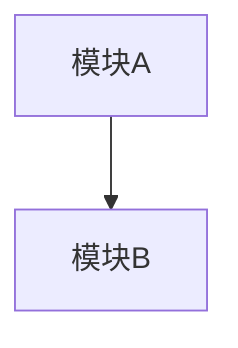

# 计划：基于 Claude Code CLI 源码分析，产出一本面向普通程序员的技术书籍

## Context

用户拥有 Claude Code CLI 的完整源码（~1884 个 TypeScript 文件），想通过系统性地解析这个项目，学习架构设计、Agent 开发、使用模型技巧等，最终产出一本**至少 20 篇技术文档**量级的学习书籍，面向普通程序员。

这个项目非常适合作为学习素材：它是一个真实的、大规模的 AI-native CLI 产品，涵盖了从系统 prompt 工程、多 Agent 编排、工具系统设计、权限安全、到终端 UI 渲染等完整技术栈。

## 用户偏好

- **语言**：中英混合 — 正文中文，技术术语保留英文原文（如 Agent、Tool、Prompt Cache、Dead Code Elimination）
- **执行节奏**：每次 1 篇，追求最高质量，逐篇深度阅读源码后撰写
- **架构图**：关键章节需包含 Mermaid 架构图（详见下方「架构图规范」）

## 书籍设计思路

### 目标读者
有 1-3 年经验的程序员，了解 TypeScript，对 AI 应用开发感兴趣，想从真实产品源码中学习工程实践。

### 核心价值主张
**"从一个真实的 AI 产品源码中，学会构建 AI Agent 应用的全栈技术"**

### 结构设计原则
- 每篇文档独立成文，但有明确的阅读顺序
- 每篇从"为什么需要"开始，带出代码实现，最后总结可复用的模式
- 代码引用精确到文件和行号，附关键代码片段
- 正文使用中文，技术术语（Agent、Tool、System Prompt 等）保留英文
- 在架构关系、数据流、生命周期等需要可视化的地方，使用 Mermaid 架构图辅助说明

### ⚠️ 计划书自修正原则

**本计划书是活文档，必须在撰写过程中持续修正。** 在深入阅读 Claude Code CLI 源码撰写每篇文章时：

1. **发现计划书中的事实错误**（如文件路径不存在、函数名拼写错误、架构理解有误）→ **立即修正计划书中的对应内容**
2. **发现某篇文章的标题不准确**（如实际源码中该模块的作用与标题描述不符）→ **修正标题，并更新目录**
3. **发现某篇文章的内容大纲需要调整**（如某个要点实际源码中不存在，或发现了更重要的设计值得替换）→ **更新大纲要点和关键文件列表**
4. **发现需要新增或删减章节**（如某个主题太薄不足以独立成篇，或发现了计划中遗漏的重要主题）→ **调整篇数和结构，保持整体连贯**

修正时在计划书对应位置直接修改，不需要保留修改历史。每次修正后确保目录（第 00 篇）与计划书保持同步。

### 架构图规范

以下章节**必须**包含 Mermaid 图表：

| 章节 | 图表类型 | 描述 |
|------|---------|------|
| 第 1 篇：项目全景 | `graph TD` | 模块依赖全景图 + 启动链路时序图 |
| 第 3 篇：状态管理 | `graph LR` | Store ↔ React Context ↔ ToolUseContext 的数据流 |
| 第 4 篇：System Prompt | `graph TD` | Prompt 分段组装流程（static → dynamic boundary → session-specific） |
| 第 5 篇：对话循环 | `sequenceDiagram` | User → query.ts → API → Tool → API 的完整交互时序 |
| 第 6 篇：上下文压缩与恢复 | `graph LR` | Token 预算管理与 Auto-compact 触发流程 |
| 第 9 篇：工具系统 | `classDiagram` | Tool 接口与 buildTool 的类型关系 |
| 第 11 篇：Agent 系统 | `sequenceDiagram` | runAgent() 的完整生命周期时序图 |
| 第 14 篇：MCP | `graph TD` | MCP 连接与 Tool 发现流程 |
| 第 15 篇：权限系统 | `flowchart TD` | Permission check 决策流程图 |
| 第 16 篇：Settings | `graph TD` | 6 层配置合并优先级图 |

其他章节视内容需要可选添加 Mermaid 图。

Mermaid 代码块格式：
````markdown

````

---

## 书籍大纲（25 篇，分 5 个 Part）

### Part 1: 全局架构（3 篇）

**第 1 篇：项目全景 — 一个 AI CLI 产品的技术蓝图**
- 技术栈选型分析（Bun + TypeScript + Ink + Commander.js 为什么这样选）
- 启动链路：`cli.tsx` → `main.tsx`（通过 Commander `preAction` 调用 `init()`）→ `setup.ts` → `replLauncher.tsx`
- 模块依赖全景图：`main.tsx` → `commands.ts`/`tools.ts`/`services/`/`components/`
- 关键文件：`main.tsx`, `query.ts`, `Tool.ts`, `commands.ts`, `tools.ts`

**第 2 篇：启动优化 — 毫秒级 CLI 启动的工程艺术**
- 快速路径（Fast Path）：`--version` 零 import 返回，10+ 条瀑布式快速路径链
- 侧效果前置：`startMdmRawRead()`, `startKeychainPrefetch()` 利用 ~135ms 模块求值并行 I/O
- API 预连接：`preconnectAnthropicApi()` 在用户打字时完成 TCP+TLS 握手
- 早期输入捕获：`startCapturingEarlyInput()` 在 REPL 就绪前缓冲用户按键
- `feature()` 编译期 DCE（Dead Code Elimination）+ `require()` 条件加载
- `memoize` 防重复初始化（`init()` 使用 lodash `memoize` 包装）
- 启动性能度量：`profileCheckpoint()` 双模式（采样日志 + 详细分析）
- 关键文件：`entrypoints/cli.tsx`, `main.tsx:1-20,907-967`, `entrypoints/init.ts`, `utils/apiPreconnect.ts`, `utils/earlyInput.ts`, `utils/secureStorage/keychainPrefetch.ts`, `utils/settings/mdm/rawRead.ts`, `utils/startupProfiler.ts`

**第 3 篇：状态管理 — React 与非 React 世界的状态桥接**
- 三层状态架构：bootstrap/state（Session 全局）→ Store + AppState（UI 层）→ ToolUseContext（运行时上下文容器）
- 35 行极简 Store 实现（`state/store.ts`）：`getState/setState/subscribe` + `Object.is` 相等性检查
- `AppState` 类型设计：`DeepImmutable<T>` 包装、70+ 字段按领域分组（mcp, plugins, tasks 等）
- `AppStateProvider` 通过 `useSyncExternalStore` 桥接 React，Context value 放 Store 实例（稳定引用）
- `onChangeAppState`：集中式副作用处理（权限同步、模型持久化、缓存清理）
- `bootstrap/state.ts`：DAG 叶子节点，session 级全局状态（sessionId, projectRoot, CWD, cost, telemetry）
- `ToolUseContext`：面向每次交互/工具执行的运行时上下文容器，`createSubagentContext()` 实现 Agent 隔离 + 选择性共享
- 关键文件：`state/store.ts`, `state/AppStateStore.ts`, `state/AppState.tsx`, `state/onChangeAppState.ts`, `bootstrap/state.ts`, `Tool.ts:158-254`, `utils/forkedAgent.ts`

---

### Part 2: AI 核心（5 篇）

**第 4 篇：System Prompt 工程 — 精密控制模型行为的提示词体系**
- 分段构建与 `systemPromptSection()` / `DANGEROUS_uncachedSystemPromptSection()`
- `SYSTEM_PROMPT_DYNAMIC_BOUNDARY` — 全局缓存与会话特定内容的分界线
- 条件分支：`USER_TYPE === 'ant'` 的内外版本差异
- 提示词中的行为引导技巧（代码风格约束、安全指令、工具使用优先级、false-claims 缓解）
- 关键文件：`constants/prompts.ts`, `constants/systemPromptSections.ts`, `context.ts`, `utils/systemPrompt.ts`, `utils/api.ts`, `constants/system.ts`, `constants/cyberRiskInstruction.ts`, `tools/AgentTool/forkSubagent.ts`

**第 5 篇：对话循环 — query.ts 如何驱动一次完整的 AI 交互**
- AsyncGenerator 状态机：`query()` / `queryLoop()` 的 `while(true)` 显式状态机设计，`State` 类型与 7+ 个 `continue` 站点，`transition` 字段记录跳转原因
- 消息预处理管线：applyToolResultBudget → snipCompact → microcompact → contextCollapse → autocompact（成本递增顺序）
- API 调用与流式响应：`deps.callModel()` → `queryModelWithStreaming` → `withRetry` AsyncGenerator 重试层（区分前台/后台 529、指数退避、`FallbackTriggeredError`）
- 暂扣-恢复模式：prompt-too-long / max_output_tokens 错误在流中暂扣（withhold），尝试 collapse drain → reactive compact → 多轮恢复
- 工具执行双模式：`StreamingToolExecutor`（流式并行）vs `runTools()`（批量），`partitionToolCalls()` 的并发安全分区
- 附件注入：Memory 预取（`using` 关键字）、Skill 发现预取、queued commands drain
- 依赖注入：`QueryDeps`（4 个方法）+ `QueryConfig`（不可变环境快照，刻意排除 `feature()` gate 以保留 DCE）
- 关键文件：`query.ts`, `query/deps.ts`, `query/config.ts`, `query/stopHooks.ts`, `services/api/claude.ts`, `services/api/withRetry.ts`, `services/tools/toolOrchestration.ts`, `services/tools/StreamingToolExecutor.ts`

**第 6 篇：上下文压缩与恢复 — 无限对话的秘密**
- Token 预算管理三函数：`getEffectiveContextWindowSize()`, `getAutoCompactThreshold()`, `calculateTokenWarningState()` 四级告警（Warning/Error/AutoCompact/Blocking）
- 本地 Microcompact 两路径：Time-based（构造新消息对象清理冷缓存）、Cached MC（cache_edits API 保护热缓存）
- API-level Context Management：独立于 microcompactMessages() 的并行机制，通过 claude.ts 注入 API 请求参数
- Full Compact：`compactConversation()` 用模型总结对话，9 维结构化 prompt，`<analysis>` chain-of-thought 然后剥离
- Session Memory Compact：免 API 调用，直接复用后台提取的 session memory 作为总结
- 熔断器：连续失败 3 次后停止 auto-compact 尝试（避免每天浪费 25 万次 API 调用）
- 文件读写安全状态追踪：`FileStateCache` LRU（max 100 条 / 25MB），`isPartialView` 约束 Edit/Write 前必须先 Read，compact 后文件恢复索引
- Compact 后上下文重建：最多 5 个文件恢复（5K token/文件），Plan/Skill/MCP 指令重注入
- 关键文件：`services/compact/autoCompact.ts`, `services/compact/compact.ts`, `services/compact/microCompact.ts`, `services/compact/prompt.ts`, `services/compact/sessionMemoryCompact.ts`, `services/compact/apiMicrocompact.ts`, `services/compact/postCompactCleanup.ts`, `utils/fileStateCache.ts`

**第 7 篇：Prompt Cache — 让每次 API 调用都省钱的缓存策略**
- `CacheSafeParams`：fork agent 与 parent 共享 prompt cache 的参数对齐
- `splitSysPromptPrefix()`：系统提示词的 global/session scope 拆分
- `SYSTEM_PROMPT_DYNAMIC_BOUNDARY` 如何最大化 cache hit 率
- `saveCacheSafeParams()` / `getLastCacheSafeParams()`：跨 turn 缓存参数复用
- 关键文件：`utils/forkedAgent.ts`, `utils/api.ts`, `constants/prompts.ts`, `services/api/claude.ts`

**第 8 篇：Thinking 与推理控制 — 让模型"想"多少**
- `ThinkingConfig` 三种模式：`adaptive` / `enabled` (带 budget) / `disabled`
- `ultrathink` 关键词触发深度思考
- Extended Thinking 与 effort 级别的交互
- 模型能力检测：`modelSupportsAdvisor()`（定义在 `utils/advisor.ts`）, 3P 模型覆盖
- 关键文件：`utils/thinking.ts`, `utils/effort.ts`, `utils/advisor.ts`, `services/api/claude.ts`

---

### Part 3: 工具与 Agent 系统（6 篇）

**第 9 篇：工具系统设计 — buildTool() 的抽象之美**
- `Tool` 接口全貌：name, inputSchema, call(), isEnabled(), isReadOnly(), checkPermissions(), render*()
- `buildTool<I>(def: ToolDef<I>)` 的 builder 模式
- 输入验证：JSON Schema + Zod 双重验证
- 工具注册表：`tools.ts` 的 `getAllBaseTools()` 单一来源
- 条件注册：`feature()` 门控 + `isEnabled()` 运行时检查
- 关键文件：`Tool.ts`, `tools.ts`, `tools/BashTool/BashTool.tsx`

**第 10 篇：BashTool 深度剖析 — 最复杂的单个工具**
- 命令语义分析：`BASH_SEARCH_COMMANDS`, `BASH_READ_COMMANDS`, `BASH_LIST_COMMANDS`
- 安全防线：`parseForSecurity()` AST 分析、`checkReadOnlyConstraints()`
- 沙箱执行：`SandboxManager`, `shouldUseSandbox()`
- 输出处理：截断策略、图片输出检测、大结果存储到磁盘
- 权限匹配：通配符模式 `matchWildcardPattern()`, 前缀提取
- 进度展示：2 秒阈值显示进度、后台任务自动转换
- 关键文件：`tools/BashTool/BashTool.tsx`, `tools/BashTool/bashPermissions.ts`, `tools/BashTool/bashSecurity.ts`

**第 11 篇：Agent 系统 — 从单体到多智能体协作**
- `AgentDefinition` 数据结构：description, tools, prompt, model, permissionMode, mcpServers, hooks, maxTurns
- Agent 定义来源：built-in（代码定义）、用户自定义（`.claude/agents/` markdown）、plugin
- `runAgent()` 生命周期：初始化 MCP → 创建 subagent context → query loop → 清理
- `createSubagentContext()`：context 隔离 vs `setAppStateForTasks` 共享
- 内置 Agent 类型：Explore（只读搜索）、Plan（只读设计）、General-purpose、Verification
- 关键文件：`tools/AgentTool/runAgent.ts`, `tools/AgentTool/loadAgentsDir.ts`, `tools/AgentTool/AgentTool.tsx`

**第 12 篇：内置 Agent 设计模式 — Explore、Plan、Verification 的 prompt 设计**
- Explore Agent：READ-ONLY 模式、高效搜索指令、并行工具调用提示
- Plan Agent：架构师角色、设计流程引导、输出格式约束
- Verification Agent：对抗性验证、PASS/FAIL/PARTIAL 评判协议
- 自定义 Agent 定义：markdown frontmatter 配置全解
- 关键文件：`tools/AgentTool/built-in/exploreAgent.ts`, `planAgent.ts`, `verificationAgent.ts`

**第 13 篇：任务系统 — Agent 的并发执行引擎**
- Task 类型体系：`LocalShellTask`（shell 命令）、`LocalAgentTask`（本地 agent）、`RemoteAgentTask`（远程）、`DreamTask`
- 前台 vs 后台：`registerForeground()` / `backgroundExistingForegroundTask()`
- `TaskOutput`：流式输出收集与磁盘持久化
- Agent 协作模型：coordinator mode, in-process teammates, fork subagent
- 关键文件：`tasks/`, `tools/AgentTool/forkSubagent.ts`, `coordinator/coordinatorMode.ts`

**第 14 篇：MCP 协议实现 — 连接外部工具的标准化桥梁**
- 传输层：stdio / SSE / HTTP / WebSocket / SDK 五种 transport
- 配置层级：local / user / project / dynamic / enterprise / managed
- 服务器生命周期：`connectToServer()` → `fetchToolsForClient()` → `cleanup()`
- Agent 的 MCP 扩展：frontmatter 中的 `mcpServers` 字段
- 认证：OAuth + XAA (Cross-App Access) 方案
- 关键文件：`services/mcp/types.ts`, `services/mcp/client.ts`, `services/mcp/config.ts`

---

### Part 4: 安全与工程（5 篇）

**第 15 篇：权限系统 — AI 安全的最后一道防线**
- 三种权限模式：`default` / `plan`（只读 + 确认）/ `bypass`（完全自动）
- 规则系统：`alwaysAllowRules` / `alwaysDenyRules` / `alwaysAskRules`，按 source 分层
- `getDenyRuleForTool()` 查找链
- Bash 工具的细粒度权限：通配符匹配、路径校验、重定向检测
- Classifier-assisted auto-mode：用模型本身判断操作安全性
- 关键文件：`utils/permissions/permissions.ts`, `utils/permissions/PermissionMode.ts`

**第 16 篇：Settings 系统 — 多层配置的合并之道**
- 6 层配置源：local → user → project → enterprise → managed → remote-managed
- Drop-in 目录模式：`managed-settings.d/*.json` 按字母顺序合并
- MDM（Mobile Device Management）集成：macOS plutil / Windows Registry
- 配置变更检测：`settingsChangeDetector` 文件监视
- 验证：Zod schema + `filterInvalidPermissionRules()`
- 关键文件：`utils/settings/settings.ts`, `utils/settings/types.ts`, `utils/settings/constants.ts`

**第 17 篇：Hooks 系统 — 用 Shell 命令扩展 AI 行为**
- Hook 事件类型：pre/post tool call, session start, pre/post compact, notification
- 执行模型：`spawn()` + `wrapSpawn()` + `TaskOutput` 收集输出
- Hook 输出协议：JSON 输出 schema（sync/async 类型）
- 安全边界：`shouldAllowManagedHooksOnly()`, `shouldDisableAllHooksIncludingManaged()`
- Frontmatter hooks：Agent/Skill 定义中的 hooks 注册
- 关键文件：`utils/hooks.ts`, `utils/hooks/hooksConfigSnapshot.ts`, `types/hooks.ts`

**第 18 篇：Feature Flag 与编译期优化 — 同一份代码构建两个产品**
- `bun:bundle` 的 `feature()` 机制：编译期常量折叠 + DCE
- 内部 vs 外部构建差异：`PROACTIVE`, `KAIROS`, `VOICE_MODE`, `COORDINATOR_MODE` 等
- `process.env.USER_TYPE === 'ant'` 运行时分支
- `INTERNAL_ONLY_COMMANDS` / `MACRO.VERSION` / `MACRO.ISSUES_EXPLAINER`
- GrowthBook A/B 测试集成：`getFeatureValue_CACHED_MAY_BE_STALE()`
- 关键文件：`commands.ts:48-100`, `tools.ts:14-55`, `constants/prompts.ts`

**第 19 篇：API 调用与错误恢复 — 面向不可靠网络的鲁棒设计**
- `withRetry` 策略：最多 10 次重试、指数退避、`BASE_DELAY_MS = 500`
- 529 (过载) 特殊处理：仅前台查询重试、最多 3 次、后台请求立即放弃
- Fast mode / fallback 降级：过载时自动降级到更小模型
- OAuth 401 重认证：`handleOAuth401Error()`
- 连接错误分类：`extractConnectionErrorDetails()`
- 关键文件：`services/api/withRetry.ts`, `services/api/errors.ts`, `services/api/claude.ts`

---

### Part 5: 终端 UI 与用户体验（4 篇）

**第 20 篇：Ink 框架深度定制 — 在终端中运行 React**
- Forked Ink 的架构：reconciler → layout (Yoga) → render → terminal output
- 自定义扩展：virtual scroll、ANSI 优化、terminal querying、focus management
- 性能优化：`line-width-cache`, `node-cache`, `optimizer.ts`
- 关键文件：`ink/reconciler.ts`, `ink/layout/`, `ink/render-node-to-output.ts`, `ink/root.ts`

**第 21 篇：设计系统 — 终端 UI 的组件化实践**
- 基础组件：`ThemedText`, `ThemedBox`, `Dialog`, `Pane`, `Divider`, `ProgressBar`, `Tabs`
- 主题系统：`ThemeProvider` + `Theme` 类型 + dark/light mode
- 工具 UI 协议：每个工具的 `renderToolUseMessage` / `renderToolResultMessage` / `renderToolUseProgressMessage`
- 关键文件：`components/design-system/`, `utils/theme.ts`, `tools/BashTool/UI.tsx`

**第 22 篇：命令系统 — 50+ 斜杠命令的可扩展架构**
- 命令类型：`prompt`（生成 prompt 发给模型）vs `local`（本地执行带 JSX UI）
- 懒加载：local 命令通过 `load()` 延迟加载模块
- Skills 扩展：markdown frontmatter 定义的自定义命令
- Plugin commands：插件提供的额外命令
- 关键文件：`commands.ts`, `types/command.ts`, `skills/loadSkillsDir.ts`

**第 23 篇：Memory 系统 — 让 AI 记住上下文的机制**
- CLAUDE.md 发现链：project root → parent dirs → home dir → additional dirs
- Auto-memory：`memdir/` 自动记忆系统
- Session memory：`services/SessionMemory/` 会话记忆
- Memory attachments：相关记忆预取与注入
- 关键文件：`memdir/memdir.ts`, `memdir/findRelevantMemories.ts`, `utils/claudemd.ts`, `context.ts`

---

### 附录篇（2 篇）

**第 24 篇：Skill/Plugin 开发实战 — 基于源码理解扩展点**
- 自定义 Agent 编写（`.claude/agents/*.md` frontmatter 全解）
- 自定义 Skill 编写（`.claude/skills/*.md` 配置参考）
- Plugin 系统架构与 manifest 格式
- Hook 脚本编写模式

**第 25 篇：架构模式总结 — 可迁移到你自己项目的设计模式**
- 编译期 DCE 模式（同一份代码构建多版本）
- 极简 Store 模式（35 行代码桥接 React 与非 React）
- 工具注册表模式（单一来源 + 条件注册）
- Prompt 分段缓存模式（static/dynamic boundary）
- 多层配置合并模式（6 层 settings）
- Agent 隔离模式（context clone + shared infra）
- 安全防线模式（permission rule chain）

---

## 执行计划 — 如何让 AI 帮你写这本书

### 输出位置

计划书和所有文章写入独立的学习项目目录：
```
├── plan.md                    (本计划书)
├── 00-目录与阅读指引.md
├── 01-项目全景.md
├── 02-启动优化.md
├── 03-状态管理.md
├── ...
├── 25-架构模式总结.md
```

### 推荐工作流（每次 1 篇，逐篇执行）

每篇文章作为一个独立 task，使用以下 prompt 模式：

```
请基于 Claude Code CLI 源码，
撰写第 X 篇技术文章：「{标题}」

要求：
1. 面向有 1-3 年经验的程序员
2. 语言：正文中文，技术术语保留英文（如 Agent、Tool、System Prompt）
3. 从"为什么需要这个设计"出发，而非直接展示代码
4. 引用关键代码时精确到文件路径和行号范围
5. 附核心代码片段（每篇 3-8 个代码块）
6. 每篇结尾总结 2-3 个可迁移到自己项目的设计模式
7. 字数 3000-5000 字

重点关注这些文件：{列出该篇对应的关键文件}

⚠️ 重要：如果在深入阅读源码的过程中，发现计划书（plan.md）中的任何错误
（文件路径、函数名、架构理解），或发现当前文章的标题/大纲需要调整，
请同时修正 plan.md 中对应的内容。
```

### 执行顺序（严格按顺序，每次 1 篇）

1. **Phase 1（第 1-3 篇）**：全局架构，建立基础认知
2. **Phase 2（第 4-8 篇）**：AI 核心，最有价值的部分
3. **Phase 3（第 9-14 篇）**：工具与 Agent，实战性最强
4. **Phase 4（第 15-19 篇）**：安全与工程，生产级视角
5. **Phase 5（第 20-25 篇）**：UI、命令、总结

### 质量检查

每 5 篇完成后，执行一次：
```
请审阅已完成的文章，检查：
1. 技术准确性（代码引用是否正确）
2. 一致性（术语使用、文章间交叉引用）
3. 可读性（是否对初中级程序员友好）
4. 信息密度（是否有冗余或遗漏）
```
